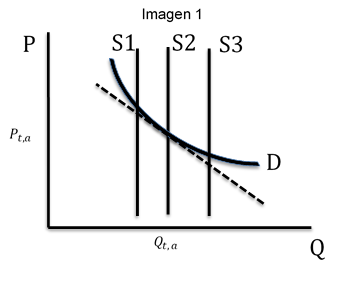
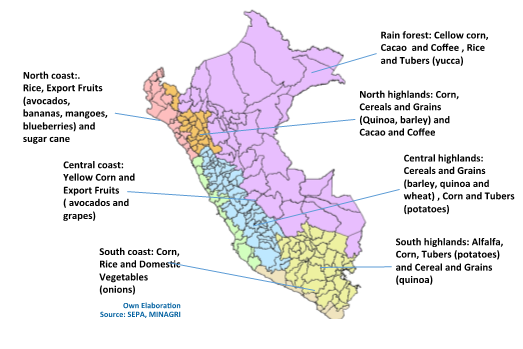
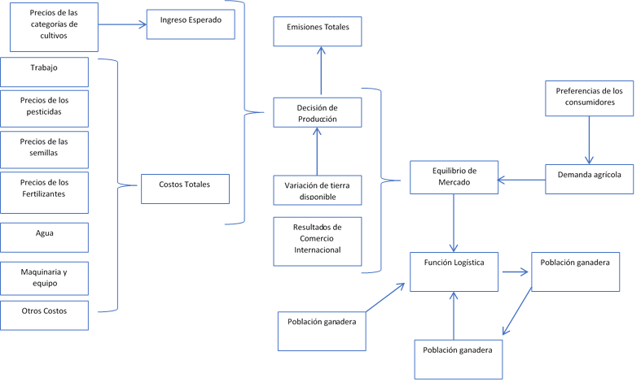

2. POLYSYS-Peru
=======================================

El cambio climático. constituye la mayor amenaza medioambiental a la que se enfrenta la humanidad; en ese contexto representa un desafío para los diversos sectores de la sociedad (academia, gobiernos, empresas, etc.) y por tanto es primordial comprender que si se continua por la senda actual el estilo de vida de las personas cambiará, forzosamente, hacia menores niveles de vida. Para evitar llegar a un estado de daño irreparable, a mediano plazo, el objetivo imprescindible es alcanzar la meta de "no incrementar la temperatura global en más de 1.5 ºC" . Arribar satisfactoriamente a esta meta es imperante toda vez que se traducirá en evidentes beneficios para la conservación de los ecosistemas naturales. Sin embargo, para conseguirlo es necesaria una cooperación internacional donde los intereses particulares de las naciones pasen a un segundo plano y sea posible priorizar el análisis de la problemática medioambiental en colectivo, en efecto, sobre los líderes del mundo la responsabilidad de tomar las medidas pertinentes para evitar una catástrofe irremediable.

El resultado ideal de la propuesta previa es que una política cooperativa se traduzca en una coordinación mundial donde los países desarrollados actúen como líderes, marcando pautas a seguir y estableciendo compromisos con el resto de las naciones. Este liderazgo se fundamenta en múltiples aspectos, iniciando por la mayor capacidad de recursos tanto económicos como técnicos, así como en un mayor grado de representatividad en las cuotas de emisiones globales. Sin embargo, esto no exenta de responsabilidad a los países en desarrollo, por el contrario, su compromiso es igualmente primordial toda vez que a largo plazo, si no se hace nada, se convertirían en las principales fuentes de contaminación ambiental.

Con base en lo anterior se puede mencionar los ejemplos de China e India, ambos países en vías de desarrollo, pero con una amplia producción industrial, la cual genera la mayor cantidad emisiones en el mundo (AIE, 2015). Por supuesto estos ejemplos se presentan sin perjuicio de minimizar la responsabilidad de aquellos países en vías de desarrollo con menores niveles de producción industrial. De esta manera es importante también recalcar otras características de dichos países que son importantes en materia ambiental, posiblemente la más preponderante relacionada al stock forestal .

Como ya se mencionó la meta "del +1.5 ºC" es un objetivo de mediano plazo por lo tanto requiere tomar medidas en el presente de tal forma que sea creen los cimientos necesarios para conseguir resultados claros en el mediano plazo. Lamentablemente el forjamiento de estos cimientos se muestra como poco atractivo para el sector político, que suele tomar decisiones basadas en expectativas que no superan los 5 años. De esta forma muchas las medidas necesarias para cumplir la meta "del +1.5 ºC" serían vistas como costosas no solo en dinero, sino también en popularidad.

Por otro lado, los países en desarrollo están tentados a industrializar sus economías a costa de una fuerte depredación de sus recursos naturales, siguiendo un camino similar al de sus pares desarrollados en el pasado. Claramente, para países con bajas capacidades de investigación y desarrollo y, en consecuencia, baja innovación en sectores como la industria o los servicios tecnológicos, la explotación de los recursos naturales se presenta como una opción simple y rápida para la generación de riqueza o en algunos casos como medio de escape a la pobreza. Por lo tanto, tomando en consideración todos los argumentos planteados hasta este punto se deduce que recae una fuerte responsabilidad sobre los analistas y técnicos de distintas ramas poder hacer propuestas que permitan equilibrar el crecimiento económico con el cuidado del medioambiente, procurando en el camino la generación de bienestar para la población más vulnerable. 

.. 1 "En adelante como abreviación diremos la meta del +1.5 ºC."
  2 "Las selvas tropicales en América del sur o los bosques boreales en Canadá y Rusia. En todos estos casos es imperativo que estos bosques sobrevivan a la deforestación causada, principalmente, por motivaciones económicas. Considerando estos dos elementos, técnicamente hablando, los resultados de la intensidad del calentamiento global dependen, principalmente, de los países en desarrollo."

Las propuestas técnicas requerirán ser fundamentadascon investigaciones y análisistanto de carácter cualitativo como cuantitativo, asi como adaptarse plenamente a la realidad del país que recibe recomendaciones. Para ello es de suma importancia considerar la heterogeneidad de las naciones, considerado incluso aspectos culturales hasta la descripción de la estructura productiva, en tal sentido es necesario que las políticas cooperativas de preservación ambiental incorporen las consideraciones de cada región de forma tal que permitan equilibrar el crecimiento económico con el cuidado del medioambiente, procurando en el camino la generación de bienestar para la población más vulnerable.

En ese contexto, se presenta este documento en que se pretende  simular y analizar sobre el comportamiento de la economía peruana, y utilizar esos resultados como una herramienta para evaluar politicasy pronósticos sobre el cambio climático futuro generado por las actividades económicas peruanas. Concretamente nos enfocamos en los efectos de cambio de uso de suelo, relacionado con la agricultura, ganadería y silvicultura.Asimismo,las contribuciones de las emisiones del sector energético, relacionadas principalmente con el transporte. Nuestro artículo presenta características económicas peruanas y pretende comprender esas cualidades que hacen que el caso peruano sea especial y diferente de otros países similares en la región.

Este documento está organizado de la siguiente manera. Primero, se presenta una introducción y una descripción de la  situación del Perú en materia económica y ambiental. El segundo capítulo está dedicado a detallar los aspectos teóricos de la modelación . El tercer capítulo incluye una documentación de la programación del modelo, así como todas las fuentes de información, incluidas las bases de datos y otros resultados de documentos utilizados como inputs del modelo POLYSYS. En el quinto capítulo se presenta un resumen de los resultados en todos los sectores. Finalmente en el sexto capítulo concluimos. Este documento está organizado de la siguiente manera. Primero, se presenta una introducción y una descripción de la  situación del Perú en materia económica y ambiental. El segundo capítulo está dedicado a detallar los aspectos teóricos de la modelación . El tercer capítulo incluye una documentación de la programación del modelo, así como todas las fuentes de información, incluidas las bases de datos y otros resultados de documentos utilizados como inputs del modelo POLYSYS. En el quinto capítulo se presenta un resumen de los resultados en todos los sectores. Finalmente en el sexto capítulo concluimos.

2.1 Estructura
+++++++++

.. 3 "Esto incluye el análisis de la oferta, que contiene la formulación del problema de programación lineal en el sector agrícola, así como su solución; y el análisis de la demanda, que está altamente relacionado con las elasticidades de la demanda y la solución de un sistema de ecuaciones."
  "Esto incluye el análisis de la oferta, que contiene la formulación del problema de programación lineal en el sector agrícola, así como su solución; y el análisis de la demanda, que está altamente relacionado con las elasticidades de la demanda y la solución de un sistema de ecuaciones."

|   **1 Situación del Perú**

El caso de la economía peruana es interesante porque su contribución al cambio climático depende no solo de la industria sino también de otros sectores como la agricultura, la ganadería y, por supuesto, la deforestación en la selva tropical. Esto es problemático porque muchas de estas actividades económicas están asociadas al comercio en pequeña escala constituido principalmente por individuos con baja acumulación de capital humano y, en consecuencia, cualquier política no bien analizada podría afectar la vida de las personas que constituyen un grupo vulnerable en el país. Esto es diferente a otras economías en desarrollo que se concentran en otro aspectos, por ejemplo en cuestiones energéticas.

Con respecto a las fuentes contaminantes en el país se puede mencionar que las emisiones nacionales de gases de efecto invernadero (en adelante abreviadas como GEI) de 2010 en Perú representaron solo el 0.3% de las emisiones globales (MINAM, 2010); y sus emisiones per cápita fueron más bajas que el promedio de América Latina y el mundo. Estas características están asociadas a una economía cuyo sector de generación de energía utiliza energía limpia, principalmente energía hidroeléctrica, además la industria no está altamente desarrollada. La principal fuente de emisión de la quema de combustibles fósiles toma lugar en el sector transporte. 

Perú podría considerarse un país altamente vulnerable a los efectos del cambio climático, ya que tiene las siguientes características: área costera baja, tierras áridas y semiáridas, áreas propensas a inundaciones, sequías y desertificación, ecosistemas de montañas frágiles, áreas propensas a desastres, áreas con alta contaminación atmosférica urbana y economías altamente dependientes de los ingresos generados por la producción y el uso de combustibles fósiles, es decir, , es decir, presenta 7 de las 9 características que vuelven vulnerable a un país al cambio climático. Debido a su alta vulnerabilidad a los efectos del cambio climático, las contribuciones de Perú buscan mantener un equilibrio entre las acciones de adaptación y mitigación.

En la actualidad,Perú ya ha definido su contribución nacional (NDC) para cumplir con los compromisos asumidos como resultado del Acuerdo de París.El gobierno peruano espera una reducción del 30% de las emisiones en relación con un escenario BAU en 2030.Lasl NDCs de Perú incluyen acciones tanto de adaptación y mitigación para los cuatro sectores analizados aquí.

|	**2 El Modelo**

Para realizar las estimaciones previamente mencionadas aquí se utiliza el modelo POLYSYS; una herramienta práctica que sirve para analizar políticas de alto impacto en el sector agrícola. Este análisis ayuda a establecer vínculos entre los indicadores económicos y el desempeño de la política ambiental. Por ejemplo, en la agricultura, para cualquier cultivo en particular, permite asociar el número de hectáreas cultivadas con un volumen determinado de emisiones de efecto invernadero, de esta horma un incremento en el número de hectáreas cultivadas implica un incremento en las emisiones. Los resultados del POLYSYS son especialmente útiles como pautas para la toma de decisiones .

.. Incluir esta sección donde se detalla los aspectos matemáticos de la modelcación es una necesidad que surge de las dificultades habituales que tiene el Estado para mantener los modelos operativos en distintas ramas del gobierno. Esto debido a la dinámica laboral habitual, bajo la cual es común que el personal capacitado en el uso de cualquier modelo cambie de centro laboral sin capacitar a otro analista, dejando 

En el modelo POLYSYS  se establecen sistemas de ecuaciones  simultáneas donde las incógnitas representan variaciones en variables endógenas que se resuelven ante cambios en las variables exógenas del modelo. El resultado representa al mercado en equilibrio y la senda generada funciona como línea de base . En este punto, la generación de escenarios implica que el equilibrio se vea afectado de manera exógena por perturbaciones, y los resultados se guardan como los resultados de las políticas que se busca analizar, generando sendas alternativas a la de equilibrio. 

El modelo considera por el lado del consumo las elasticidades, tanto precio, como cruzadas y de ingreso, las cuales representan las preferencias de la población. Así los cambios proporcionales en las variables exógenas determinan el efecto acumulado de los cambios en el paquete de variables exógenas para cada escenario, incluyendo variaciones en las variables de consumo de los distintos bienes. 

|  **2.1 La Oferta Agrícola**

La dinámica del POLYSYS consiste en utilizar funciones de oferta constantes en cada año pero que varían de periodo a periodo, adaptándose a las condiciones de mercado, basados en los resultados de mercado del año anterior. Para ello el POLYSYSIS busca simular como un agricultor representativo en una determinada región toma la decisión de cultivar determinada canasta de productos agrícolas. Esta simulación implica representar una función de beneficios sujeta a restricciones de capacidad y flexibilidad. Para ejemplificar mejor la dinámica del modelo consideremos que en una región solo se cultivan dos productos a y b; luego un agricultor asentado en dicha región tendrá la siguiente función de beneficios de cultivar los dos productos:

.. math::

 \begin{equation}\pi=\left(P_{t, a} R_{t, a}-C_{t, a}\right) H_{t, a}+\left(P_{t, b} R_{t, b}-C_{t, b}\right) H_{t, b} \ldots(1)\end{equation}

Donde :math:`P_(t,a)` representa el precio del cultivo a, :math:`R_(t,a)` representa el rendimiento (número de kg producidos en una hectárea del producto a), :math:`C_(t,a)` representa el costo por hectárea de cultivar el producto a y :math:`H_(t,a)` representa el total de hectáreas cultivadas del producto a. El caso para el producto b es análogo, y como se puede observar el beneficio del agricultor se constituye por la venta de los dos cultivos disponibles. Claramente el total de tierra del que dispone el agricultor es la suma :math:`H_(t,a)+H_(t,b)` y no podrá cultivar más allá de este nivel. En todos los casos el subíndice t representa el tiempo y está indicando que nos encontramos en el periodo actual t.

Se tiene entonces que un agricultor recibirá como beneficio el margen neto, por hectárea, de cada cultivo multiplicado por el número de hectáreas cultivadas de cada cultivo. Si se piensa en este agricultor como el agricultor representativo o promedio de una región y posteriormente se agregan todos los agricultores en dicha región entonces podremos observar que la ecuación (1) también puede representar la función de beneficios de las actividades agrícolas en la región. Los agricultores tomarán en consideración la función (1) cuando decidan como asignarán la tierra entre los cultivos disponibles y por tanto lo que harán será optar por cultivar los más rentables.

.. entrenado en la academia. Así, ambos elementos juegan un papel fundamental en el uso, mejoramiento y actualización de cualquier modelo.eeee

La forma funcional de la ecuación (1) es un problema de programación lineal (LP).  En general los problemas de LP, sinrestricciones, tendrán una solución de esquina, esto implicaría que solo se cultivase un producto. Intuitivamente esto es lógico toda vez que el agricultor preferirá cultivar el producto que le deje la mayor ganancia, y por ende, en general la región, se especializaría en un solo producto. En ausencia de alguna restricción sobre la función (1) el resultado de esquina previamente mencionado tomaría lugar sin importar el número de productos que se oferten en una región. Esto sería contra intuitivo ya que reduciría la oferta de todos los productos a 0 con excepción de un producto, o grupo de productos en caso existan varios con la mayor rentabilidad, algo que no se observa en la realidad.

Para solucionar el problema de los resultados de esquina es necesario incluir restricciones en las capacidades de variación de la tierra asignada a cultivar los diversos productos a analizar. Es decir que hay que limitar 
:math:`H_(t,a)` y :math:`H_(t,b)` en la optimización de forma tal que ninguno pueda tomar el valor de 0. Para solucionar este problema se propone la siguiente forma del problema de LP:

.. math::

 \begin{equation}\max _{H_{a} H_{b}}\left(P_{t, a} R_{t, a}-C_{t, a}\right) H_{t, a}+\left(P_{t, b} R_{t, b}-C_{t, b}\right) H_{b t} \ldots(2)\end{equation}

sujeto a

.. math::

 \begin{equation}\begin{array}{l}
 \left(1-\delta_{a}\right) H_{t-1, a}<H_{t, a}<\left(1+\delta_{a}\right) H_{t-1, a} \\
 \left(1-\delta_{b}\right) H_{t-1, a}<H_{t, a}<\left(1+\delta_{b}\right) H_{t-1, a}
 \end{array}\end{equation}	

Se puede observar que las restricciones de tierra están determinadas por valores de asignaciones previas de la tierra. Intuitivamente estas restricciones lo que muestran es que una región tiene cierto grado de capacidad de cambio en la asignación de cultivos de un periodo a otro, indirectamente lo que se está modelando es una flexibilidad de oferta en la cual una variación en el precio, y por ende en la rentabilidad, genera una variación en la producción.

Usualmente la dinámica agrícola replica el comportamiento de una inversión de corto plazo donde se realiza un desembolso al inicio de un periodo y se tienen resultados al final de este. En este sentido los ciclos vegetativos suelen conllevar meses o hasta un año desde la adecuación de la tierra hasta la etapa de cosecha. En este sentido si bien es cierto la función de beneficios (2) indica que la decisión de cultivar algún producto agrícola depende del precio, lo cierto es que al momento de realizar de decidir qué productos cultivar, los agricultores no saben a cuanto lo podrán vender y por tanto los valores P_(t,a) y P_(t,b) en realidad son valores esperados.

Existen muchas formas de considerar los precios esperados, usualmente se toma un valor ponderado de los últimos periodos, dándole un mayor peso al precio del periodo anterior. Otra forma puede ser utilizando alguna función que genere una expectativa lógica de cómo pueden ser los precios en el periodo t. Luego el problema de optimización se presenta de la siguiente manera:

.. math::

 \begin{equation}\max _{H_{a}, H_{b}}\left(E\left[P_{t, a}\right] R_{t, a}-C_{t, a}\right) H_{t, a}+\left(E\left[P_{t, b}\right] R_{t, b}-C_{t, b}\right) H_{b t} \ldots(3)\end{equation}

sujeto a

.. math::

 \begin{equation}\begin{array}{l}
 \left(1-\delta_{a}\right) H_{t-1, a}<H_{t, a}<\left(1+\delta_{a}\right) H_{t-1, a} \\
 \left(1-\delta_{b}\right) H_{t-1, a}<H_{t, a}<\left(1+\delta_{b}\right) H_{t-1, a}
 \end{array}\end{equation}

Finalmente los resultados para cada región permiten determinar la asignación de tierra entre la canasta de 	cultivos y por ende se puede determinar la oferta de los productos. En este sentido es posible hallar como varían las ofertas de los distintos cultivos, estas se denotan como :math:`∆%Q_(t,a)^S` y :math:`∆%Q_(t,b)^S`.

| **2.2 La Demanda Agrícola**

En el modelo POLYSYS la demanda toma una posición más pasiva en el sentido que a diferencia de generar una demanda diferente para cada periodo, se utiliza una única demanda nacional que se adapta, en el tiempo, a las condiciones de la oferta. En este sentido la demanda está representada por una matriz de elasticidades precio y  elasticidades cruzadas entre productos que permiten entender como variaciones de la oferta de productos generará variaciones en el equilibrio de mercado.

Para entender mejor esto regresemos sobre el ejemplo de la sección previa donde solo existen dos productos agrícolas en una región determinada se tiene que la matriz de elasticidades toma la siguiente forma:

.. math::

 \begin{equation}E=\left(\begin{array}{ll}
 \varepsilon_{a a} & \varepsilon_{a b} \\
 \varepsilon_{b a} & \varepsilon_{b b}
 \end{array}\right)\end{equation}

Luego se puede generar la siguiente ecuación de variaciones en la demanda:

.. math::

 \begin{equation}\left(\begin{array}{cc}
 \Delta \% Q_{t, a}^{D} \\
 \Delta \% Q_{t, b}^{D}
 \end{array}\right)=\left(\begin{array}{cc}
 \varepsilon_{a a} & \varepsilon_{a b} \\
 \varepsilon_{b a} & \varepsilon_{b b}
 \end{array}\right)\left(\begin{array}{c}
 \Delta \% P_{t, a} \\
 \Delta \% P_{t, b}
 \end{array}\right) \ldots(4)\end{equation}

Donde el vector del lado izquierdo de la ecuación representa cambios porcentuales de la cantidad demandada de los productos a y b. Como se puede observar, las variaciones porcentuales en la demanda dependen de las variaciones porcentuales en los precios ajustadas por las elasticidades.

| **2.3 El Equilibrio Agrícola **

El equilibrio en este mercado toma lugar cuando se intersectan la oferta y la demanda. Ademas, existen dos casos, el primero, cuando un producto agrícola es transable y, el segundo,cuando no lo es. Por ejemplo, en el caso previo, donde solo hay dos productos :math:`a` y :math:`b`, supongamos que ambos son no transables. Luego la limpieza del mercado implica que:

.. math::

 \begin{equation}\Delta \% Q_{t, a}^{S}=\Delta \% Q_{t, a}^{D}\end{equation}

Por lo tanto en cada iteración, cuando el agricultor decida la asignación de tierra, está decidiendo cuanto va a producir lo cual al mismo tiempo está indicando cuanto se va a demandar y consumir.

*Figura 1 - Imagen 1*

Cuando un bien es transable, entonces, poder determinar cuanto se va a consumir depende de las variaciones del precio de dicho bien; dado que se trata de productos transados en el mercado internacional el equilibrio se determina por la interacción de la oferta y demanda agregadas del mundo en ese sentido el modelo requiere importar dichos resultados de mercado toda vez que el modelo no incorpora una metodología para predecir precios ni niveles de producción globales. 

| **2.4 La población Ganadera**

La simulación del sector ganadero se realiza considerando una función logística que permita simular una tendencia general de la población ganadera en la región. Sin embargo, dado que el valor que toma población en este sector se ve afectada por otras variables de índole, principalmente, económico la función logística aquí propuesta incorpora shocks de estas variables. Para comprender mejor esto, supongamos que en una región cualquiera se quiere analizar la población ganadera, luego se tiene la siguiente función logística:

| **3. POLYSYS-Perú**
En el capítulo anterior se presentaron las formalidades matemáticas del modelo POLYSYS. En este capítulo, se explicarán en cambio, explicaremos los detalles metodológicos, especificando los arreglos que se hicieron en la data disponible así como indicaremos las fuentes de información necesarias para poder aplicar el modelo expuesto en el capítulo 2.

| **3.1 Categorización: Regional, Agrícola y Ganadera**
El punto de partida para la simulación con el modelo POLYSYS para Perú es dividir el país bajo análisis, en pequeñas porciones de tierra, tal que dicho espacio tenga en todos su puntos de producción características productivas homogéneas en el sector agrícola y ganadero. Esta división debe incorporar, también, las limitaciones de datos que tenga el país. En este sentido se decidió dividir al Perú en 7 regiones: costa norte, costa centro, costa sur, sierra norte, sierra centro, sierra sur y selva. 

Por otro lado, la elección de la canasta de productos que utilizará debe ser escogida con sumo cuidado toda vez que esta debe ser representativa de la estructura productiva y de consumo del país. Al respecto Seminario (2018) utiliza una clasificación de productos agrícolas basada en "Clasificación Nacional de Productos Agrarios" (CNPA). Su clasificación agrupa 160 productos agrícolas en seis grupos:

1.	Tubérculos y raíces 
2.	Frutas 
3.	Vegetales 
4.	Producción industrial 
5.	Alimentación animal 
6.	Granos y cereales

Esta agrupación se muestra muy atractiva, sin embargo, resulta insuficiente para la simulación del POLYSISPOLYSYS ya que no permite distinguir claramente entre productos transables y no transables en el sector agrícola; además existen algunos productos que, sin ser agrupados, tienen una importancia relativa muy importante en el valor de la producción agrícola, siendo más atractivo poder hacer una simulación que permita observar de manera más directa una evolución de dichos cultivos. Por estos motivos finalmente se consideró la siguiente categorización:

1.	Alfalfa
2.	Legumbres
3.	Maíz
4.	Tubérculos
5.	Frutas de consumo doméstico
6.	Vegetales de consumo doméstico
7.	Frutas de exportación
8.	Vegetales de exportación
9.	Cacao y café
10.	Maíz amarillo duro
11.	Caña de azúcar
12.	Arroz
13.	Algodón
14.	Cereales y granos

En el gráfico 1 se puede observar la división que se propuso, así como los productos incluidos en cada región.

*Figura 1 - Imagen 2*

En el caso de la ganadería, en el Perú se consume principalmente carne de pollo y de res, por ello, se simula ambos tipos de animal. En el caso de la carne de res, se hace la distinción entre vacas cárnicas y lecheras con el objetivo de poder hacer una diferenciación entre las dos ofertas. Luego se tiene la siguiente categorización:

1.	Vaca cárnica 
2.	Vaca lechera
3.	Aves

| **3.2 Las Fuentes de Datos**

Como se ha mencionado, las bases de datos con información detallada sobre el desempeño del sector agrícola y ganadero peruano, y que simultáneamente sean confiables, son escasas. Las mejores opciones son aquellas bases de datos gubernamentales (estimaciones) publicadas por diferentes instituciones públicas, especialmente el Ministerio de Agricultura y el Ministerio de Medio Ambiente. Estas bases de datos suelen ser, en gran medida, aproximaciones. El POLYSYS Perú utiliza fundamentalmente cuatro fuentes de datos diferentes: SEPA, ENA, CENAGRO e Inforcarbono.

La Serie de Producción Agrícola Estadística (SEPA) es información recopilada por el Ministerio de Agricultura de Perú y disponible para el público. Contiene series de datos sobre precios, producción, rendimiento y superficie cosechada para cada departamento y para cada cultivo en el país, desde XX hasta XX. Los datos contenidos en SEPA son una aproximación a valores reales y pueden existir posibles diferencias importantes con la realidad. Se puede encontrar en el siguiente frenteweb_.

.. _frenteweb: http://frenteweb.minagri.gob.pe/sisca/

La Encuesta Nacional Agraria (ENA) es una encuesta con datos disponibles por año desde 2014 hasta 2018. Esta encuesta es realizada por el Instituto Nacional de Estadística e Informática. ENA incluye información por año sobre los costos agrícolas: pesticidas, semillas y fertilizantes. Los datos de ENA se recopilan anualmente, por lo tanto, los datos de inversión no están disponibles durante largos períodos de tiempo. En este sentido, los datos de ENA representan los gastos corrientes asociados al sector agrícola. Los datos de la ENA se pueden descargar del siguiente iinei_.

El CENAGRO es un censo del sector agrícola peruano y la fuente de datos más confiable de la que se dispone, fué aplicado por el Instituto Nacional de Estadística e Informática en el 2012. Lamentablemente no han sido actualizados aún, por lo que los datos no son totalmente representativos de nuestro año base. Por otro lado, el CENAGRO carece de datos de costos, lo cual es esencial para el modelo de simulación POLYSYS. Se puede descargar en el siguiente iinei_.

.. _iinei: http://iinei.inei.gob.pe/microdatos/ 

Inforcarbono es una metodología para calcular las emisiones de cada cultivo y del sector ganadero. Es un consolidado en que se presenta una hoja de calculo donde diversos factores se aplican sobre distintas variables de cada sector. Esta metodología permite obtener linealidad en los cálculos de emisiones, por lo que será más fácil incorporarlos en la simulación POLYSYS.

| **3.3 Precios, rendimientos y costos**

El modelo, para sus proyecciones, agrupa categorías de cultivos en lugar de analizar cultivos específicos, por ejemplo la categoría tubérculos incluye papa, camote y yuca. De esta forma es necesario construir precios, rendimientos y costos para todas estas categorías de cultivos de forma conjunta. Para hacerlo se usó como ponderador al valor de la producción de cada cultivo que compone una categoría dentro de la región. 

Por ejemplo en el caso de los tubérculos se halló el valor de la producción nacional del camote, de la papa y de la yuca. Posteriormente se agregó el valor de los tres cultivos y se encontró el valor de la producción nacional de los tubérculos. Finalmente usando el valor de la producción de cada componente de la categoría se halló el cual era la importancia de cada cultivo dentro de su categoría. 

Usando la información de la SEPA, del MINAGRI, se utiliza los pesos previamente hallados y se encuentra un precio a nivel nacional por cada categoría. Evidentemente este procedimiento fue necesario, únicamente, cuando una categoría se compone por más de un cultivo. Estos mismos pesos se usaron para encontrar los rendimientos y costos para todas las categorías de cultivo.

| **3.4 Dinámica del Modelo**

Como mencionamos, nuestra propuesta se organiza en torno a simulaciones de dos sectores: agricultura y ganadería. Para el sector agrícola, modelamos la oferta, la demanda y su interacción respectiva en el mercado. Para el sector ganadero utilizamos un modelo combinado, que se basa en la función de crecimiento logístico de la población, una estimación econométrica de la oferta (sacrificio) y una simulación y la demanda de carne de res, de pollo y leche mediante una aproximación resultante de la solución de un sistema de ecuaciones. Los resultados del sector forestal, se vinculan a la actividad agrícola en la región amazónica al variar la tierra agrícola disponible, esto es resultado de la deforestación y reforestación de la zona. De manera similar las tierras destinadas para pastos ingresan como un input al modelo ganadero y modifican la capacidad de soporte vital total de la región selva. La dinámica del modelo se puede apreciar en el gráfico 2. 

Finalmente es importante mencionar que el objetivo de la simulación es realizar predicciones hasta el año 2050, partiendo del año 2016. Teniendo al año 2016 como año base de la simulación y todos los inputs, para todos los sectores, serán datos de dicho año.

*Figura 1 - Imagen 3*

| **3.4.1 Notación General**

Para esta sección, se ha decidido utilizar la siguiente notación:
	El subíndice :math:`i` denota una categoría agrícola, como se tienen 14 categorías distintas entonces 
	:math:`i∈{1,2,…,14}`.
	El subíndice :math:`j` denota una categoría de ganado, como se tienen 3 categorías distintas entonces 
	:math:`j∈{1,2,3}`.
	El subíndice :math:`r` denota una región, como se tienen 7 categorías distintas entonces :math:`r∈{1,2,…,7}`.
	El subíndice :math:`t` denota el tiempo, dado que se hará una simulación hasta el año 2050, y el punto de partida es el 2016, entonces :math:`t∈{1,2,…,50}`.
	La constante :math:`δ` denota la tasa de cambio de uso de la tierra agrícola.
	La constante :math:`ρ` denota el factor de descuento, que toma el valor de 0.91
	La variable :math:`H` denota tierra 
	La variable :math:`G` denota ganado vacuno 
	La variable :math:`L` denota ganado lechero. 
	La variable :math:`A` denota aves
	La variable :math:`C` denota costo por hectárea agrícola
	La variable :math:`P` denota precios de los cultivos. 
	La variable :math:`Y` denota el rendimiento de la tierra. 
	Las variables de tierra con una barra superior indican el total de tierra cultivable disponible. 
	Las variables de tierra con dos sobre la barra indican el pasto total disponible.

A partir de ahora, el índice asociado a cada variable o constante caracterizará las cualidades que queremos expresar . 

| **3.4.2 Business as Usual**

Sobre el modelo propuesto en el capítulo 2 y sabiendo el total de divisiones regionales (7 regiones), de categoría de productos agrícolas (14 categorías) y de categorías de productos ganaderos (3 categorías) tenemos que la aplicación a la economía peruana implica que la oferta debe simular las decisiones de inversión agregada de los agricultores y ganaderos en cada región, como resultado estamos simulando las decisiones económicas de las 7 regiones en cada período de tiempo t. Intuitivamente, esto significa que en cada año una región decide cuántas tierras se dedican a cultivar cada cultivo, así como indicar cuanto ganado se sacrificará y en cuanto crecerá el total de cabezas de ganado. Esta decisión está limitada en dos sentidos: 

1.	Primero la tierra total disponible en cada región, para agricultura y para ganadería:

.. math::

 \begin{equation}\begin{array}{l}
 \sum_{i=1}^{14} L_{i, r, t}<\bar{L}_{r} \\
 \sum_{j=1}^{2} L_{j, r, t}<\bar{L}_{r}
 \end{array}\end{equation}

2.	Segundo considera la limitación en el cambio del uso de la tierra agrícola de un período al siguiente:

.. math::

 \begin{equation}\left|L_{i, r, t}\right|<\left(1+\delta_{i, r, t}\right)\left|L_{i, r, t-1}\right|\end{equation}

La tasa de cambio se determina de manera aproximada como un promedio de la tasa de variación del uso de la tierra de los últimos cinco años y posteriormente se ajusta de acuerdo a las necesidades que pueda requerir la simulación. Como ya se mencionó intuitivamente estas restricciones simulan la elasticidad de la oferta, ya que indica la capacidad de la oferta para sustituir un producto por otro. Por otro lado, suponemos que la capacidad de previsión de los agricultores es limitada, por lo cual basan sus decisiones en expectativas adaptativas donde el precio esperado para este período es el precio del período anterior. Es decir:

.. math::

 \begin{equation}E\left[P_{i, r, t}\right]=P_{i, r, t-1}\end{equation}

En este punto resulta útil mencionar que los productos permanentes, en el problema de programación lineal que presentamos a continuación, debe considerar que el espacio temporal es distinto dependiendo el tipo de producto que se cultivará. En tal sentido las frutas de consumo doméstico, de exportación y la categoría de café y cacao son productos permanentes mientras el resto son considerados productos transitorios.
Como simplificación el espacio temporal de los productos transitorios se considerará un año. De esta manera lo que, intuitivamente, estamos diciendo es que un agricultor decide cultivar un producto al inicio del año y al final del mismo lo cosecha y vende. En cambio, un producto permanente tiene un comportamiento más parecido al de una inversión de mediano y largo plazo, donde la decisión de cultivar un producto se toma en el presente, sin poder modificarla hasta que la planta haya cumplido todo su ciclo vegetativo.
El cuestionamiento que surge de esto es saber cuál es el ciclo vegetativo correcto para los cultivos permanentes en el Perú. Sin embargo, cuando se hicieron indagaciones se encontró que los ciclos de cada cultivo eran muy diversos, y por tanto el ciclo para cada categoría era muy difícil de obtener. Por ejemplo, en el caso del café se encontraron distintos tipo de plantas de café, existiendo variedades que tenían un ciclo que rondaba entre los 20 y 25 años, sin embargo también se encontró que había otra variedad, que es la más utilizada hoy en día, y cuyo ciclo vegetativo rondaba los 10 años. Por lo tanto, debido a la fuerte heterogeneidad que existe entre los cultivos que componen cada categoría se decidió que el ciclo vegetativo de todos los cultivos permanentes sería de 12 años para la simulación.
Otro aspecto a tener en cuenta es la rigidez de los cultivos permanentes después de ser cultivados. En tal sentido después que una región decide destinar cierta cantidad de tierra al cultivo de una categoría permanente, esta tierra no podrá ser dedicada a otro cultivo durante 12 años. Además, una vez que los cultivos permanentes, requieren de un tiempo mínimo durante el cual debe permanecer plantado, sin producir ningún retorno. Como simplificación se consideró que este tiempo, en el caso todos los cultivos permanentes, se reduce al primer año.
La decisión de inversión resulta de una maximización de ganancias, que está representada por el siguiente problema lineal del programa:

.. math::

 \begin{equation}\begin{aligned}
 &\max _{L_{i, r, t}}\left\{E\left[\Pi_{r}\right]=\sum_{t=1}^{12} \rho^{t} \sum_{i=1}^{14} L_{i, r, t}\left(Y_{i, r, t} E\left[P_{i, r, t}\right]-C_{i, r, t}\right)\right\}\\
 &\text {s.a.} \quad\left|L_{i, r, t}\right|<\left(1+\delta_{i}\right)\left|L_{i, r, t-1}\right| \forall i \in\{1, \ldots, I\}\\
 &\text {s.t.} \sum_{i=1}^{I} L_{i, r, t}<\bar{L}_{r, t}^{*} \forall i \in\{1, \ldots, I\}
 \end{aligned}\end{equation}

Esta optimización se aplica en cada período (año); además el total de tierra disponible depende también de cuántas hectáreas de cultivos permanentes se han cultivado en años anteriores. Esto se debe la restricción que existe una vez un cultivo permanente ha sido cultivado. Queda claro que una vez han pasado 12 años, la tierra destinadas a dichos cultivos permanente queda libre para poder asignarse a otros cultivos. 
3.4.3 Contribuciones Nacionalmente Determinadas

.. math::

 \begin{equation}\begin{aligned}
 \pi_{t, j}=& \sum_{i=1}^{15} T_{t, i}\left(Y_{t, i} P_{t-1, i}-C_{t-1, i}\right) \\
 & \sum_{i=1}^{15}\left(1+\beta_{t, i}\right) T_{t, i} \leq \bar{T}
 \end{aligned}\end{equation}

Vamos a determinar el arroz como :math:`i ̂ y` el nuevo método de cultivo de arroz como :math:`i ̃,` luego para cualquier :math:`i∈ {1,2 ... 15} - {i ̂, i ̃}` tenemos:

.. math::

 \begin{equation}\begin{array}{c}
 \left(1-\beta_{t, i}\right) T_{t-1, i} \leq T_{t, i} \leq\left(1+\beta_{t, i}\right) T_{t-1, i} \\
 \left(1-\beta_{t, i}\right) T_{t-1, i}+\left(1-\beta_{t, i}\right) T_{t-1, i}<T_{t, \hat{i}}+T_{t, i}<\left(1+\beta_{t, i}\right) T_{t-1, i}+\left(1+\beta_{t, i}\right) T_{t-1, i}
 \end{array}\end{equation}

.. math::

 \begin{equation}\begin{array}{l}
 \left(1-\beta_{t, i}\right) T_{t-1, i}+\left(1-\beta_{t, i}\right) T_{t-1, i}<T_{t, i}<\left(1+\beta_{t, i}\right) T_{t-1, i}+\left(1+\beta_{t, i}\right) T_{t-1, i} \\
 \left(1-\beta_{t, i}\right) T_{t-1, i}+\left(1-\beta_{t, i}\right) T_{t-1, i}<T_{t, \tilde{i}}<\left(1+\beta_{t, \hat{i}}\right) T_{t-1, \hat{\lambda}}+\left(1+\beta_{t, \bar{i}}\right) T_{t-1, \tilde{i}}
 \end{array}\end{equation}

| **4. Diseño del Programa**

Este documento pretende ser una guía del código POLYSYS implementado en matlab. Antes de iniciar es importante hacer algunas menciones de forma:
	Para todas las variables que se crean en el modelo, primero se generan como variables llenas de ceros; y después se llenan con los datos que se desea.
	Por nomenclatura todas las variables referidas al sector agrícola tienen la palabra Agri al inicio y las variables referidas al sector ganadero tienen las letras LS.

| **4.1 Variables Principales**

Las dos variables principales son:
	AgriData: La variable que contiene toda la información relevante (inputs y outputs) para el sector agrícola
	LSData: La variable que contiene toda la información relevante (inputs y outputs) para el sector ganadero
Ambas variables siguen un patrón claro de la presentación de los datos; ambas son un arreglo de dimensión 4 que sigue la siguiente estructura :
Variable(i,j,t,x)…(1)
Donde:
	i representa la categoría de producto
	j representa la región
	t representa el año
	x representa la variable a usar; por ejemplo, ha de tierra, producción, costos, cabezas de ganado, etc.
	
| **4.2 Categoría de producto**

En los dos sectores que se analizan se tiene lo siguiente

	AgriNumberCategories: Indica el número de categorías de cultivo que hay en el sector agricultura, en este caso son 14.
	LSNumberCategories: Indica el número de categorías de cultivo que hay en el sector ganadería, en este caso son 3.

En el sector agrícola tenemos la siguiente categorización:

*Tabla 1. Índices Correspondientes a Categorías de Cultivo*

================= ================================
Valor del Índice   Categoría de Cultivo
================= ================================
número 1           Alfalfa
número 2           Legumbres
número 3           Maíz
número 4           Tubérculos
número 5           Frutas de consumo doméstico
número 6           Vegetales de consumo doméstico
número 7           Frutas de exportación
número 8           Vegetales de exportación
número 9           Cacao y café
número 10          Maíz amarillo duro
número 11          Caña de azúcar
número 12          Arroz
número 13          Algodón
número 14          Cereales y granos
================= ================================

En el sector ganadero tenemos la siguiente categorización:

*Tabla 2. Índices Correspondientes a Categorías Animal*

========== ============================
número 1	Cabezas de ganado
número 2	Cabezas de ganado lechero
número 3	Aves
========== ============================

| **4.3 La región**
Es denotado por j en el modelo. Para todo el modelo el total de regiones a analizar es 7: costa norte, costa centro, costa sur, sierra norte, sierra centro, sierra sur y selva. El número de regiones a analizar se define como: NumberRegions.

| **4.4 El tiempo**
El modelo hace un análisis que inicia con el año base en 2016 hasta el 2050; se tiene un total de 34 años de simulación y uno de base. El número de periodos se define como: NumberPeriods

| **4.5 Variables**

Para el sector agrícola tenemos:

*Tabla 3. Índices Correspondientes a Variables del Sector Agrícola*

========== ======================================================
                Indicadores de económicos
========== ======================================================
número 1     Tierra
número 2     Rendimiento
número 3     Costo
número 4     Precios
número 5     Demanda o consumo
número 6     Rendimiento
número 7     Incremento en costo
número 8     Tasa de variación de la tierra hacia abajo
número 9     Tasa de variación de la tierra hacia arriba
número 10    Tierra que acota la tierra hacia abajo
número 11    Tierra que acota la tierra hacia arriba
número 12    Consumo per cápita
número 13    Calorías per cápita
número 14    Producción agrícola
número 15    Valor presente neto
número 16    Valor de la producción
número 17    Resultados de mercado internacional en producción
número 18    Resultados de mercado internacional en valor
========== ======================================================

                  
========== ======================================================
                   Emisiones
========== ======================================================
Número 19    Factor agregado de emisiones
Número 20    Factor de emisiones de arrozales anegados
Número 21    Factor de emisiones de residuos de cosecha
Número 22    Factor de emisiones de fertilizantes sintéticos
Número 23    Factor de emisiones de fijadores
Número 24    Factor de emisiones de quema de residuos
Número 25    Factor de emisiones de fertilizantes indirectos
Número 26    Total agregado de emisiones
Número 27    Total de emisiones arrozales anegados
Número 28    Total de emisiones de residuos de cosecha
Número 29    Total de emisiones de fertilizantes sintéticos
Número 30    Total de emisiones de fijadores
Número 31    Total de emisiones de quema de residuos
Número 32    Total de emisiones de fertilizantes indirectos
========== ======================================================

Para el sector ganadero tenemos:

*Tabla 4 Índices Correspondientes a Variables del Sector Ganadero*

========== ================================================
número 1    Cabezas
número 2    Incremento en el número de cabezas
número 3    Costo
número 4    Saca (oferta o matanza)
número 5    Consumo
número 6    Emisiones
número 7    Precios
número 8    Pastos
número 9    Factores explicativos de los precios
número 10   Factores explicativos de los costos
número 11   Carga viva
número 12   Capacidad natural para soportar una población
========== ================================================

| **4.6 Otros Inputs**
El modelo requiere ciertos inputs complementarios para la simulación:

- Población: La población se define en base a los resultados predictivos del modelo T21. En el programa consiste en un vector de dimensión 1x35. La variable población se denomina: Population.
- PBI: El PBI se define en base a los resultados predictivos del modelo T21. En el programa consiste en un vector de dimensión 1x35. La variable PBI se denomina: GDP.
- Distribución de la población: Se tiene una distribución de la población entre las 7 regiones. La variable de distribución de la población se llama PopDistribution.

| **4.7 Inputs generados**

Otras variables son elementos que ingresan al modelo pero que fueron calculados a partir de información que ingresada previamente. Tenemos:

- RegionalPop: Se calcula la población para cada región mediante la función AssignPopulation. Lo que hace esta función es tomar como inputs la población total (Population) y multiplicarla por PopDistribution.
- GDPperCapita: Representa el PBI per cápita en el modelo; se calcula usando como inputs el PBI (GDP) y la población (Population).
- ConsumptionPerCapita: Representa el consumo por individuo en peso del producto de cada categoría de cultivo.
- EnergyConsumption: Representa el consumo de energía por individuo de cada categoría de cultivo.
- AggregatedEnergyConsumption: Es el consumo agregado de energía per cápita.

| **4.8 Diseño de la Simulación**

La simulación se divide en tres subniveles:

1.	Ingreso de información (inputs)
2.	Tratamiento a la data (Solución del problema del problema de programación lineal y de la función logística).
	3.	Generación de output.

| **4.8.1 Ingreso de información**

La transferencia de datos incluye dos secciones, la primera relacionada a información que no se almacena en las variables Agridata ni LSddata. La segunda a información que se almacena en las dos variables principales. La siguientes variables de carácter general se incluyen en la transferencia de datos inicial que no pertenece a Agridata ni LSddata. Tenemos:

•	Population: La población proyectada hasta el 2050 del modelo T21.
•	GDP: El PBI proyectado hasta el 2050 del modelo T21.
•	DiscountFactor: El factor de descuento para traer a valor presente cualquier valor dentro del modelo. Este es estático y toma el valor de 0.92, siendo un input del modelo.
•	AgriLandUseDomFruits, AgriLandUseExpFruits y AgriLandUseCandC: Estas variables indican la distribución de la tierra destinada a cultivos permanentes entre los 12 años del ciclo vegetativo. De esta forma se incorpora cuanta tierra está en su primer año, en su segundo año y así sucesivamente.  
•	AgricultureLandbyRegion: Denota el máximo de tierra disponible para fines de agricultura para cada región
•	AgriElasticities: Se genera como un arreglo de tres dimensiones, en el cual el primer y segundo elemento representa las categorías agrícolas, el tercer elemento denota al tiempo. Se puede entender como un grupo de 35 matrices de dimensión 14x14.
•	LSElasticities: Se genera como un arreglo de tres dimensiones, en el cual el primer y segundo elemento representa las categorías ganaderas, el tercer elemento denota al tiempo. Se puede entender como un grupo de 35 matrices de dimensión 3x3.

La población y el PBI (líneas 161 y 163):

| ``Population = xlsread('BAU.xlsx','General','C3:AL3');``
| ``GDP = xlsread('BAU.xlsx','General','C4:AL4');``

La tierra correspondiente a cada región (líneas 206, 239, 249 y 251)

| ``DiscountFactor = xlsread('BAU.xlsx','Agriculture','N6');``
| ``AgricultureLandbyRegion = xlsread('BAU.xlsx','Agriculture','N4:T4');``
| ``Elasticities(:,:,1) = xlsread('BAU.xlsx','Agriculture','N21:AA34');``
| ``LSElasticities(:,:,1) = xlsread('BAU.xlsx','Livestock','L16:N18');``

En cuanto a la información que se destina a AgriData y LSData, esta ingresa al modelo mediante la función BAUTransferData. Esta función no tiene inputs de información agrícola o ganadera; sus únicos inputs están relacionados con la información general del modelo: número de regiones, número de periodos a simular, número de variables tanto para agricultura como para ganadería. Esta función simplemente se encarga de descargar toda la información de los file originales y la coloca en las variables principales AgriData y LSData. Por ello toda la información descargada aquí tiene la estructura apropiada para ser guardada dentro de variables estructuradas como (1).

| ``%Transfers agiculture and livestock data from database to the code``
| ``[AgriData, LSData]=BAUTransferData(AgriNumberCategories,LSNumberCategories,...``
| ``NumberRegions,NumberPeriods,AgriNumberVariables,LSNumberVariables);``

| **4.8.2 Tratamiento a la data**

Una vez que la información ingresa al modelo, las variables AgriData y LSData están listas para recibir tratamiento y realizar cálculos.

| **4.8.3 Cultivos Permanentes**

En primer lugar, dado que existen categorías de cultivos permanentes, la tierra dedicada a estos cultivos estará dividida en porciones que estarán en distintas etapas (años) de su ciclo vegetativo. Para el modelo es necesario tener una variable que indique cuanta tierra está en cada etapa (año) para cada cultivo. Como ya se mencionó se tienen tres cultivos permanentes: frutas de consumo doméstico, frutas de exportación y café. Esta tierra se guarda, en detalle por año, en las variables:

| ``AgriLandUseDomFruits``
| ``AgriLandUseExpFruits``
| ``AgriLandUseCandC``

Como se mostró en la sección anterior para el primer año (2016) se asigna la tierra de manera manual; como un dato más del inicio de la simulación. Posteriormente se reasignará la tierra en cada simulación (para cada año) de tal forma que se pueda hacer una redistribución en base a los cambios agregados de la tierra. Esta tierra irá cambiando año a año de acuerdo a los resultados de la simulación. Consideremos un ejemplo, supongamos que un cultivo cualquiera tiene 1´216 ha divididas para cada año de su ciclo vegetativo, en el segundo año esta distribución varía porque la tierra que estaba en el último año vuelve a estar libre para usarse en otros cultivo; la tierra que estaba en el primer año, pasa a estar en su segundo año y así sucesivamente. La tierra nueva que se cultiva de los cultivos permanentes pasa a estar en su primer año. Para entender mejor esta dinámica podemos observar la tabla 5, a continuación: 

*Tabla 5*

======= ============== ============== ============== ==============
                    Cultivo Permanente
------------------------------------------------------------------- 
          Simulación 	 Simulación 	Simulación 	   Simulación 
           - Año 1        - Año 2        - Año 3        - Año 4    
======= ============== ============== ============== ==============
Año 1        100             132            140          98
Año 2        100             100            132         140
Año 3        100             100            100         132
Año 4        100             100            100         100
Año 5        100             100            100         100
Año 6        100             100            100         100
Año 7        100             100            100         100
Año 8        100             100            100         100
Año 9        100             100            100         100
Año 10       100             100            100         100
Año 11       102             100            100         100
Año 12       114             102            100         100
Total       1216            1234           1272        1270
======= ============== ============== ============== ==============

**4.8.4. Los precios internacionales**

En cuanto a los precios internacionales que se importan de los resultados del modelo de equilibrio general COFFEE, lo que se hace antes de iniciar propiamente con la simulación, es importar la data para los cultivos del 5 al 14 (productos agrícolas internacionales). Esta información se coloca en AgriData(:,:,:,4). Es decir, en el segmento correspondiente al precio para todos los periodos.

El ingreso de la información se realiza mediante la función IntPrices, cuyos inputs son el número de periodos y la propia matriz de precios a llenar (AgriData). Los datos de precios del modelo de COFFEE, ingresan como una matriz de 10x35 (diez productos y 35 años de resultados) y estos deben ser distribuidos en las 35 matrices que se generan dentro de AgriData. Por ejemplo AgriData(:,:,1,4) matriz que representa el año 2016, AgriData(:,:,2,4), matriz que representa el año 2017, …, AgriData(:,:,35,4), matriz que representa el año 2050.

Ahora es importante mencionar que la data de precios internacionales no está distribuida por región (costa norte, sierra sur, etc.). Por ello, se realiza el siguiente procedimiento:

1.	Primero, cuando se transfirió la data mediante BAUTransferData, se incluyó transferir los datos de precios regionalmente para cada producto de tal manera que AgriData(:,:,1,4) fue llenada.
2.	Segundo la función IntPrices, toma los indicies de precios importados del modelo COFFEE y saca la variación para cada año desde el 2016 hasta el 2050.
3.	El tercer paso consiste en usar el vector de las variaciones acumuladas previamente encontradas y multiplicarlo por la matriz de precios regional de tal manera que se consigue llenar el precio regionalmente para todos los años de simulación.

A partir de este punto se genera un bucle, donde cada vuelta representa lo que sucede en un año, propiamente se podría decir que toda la dinámica que toma lugar dentro de este bucle representa toda la dinámica del modelo. Se realiza un tratamiento para cada sector; en el código la simulación de cada sector tiene un título en comentario que permite identificar la sección correspondiente.

| ``%%%%%%%%%%%%%%%%%%%%%%%%%%%%%%%%%%%%%%%%%%%%%%%%%%%%%%%%%%%%%%%%%%%%%%%%%%%%%%%``
| ``%%%%%%%%%%%%%%%%%%%%%%%%%%%%%%%%%%%%%%%%%%%%%%%%%%%%%%%%%%%%%%%%%%%%%%%%%%%%%%%``
|                          ``%Agriculture Simulation%``
| ``%%%%%%%%%%%%%%%%%%%%%%%%%%%%%%%%%%%%%%%%%%%%%%%%%%%%%%%%%%%%%%%%%%%%%%%%%%%%%%%``
| ``%%%%%%%%%%%%%%%%%%%%%%%%%%%%%%%%%%%%%%%%%%%%%%%%%%%%%%%%%%%%%%%%%%%%%%%%%%%%%%%``

| ``%%%%%%%%%%%%%%%%%%%%%%%%%%%%%%%%%%%%%%%%%%%%%%%%%%%%%%%%%%%%%%%%%%%%%%%%%%%%%%``
| ``%%%%%%%%%%%%%%%%%%%%%%%%%%%%%%%%%%%%%%%%%%%%%%%%%%%%%%%%%%%%%%%%%%%%%%%%%%%%%%``
|                           ``%Livestock Simulation%``
| ``%%%%%%%%%%%%%%%%%%%%%%%%%%%%%%%%%%%%%%%%%%%%%%%%%%%%%%%%%%%%%%%%%%%%%%%%%%%%%%``
| ``%%%%%%%%%%%%%%%%%%%%%%%%%%%%%%%%%%%%%%%%%%%%%%%%%%%%%%%%%%%%%%%%%%%%%%%%%%%%%%``

**4.8.5 Agricultura**

El Valor Presente neto

El primer paso para el problema de agricultura es hallar el valor presente para el sector agrícola. Esto se realiza mediante el uso de la función TotalNPV (ver línea 359), lo inputs de esta función son: los precios (AgriData(:,:,t,4)), los rendimientos, por región y categoría de cultivo (AgriData(:,:,t,2)), los costos, por región y categoría de cultivo (AgriData(:,:,t,3)), el factor de descuento (DiscountFactor), y una variable que indica en qué posición del arreglo están ubicados los cultivos permanentes (PermanentCrops).

Propiamente la funciónTotalNPV utiliza a la función NPV para hallar el valor presente neto de cada categoría cultivo. La función NPV, usa como inputs los precios (AgriData(i,:,t,4)), los rendimientos, por región y categoría de cultivo (AgriData(i,:,t,2)), los costos, por región y categoría de cultivo (AgriData(i,:,t,3)), el factor de descuento (DiscountFactor), y un indicador de ser cultivo permanente o transitorio.

La función NPV lo que hace es hallar la sumatoria de los beneficios netos de cada año para los siguientes 12 años.

(DiscountFactor^t)*(AgriData(:,:,t,4).*(AgriData(:,:,t,2) - AgriData(:,:,t,3)))

siendo que t toma valores para los 12 años. Los detalles de la programación se muestran a continuación:

| ``function V = NPV(P,Y,C,d,e)``
| `` %This function permit to find a category crop net present value``
| ``%If e is equal to 1 then the crop is permanent``

| ``if e==1``
|       ``R=0;``
|       ``for i=1:12``
|             ``if i==1``
|                   ``R = R - (d^(i-1))*C*3;``
|             ``else``
|                   ``R = R + (d^(i-1))*(P.*Y-C);``
|             ``end``
|       ``end``
| ``end``

| ``%If e is equal to 0 then the crop is transient``
| ``if e==0``
|       ``R=0;``
|       ``for i=1:12``
|             ``R = R + (d^(i-1))*(P.*Y-C);``
|       ``end``
| ``end``

| ``%If e is different to 0 or 1 then an error is display``
| ``if(e~=1) && (e~=0)``
|        ``disp('error');``
| ``end``

| `` V = R;``

El condicional que se coloca al inicio (e==1 o e==0) verifica si la posición dentro del vector corresponde a un cultivo permanente o a un transitorio. Cuando es 1, es permanente y 0 es transitorio. La forma de hallar el valor presente en ambos difiere un poco debido a las condiciones estructurales propias de cada tipo de cultivo.

Por ejemplo por limitaciones de datos fue imposible obtener datos representativos de la inversión que requieren los cultivos permanentes. Por ese motivo se revisaron tesis sobre planes de negocio en el sector agrícola. Y se encontró que aproximadamente la inversión inicial era unas tres veces el valor del gasto corriente. 

Debe notarse que en el programa el símbolo .* indica que se trata de un producto de matrices pero dato a dato. Por ejemplo:

.. math::

 \begin{equation}\left[\begin{array}{l}
 2 \\
 4
 \end{array}\right] \cdot *\left[\begin{array}{l}
 1 \\
 2
 \end{array}\right]=\left[\begin{array}{l}
 2 \\
 8
 \end{array}\right]\end{equation}

Se hacen los productos de esta forma porque se está sacando el valor presente para las 7 regiones de manera simultanea. 

Como se puede observar, cuando la categoría de cultivo es permanente, el primer año automáticamente tiene un rendimiento igual a 0 y por tanto no hay ingresos, solo costos.

**El LP y su solución**

Una vez los valores presentes netos han sido hallados por región y por categoría de cultivo, entonces se puede proceder a hallar la solución del problema de programación lineal. Para este fin se utiliza la función Linprog, una función propia del MATLAB, cuya sintaxis que se describe así :

.. math::

 \begin{equation}\min _{0 \leq x \leq \infty} f(x)\left\{\begin{array}{c}
 \text { A. } x<b \\
 \text { Aeq. } x=\text { beq } \\
 \text { lb }<x<u b
 \end{array}\right.\end{equation}

Tal como se observa, esta función minimiza una función lineal sujeta a restricciones de igualdad, y desigualdades lineales. La función se aplica de la siguiente forma:

:math:`x = linprog(f, A, b, Aeq, beq, lb, ub)`

•	Siendo f la función a optimizar
•	A es la matriz de coeficientes de las ecuaciones que sirven como restricciones.
•	La letra b denota a los valores que toman estas ecuaciones.
•	Aeq es la matriz de coeficientes de las ecuaciones que sirven como restricciones.
•	La letra beq denota a los valores que toman estas ecuaciones.
•	El término lb denota las restricciones inferiores a las variables a optimizar.
•	El término ub denota las restricciones superiores a las variables a optimizar.

Primero se coloca la función a optimizar, posteriormente la matriz que representa las restricciones, después el valor de dichas restricciones. En el caso del sector agrícola en el POLYSYS se coloca lo siguiente (ver línea 379):

|``AgriData(:,i,j+1,1)=linprog(-1*transpose(AgriData(:,i,j,15)),[],[],... ``
|``AgriLandConstrains,AgricultureLandbyRegion(1,i),AgriData(:,i,j,10),AgriData(:,i,j,11));``

En este caso los dos puntos que se ponen en la primera entrada de las variables hacen referencia a que se están tomando todos las categorías de cultivo al mismo tiempo; es decir un vector. La letra i denota región y la letra j el tiempo en este caso. Podemos, entonces, observar que AgriData(:,i,j+1,1), denota un vector. Por el valor 1 del índice que se utiliza en la cuarta entrada de la variable entonces AgriData(:,i,j+1,1) se refiere a la tierra cultivada y cosechada. Entonces AgriData(:,i,j+1,1) denota al vector de tierra que representa a todas las categorías de cultivo en la región i, en el periodo j+1.

En este caso por observar que el vector AgriData(:,i,j+1,1) es igual al resultado de la función linprog; es decir estamos hallando la tierra en el periodo siguiente j+1. Ahora en cuanto al uso propio de la función tenemos que:

•	La función f (función a optimizar) es -1*transpose(AgriData(:,i,j+1,15)). El negativo es porque lo que queremos es realizar una maximización, y como la función está diseñada para una minimización la forma de adaptarla es multiplicando todo por -1.  Para fines expositivos tenemos lo siguiente:
-1*transpose(AgriData(:,1,1,15))=-1*[59499.12 6586.37 17519.52 -5877.41 40215.23 265877.10 58709.67 247895.73 -19838.60 -3823.85 44397.96 83.94 10013.21 -18568.92]
Aquí se puede observar claramente que se tiene una vector de dimensiones 1x14, cada valor representaría el ponderador de cada incógnita en una función lineal dentro de un problema de optimización lineal.
•	El problema no tiene restricciones de desigualdad por eso los valores que están por notación de la función deben estar ocupados por A y b son reemplazados por [].
•	Las restricciones de igualdad son AgriLandConstrains=[1 1 … 1] que es igual a AgricultureLandbyRegion, el vector (1x14) de tierra que denota el total de tierra para cada región. Esto indica que la suma de la tierra cultivada de todas las categorías dentro de una misma región no puede ser mayor a la tierra disponible en la región.
•	Luego tenemos las restricciones de cambio propias de cada categoría de cultivo AgriData(:,i,j+1,10) y AgriData(:,i,j+1,11). Esto lo que indica es que la tierra cultivada de cada categoría no puede ser mayor ni menor del valor de la tierra multiplicada por uno más su tasa de flexibilidad.

Los resultados de la optimización son la tierra cultivada y cosechada en el periodo j+1.

Finalmente aquí es importante mencionar la redistribución de tierra en el caso de los cultivos permanentes que mencionamos anteriormente en la sección 4.8.3.

| ``%Land is re-allocated``
| ``AgriLandUseDomFruits = AllocateLand(AgriLandUseDomFruits,AgriData(5,:,j+1,1));``
    
| ``AgriLandUseExpFruits = AllocateLand(AgriLandUseExpFruits,AgriData(7,:,j+1,1));``

| ``AgriLandUseCandC = AllocateLand(AgriLandUseCandC,AgriData(9,:,j+1,1));``

Se usa la función AllocateLand, la cual redistribuye la tierra entre los 12 años correspondientes y que serán input para la simulación del siguiente año. Esto sucede después de la optimización en la línea 395.

En este punto también se definen los nuevos limites a los cambios de tierra que serán usados en el siguiente periodo a simular (líneas 409 y 427):

| ``AgriData(:,:,j+1,10) = (1+AgriData(:,:,1,8)).*AgriData(:,:,j+1,1); %Down limit``

| ``AgriData(:,:,j+1,11) = (1+AgriData(:,:,1,9)).*AgriData(:,:,j+1,1); %Up limit``

Esto indica cuanto podrán crecer o disminuir las hectáreas asignadas a cada categoría cultivo en el siguiente periodo.

**La oferta**

Una vez la optimización ha sido realizada, se tienen los resultados de la tierra cosechada, la cual representa la oferta. Para hallar esto en términos de producción se utiliza la función AgriOuput de la siguiente manera:

| ``AgriData(:,:,j+1,14)=AgriOutput(AgriData(:,:,j+1,1),AgriData(:,:,j+1,2),LandFirstYear(:,:,j));``

Los inputs de la función son: 

1.	La tierra total; es decir el resultado de LP (AgriData(:,i,j+1,1))
2.	El rendimiento AgriData(:,i,j+1,2)
3.	La tierra de los cultivos permanentes que están en su primer año LandFirstYear(:,:,j)

La función AgriOuput (línea 442), encuentra el volumen de producción agrícola dada la cantidad total de tierra resultante del problema de optimización.

:math:`AgriData(:,i,j+1,1).* AgriData(:,i,j+1,2)`

En esencia lo que hace esta función es multiplicar término a término las matrices de tierra (por cultivo y región) con la matriz de rendimiento (por cultivo y región).

**La demanda**

Dado que las variables de oferta han sido halladas en este punto es necesario hacerla interactuar con la demanda para obtener el resultado de equilibrio en el mercado. La interacción con la demanda se da a través de la función BAUFindEquilibrium. Esta función toma las variaciones de la oferta de los cultivos que se transan únicamente de manera interna y toma los precios internacionales y adapta el precio en el caso del primero y la demanda en el caso del segundo. La función tiene la siguiente notación:

| ``[VarQD, VarPD] = BAUFindEquilibrium(AgriData,Elasticities,0.3,Population,GDP,j+1)``

Sus inputs son, la variable principal del sector agrícola, la matriz de elasticidades, la elasticidad ingreso (que toma el valor de 0.3), el vector de población, el vector de PBI y el periodo que se está simulando. Se puede ver el detalle a continuación:

| ``function [VarQD, VarPD] = BAUFindEquilibrium(a,e,m,Pop,GDP,j,q,r)``
| ``%a is the agriculture data``
| ``%e is the elasticities matrix``
| ``%m is the incom elasticity``
| ``%Pop is the population``
| ``%GDP is the GDP``
| ``%j is the current period``

| ``VarP=zeros(14,1);``
| ``b=a(:,:,j,14);``
| ``b(12,1:3)=b(12,1:3)+q;``

| ``c=a(:,:,j-1,14);``
| ``c(12,1:3)=c(12,1:3)+r;``

| ``VarQ = transpose(sum(transpose(b)))./transpose(sum(transpose(c)))-1;``

| ``VarP(5:14,1)=a(5:14,1,j,4)./a(5:14,1,j-1,4)-1;``

| ``CPop=Pop(1,j)/Pop(1,j-1)-1;``
| ``CGDP=GDP(1,j)/GDP(1,j-1)-1;``

| ``%Matrix for the domestic price determinated products``

| ``A=e(1:4,5:14,j);``

 ``|VarNQ=VarQ(1:4,1);``

| ``VarNQ = VarNQ-A*VarP(5:14,1)-CPop-m*CGDP;``

| ``B=e(1:4,1:4,j);``
| ``VarP(1:4,1) = linsolve(B,VarNQ);``
| ``VarQD = e(:,:,j)*VarP + CPop + m*CGDP;``
| ``VarPD = VarP;``
| ``end``

El detalle de lo que hace la función se presenta a continuación:

1.	De la optimización y aplicación de la función AgriOuput sabemos cuánto es la producción de cada región. Dentro de esta función se agrega toda la producción por categoría de cultivo y posteriormente se obtiene cuanto ha sido la variación para el presente periodo.
2.	Luego se encuentran los efectos (elasticidad multiplicada por variación de precio) que las variaciones de los precios internacionales generan sobre la demanda de los productos cuyos precios se determinan domésticamente.

| ``VarNQ = VarNQ-A*VarP(5:14,1)-CPop-m*CGDP;``

3.	Como se tiene la información de la variación de la oferta (producción) y del efecto de los precios internacional (que vendrían a ser constantes en esta sección) entonces se genera un sistema de ecuaciones a partir del cual se puede encontrar cuanto tienen que variar los precios para realizar el ajuste doméstico:

| ``VarP(1:4,1) = linsolve(B,VarNQ);``

4.	Una vez las variaciones de los precios domésticos se han encontrado, entonces es posible encontrar la variación de la demanda de productos transables. Esto se hace simplemente sumando la multiplicación de las elasticidades por las variaciones porcentuales de precios.

| ``VarQD = e(:,:,j)*VarP + CPop + m*CGDP;``

**El mercado Internacional**

Una vez se ha hallado los resultados de producción y consumo entonces se procede a encontrar los resultados de mercado internacional,. E esencialmente encontrar cual es el resultado en cada categoría de producto agrícola. Esto se logra restando el consumo de la producción.

:math:`AgriOuput(:,:,t,14) - AgriOuput(:,:,t,5)`	

Estos resultados se guardan en AgriOuput(:,:,t,14). Propiamente es una resta simple de matrices. El resultado se interpreta como exportaciones si el resultado es positivo y como importaciones si el resultado es negativo.

Emisiones

Finalmente, en cuando a las emisiones se creó la función FindEmissions, la cual recibe como inputs la variable principal AgriData. Esta función multiplica los factores de emisión por la cantidad de tierra en cada año. Toma la siguiente sintaxis:

| ``[AgriData(:,:,j+1,26), AgriData(:,:,j+1,27), AgriData(:,:,j+1,28), AgriData(:,:,j+1,29),``
| ``AgriData(:,:,j+1,30), AgriData(:,:,j+1,31), AgriData(:,:,j+1,32)]= findEmissions(AgriData,j+1);``

Los inputs de esta función son:
1.	Factores de emisión (todos los tipos) AgriData, las variables del 19 al 25.
2.	Total de tierra para cada región y para cada categoría de cultivo.

Los resultados se guardan en AgriData, en las variables del 26 al 31.

**3.2.2 Ganadería**

Para la ganadería se utiliza el modelo mencionado en la sección teórica basado en una función de crecimiento poblacional logístico. Este modelo es ajustado por los pecios y costos del sctor de tal manera que se genera una senda de crecimiento poblacional con fluctuaciones dependiendo de los cambios en precios y costos.

**Determinantes de las Fluctuaciones**

Las variaciones de precios (carne y leche) y costos (alfalfa y maíz amarillo duro) se obtienen dividiendo la senda de precios y costos del periodo actual respecto al periodo anterior:

| ``%LSChangePrice=LSData(:,:,j+1,7)./LSData(:,:,j,7)-1;``
| ``%Change in  price``
| ``%LSChangeCost(1,:)=AgriData(1,:,j+1,4)./AgriData(1,:,j,4)-1;``
| ``%LSChangeCost(2,:)=AgriData(2,:,j+1,4)./AgriData(2,:,j,4)-1;``
| ``%LSChangeCost(3,:)=AgriData(10,:,j+1,4)./AgriData(10,:,j,4)-1;``

En este sentido, en cada iteración estos resultados dependen de los resultados del modelo de agricultura (la variable 4); AgriData(i,j,t,4).

**Variación en Pastos**

El modelo incluye los resultados de pastos de la simulación forestal, de esta manera se agregan dichos en la selva generando variaciones en el total de tierra disponible. 

| ``LSData(1,7,j+1,8) = LSData(1,7,j,8)+LSShareGrassCows(1,7)*GrassResult(1,j);``
| ``LSData(2,7,j+1,8) = LSData(2,7,j,8)+LSShareGrassDairyCows(1,7)*GrassResult(1,j); ``

**Capacidad del hábitat**

Sobre este nuevo total de pastos se agrega la tierra cultivada de alfalfa como pastos. Entonces se determina la máxima capacidad de soporte del hábitat. 

|   ``LSData(1,:,j,12)=LSData(1,:,j,12)+LSShareGrassCows.*AgriData(1,:,j+1,1).*AgriData(1,:,j+1,2)/10950;``
|   ``LSData(2,:,j,12)=LSData(2,:,j,12)+LSShareGrassDairyCows.*AgriData(1,:,j+1,1).*AgriData(1,:,j+1,2)/10950;``

**Ecuación Logística**

Posteriormente se incluyen todos los datos necesarios para el desarrollo de la ecuación logística:

1.	El número de cabezas de ganado del periodo anterior (LSData(:,:,j,1))
2.	Las tasas de crecimiento (LSData(:,:,j,2))
3.	Las variaciones de precios y costos multiplicadas por sus ponderadores (LSChangePrice y LSChangeCost)

| ``LSData(:,:,j+1,1)=LSData(:,:,j,1)+LSData(:,:,j,1).*((LSData(:,:,1,2).*(1-LSData(:,:,j,1)./LSData(:,:,j,12)))+LSData(:,:,1,9).*LSChangePrice+LSData(:,:,1,10).*LSChangeCost);``

**La demanda**

La demanda consiste en multiplicar la matriz de elasticidades de consumo por las variaciones de precio es decir LSElasticitiesxLSChangePrice.

| ``LSConsumptionChange=LSElasticities(:,:,1)*LSChangePrice(:,1);``

**3.3 Generación del Output**

El ouput del modelo se escribe en tablas que son exportadas a archivos de texto. Esto se hace en la parte final de la modelación de la siguiente forma.
1.	Primero se crean encuentran los datos nacionales para cada cultivo en cada año. Esto se hace, por ejemplo, sumando las hectáreas de cada cultivo en todas las regiones y agregándolas para obtener un valor nacional. Este valor se ajusta de acuerdo a la forma en que se quieren presentar los datos, por ejemplo, hectáreas cultivadas registradas en miles de ha por año. 
2.	Una vez encontrados los valores nacionales estos se guardan en una tabla.
3.	El paso final es exportar los datos a un archivo de texto.

Los detalles de la programación se pueden ver a continuación:
| ``%%%%%Land%%%%%%``
| ``Y2016 = transpose(sum(transpose(AgriData(:,:,1,1))))/1000;``
| ``Y2020 = transpose(sum(transpose(AgriData(:,:,5,1))))/1000;``
| ``Y2030 = transpose(sum(transpose(AgriData(:,:,15,1))))/1000;``
| ``Y2040 = transpose(sum(transpose(AgriData(:,:,25,1))))/1000;``
| ``Y2050 = transpose(sum(transpose(AgriData(:,:,35,1))))/1000;``
 
| ``CropNames = {'Alfalfa','Corn', 'Legumes', 'Tubers','DomesticConsumptionFruits', ``
| ``'DomesticConsumptionVegetables' ...``
| ``,'ExportFruits','ExportVegetables','CocoaandCoffee', 'YellowCorn', 'SugarCane', 'Rice',...``
| ``'Cotton', 'CerealsandGrains'};``
 
| ``TAgricultureLand = table(Y2016,Y2020,Y2030,Y2040,Y2050,'RowNames',CropNames);``
 
| ``writetable(TAgricultureLand,'TAgricultureLand.txt'); type TAgricultureLand.txt``

El ouput del modelo se escribe en tablas que son exportadas a archivos de texto. Esto se hace en la parte final de la modelación de la siguiente forma.
1.	Primero se crean encuentran los datos nacionales para cada cultivo en cada año. Esto se hace, por ejemplo, sumando las hectáreas de cada cultivo en todas las regiones y agregándolas para obtener un valor nacional. Este valor se ajusta de acuerdo a la forma en que se quieren presentar los datos, por ejemplo, hectáreas cultivadas registradas en miles de ha por año. 
2.	Una vez encontrados los valores nacionales estos se guardan en una tabla.
3.	El paso final es exportar los datos a un archivo de texto.
Los detalles de la programación se pueden ver a continuación:

| ``%%%%%Land%%%%%%``
| ``Y2016 = transpose(sum(transpose(AgriData(:,:,1,1))))/1000;``
| ``Y2020 = transpose(sum(transpose(AgriData(:,:,5,1))))/1000;``
| ``Y2030 = transpose(sum(transpose(AgriData(:,:,15,1))))/1000;``
| ``Y2040 = transpose(sum(transpose(AgriData(:,:,25,1))))/1000;``
| ``Y2050 = transpose(sum(transpose(AgriData(:,:,35,1))))/1000;``
 
| ``CropNames = {'Alfalfa','Corn', 'Legumes', 'Tubers','DomesticConsumptionFruits',``
| ``'DomesticConsumptionVegetables' ...``
| ``,'ExportFruits','ExportVegetables','CocoaandCoffee', 'YellowCorn', 'SugarCane', 'Rice',...``
| ``'Cotton', 'CerealsandGrains'};``
 
| ``TAgricultureLand = table(Y2016,Y2020,Y2030,Y2040,Y2050,'RowNames',CropNames);``
 
| ``writetable(TAgricultureLand,'TAgricultureLand.txt'); type TAgricultureLand.txt``

2.2 Datos e información
+++++++++

2.2.1 Sets
---------

2.2.1 Procesos
---------

2.2.1 Comodities
---------

2.2.1 Costos 
---------

2.2.1 Emisiones
---------

2.2 Consideraciones del modelo 
+++++++++

2.2.1 Construcción de scenarios 
---------

2.2.2 Narrativas
---------

2.2.3 Síntesis cuantitativa de escenarios
---------

2.3 Resultados de los escenarios base
+++++++++