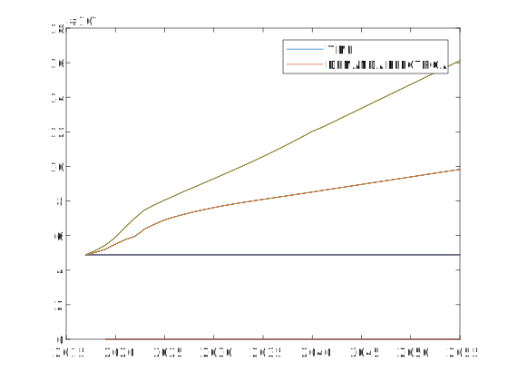
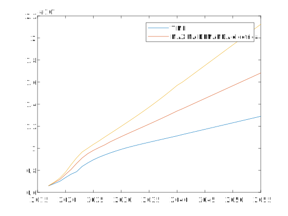
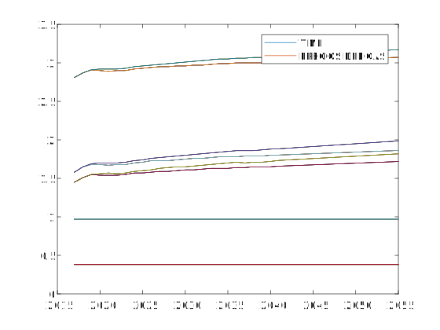
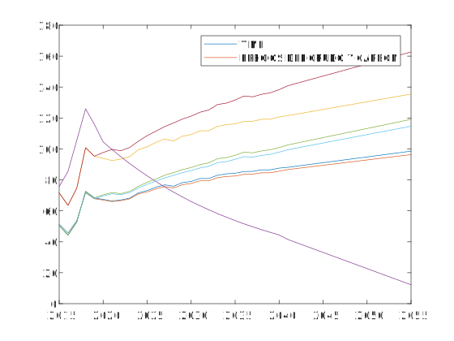
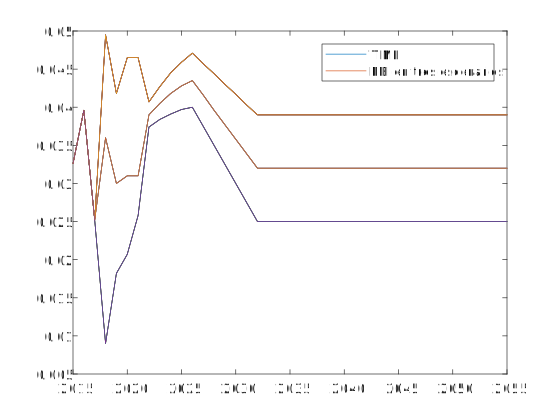
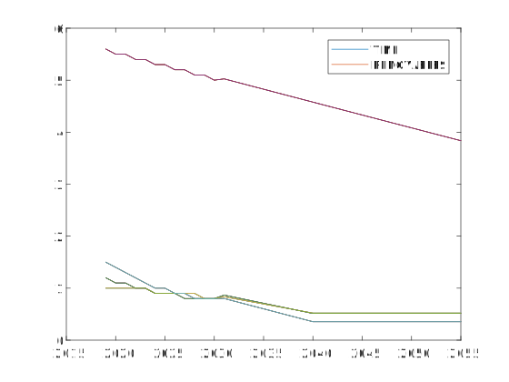

.. _docgen:

Energy System Modeling: Data Analysis
=======================================

Characterization of Energy Sectors
-----------------------------------------------------
 Fitter Data and Outlier Correction
  blaa... 
  
  

   *Figure 2.2: Demanda Electrica en MW-h.*
   
   

   *Figure 2.2: Máxima demanda electrica MW.*
   
   

   *Figure 2.2: Precios del gas en MMUSD/MMBTU.*
   
  

   *Figure 2.2: Precios del crudo en USD/barril.*
   
   

   *Figure 2.2: Proyecciones del PBI.*
   

   *Figure 2.2: Simple diagram for fuel specification.*
   
   
 
 Clustering and Representative Networks
 
 Time-Series Analysis and Forecasting

Electricity Sector Simulation
-----------------------------------------------------
 Data Structure and Elements of Electric System
  power..
 
 Electricity Power Flow and Efficiency
 
 Emissions from Electricity Sector

Transport Sector Simulation
-----------------------------------------------------

 Data Structure and Elements of Transport System
 Traffic Flow Analysis and Efficiency of the System
 Emissions and Air Pollution from Transport Sector

