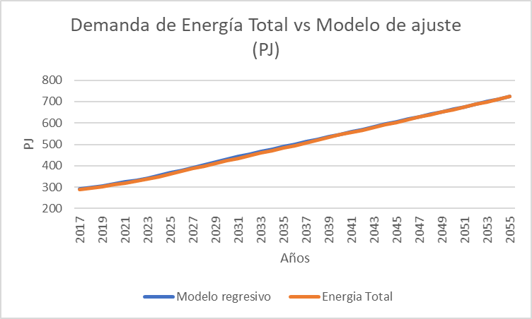
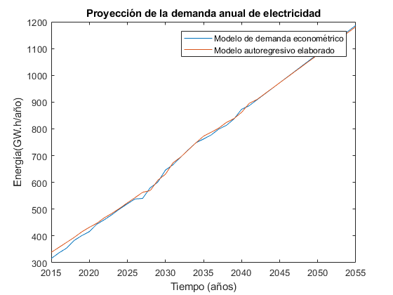
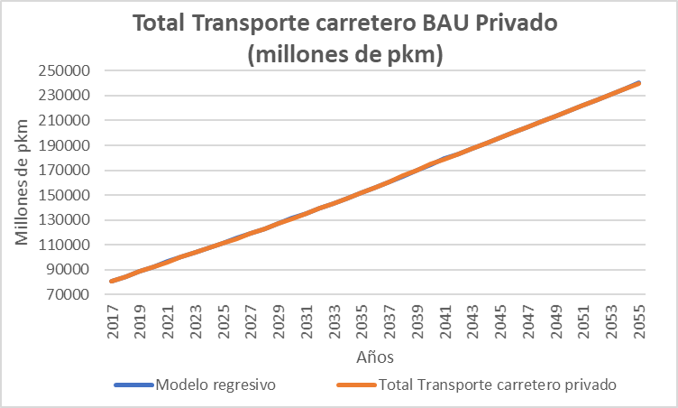
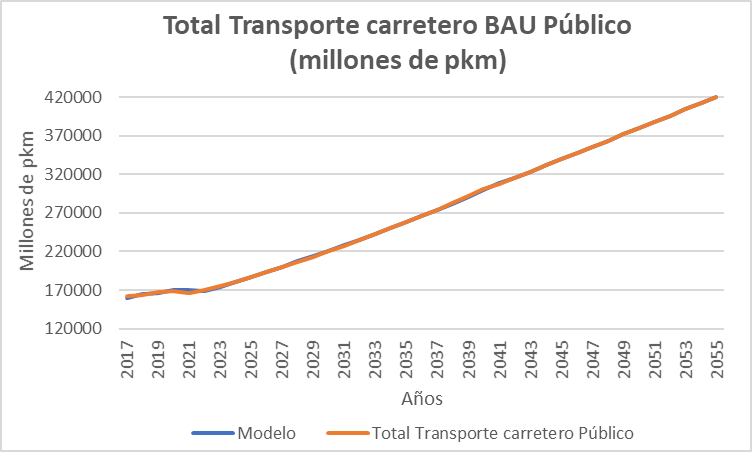
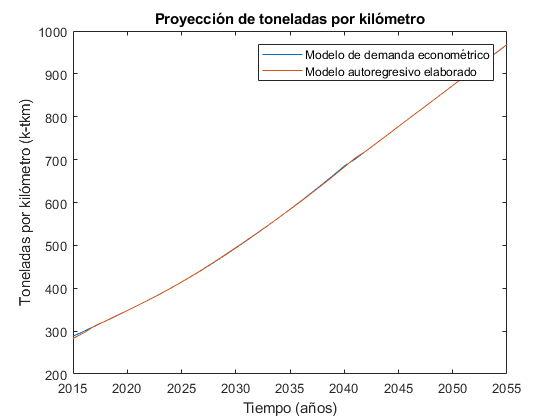
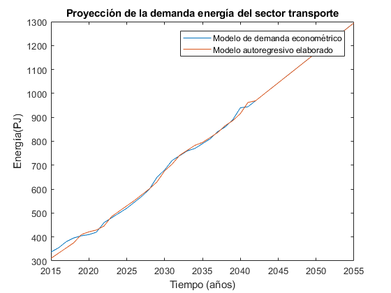
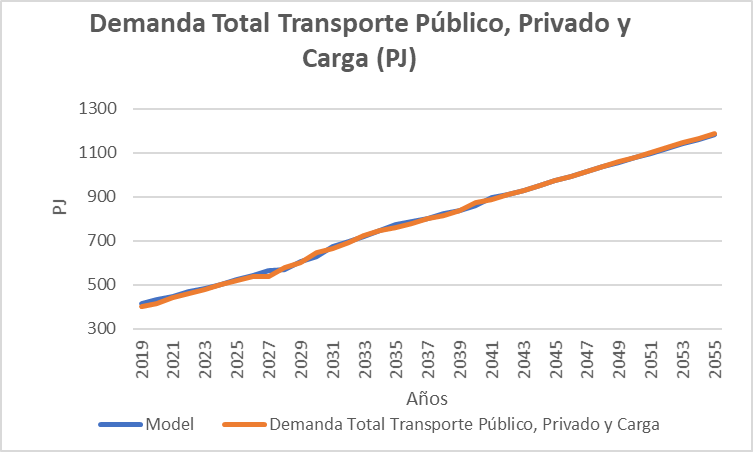

   .. _docgen:

3.1 Energy System Modeling: Data Analysis
=======================================

3.1.1 Characterization of Energy Sectors
-----------------------------------------------------
 Fitter Data and Outlier Correction
  blaa... 
  

.. figure:: img/RES_Energia.png
   :align:   center
   :width:   700 px
*Figure 3.1: Diagrama de referencía*

El sector de energía Peruano se divide ampliamente en los macrobloques de demanda
y de oferta, las tecnologías son mostradas en bloques y estan asociados a los 
commodities que son mostradas como líneas verticales. De los commodities se toma 
una división, la cual va a la tecnología correspondiente para su transformación.    

La diversidad de la matriz energética en el Peru se muestra en una amplia cantidad 
de technologías y commodities, todo este conjunto de información para el sector 
energía han sido tomadas de los informes hechos por el PROSEMER en los cuales su 
principal objetivo es el desarrollo de un modelo para la optimización de la oferta 
del sistema energético basados en modelos de optimización TIMES_ que fue desarrollado 
como parte del IEA-ETSAP's metodología usada para escenarios de energía para conducir 
en un profundo análisis de la energía.

Las tecnologías de entrada son la importación y produción de los commodoties, hay 
tecnologías intermedias como refinación, procesasmiento de gas, producción de 
carbón, plantas de generación, transmisión y distribución de energía eléctrica.
Las commodities inciales son por lo general insumos procesados por tecnologías
o productos importados, estos pasan por tecnologías para su transformación a 
comodities de mayor calidad. 

.. ``bueno ya es hora de divertirse, como para poner lineas de código, esto se debe eliminar``

.. _TIMES: https://iea-etsap.org/index.php/etsap-tools/model-generators/times/

.. Una oración que enlaza a Wikipedia_ y al `Linux kernel archive`_.

.. .. _Wikipedia: http://www.wikipedia.org/
.. .. _Linux kernel archive: http://www.kernel.org/

.. Otra oración con un `enlace anónimo al sitio de Python`__.

.. __ http://www.python.org/

.. `Python <http://www.python.org/>`_. 

3.1.1.1 Procesos
---------
Los procesos o tecnologías son representados en forma de bloque y pueden tener o no una 
entrada de commodities, sin embargo, siempre tienen una salida de commodities, Los procesos 
tienen involucrados costos como CAPEX(Capital Expenditure), OPEX (Operacional Expenditure), los 
costos examinados por capacidad para las plantas de gas y refinerías han sido estudiadas 
para tener datos con los cuales poder suministrar al modelo. Las principales tecnologías 
para el peru se muestran a continuación.

+--------------------+----------------------------------------------------------------------+
|Producción          | La producción de commodities incluye extración, procesamiento,       |
|                    | transformación de materia primaría hasta llegar a ser commodity.     |
+--------------------+----------------------------------------------------------------------+
|Importaciones       | Importaciones incluyen todos los procesos y acciones comerciales para|
|                    | lograr el suministro de commodities al país.                         |
+--------------------+----------------------------------------------------------------------+
|Refinería           | Refinería incluye todo el procesamiento de crudo para la obtención   |
|                    | de los subproductos como la gasolina o el diesel.                    |
+--------------------+----------------------------------------------------------------------+
|Carboneras          | Carboneras incluye el proceso de extracción de una mina carbón       |
|                    | mineral y trasnformación de en carbon vegetal.                       |
+--------------------+----------------------------------------------------------------------+
|Planta de gas       | Las plantas de gas incluye la licuación, transporte de gas           |
|                    |                                                                      |
+--------------------+----------------------------------------------------------------------+
|Plantas eléctricas  | En las plantas eléctricas se incluye todos las plantas de diversos   |
|                    | tipos de tecnologías como las hidroelectricas, termoelectricas, etc. |
+--------------------+----------------------------------------------------------------------+
|Transmisión         | La transmisión eléctrica incluye todos las formas de transmision en  |
|eléctrica           | alta y media tensión.                                                |
+--------------------+----------------------------------------------------------------------+
|Distribución        | La distribución eléctrica incluye distribución en baja tensión       |
|eléctrica           | hasta el usario final.                                               |
+--------------------+----------------------------------------------------------------------+
|Distribución        | La distribución energética incluye todos los medios y procesos para  |
|energética          | la repartición de los productos.                                     |
+--------------------+----------------------------------------------------------------------+
|Transporte          | Transporte en el Perú  incluyen todos las formas de transporte tanto |
|                    | aéreo, marítimo y terrestre, como privado, público y de carga.       |
+--------------------+----------------------------------------------------------------------+
|Residencial, comer- | Esta tecnología incluye todos los procesos de transformación de      |
|cial y carga        | energía para los sectores residencial, comercial y carga.            |   
+--------------------+----------------------------------------------------------------------+
|Agropecuario, Pesqu-| Estas tecnologías incluyen todos los procesos de ransformacion de    |
|ero, industría      |  energía  para los sectores agropecuarios, minero e industría.       |
+--------------------+----------------------------------------------------------------------+

 Todas las tecnologías se puede ver a en Anexos Tecnologías_.

.. Hay que cambiar este hyperlink

.. _Tecnologías: https://github.com/guidogz/Doc_ELP_Peru/blob/master/docs/999Annexes.rst/ 

3.1.1.2 Comodities
---------

Los commodities son los bienes, insumos, productos, etc. Estos ingresan a cada 
tecnología para ser transformados y procesados en otros comodities dentro de toda 
la cadena energética, en el Perú contamos con una gran variedad de commodities desde
insumos primarios como bosta y yesta para producción de carbón hasta la electricidad 
generada por cada tecnología eléctrica y los combustibles consumidos por el sector
transporte, las etiquetas para cada commodity considerados se muestran a continuación.
Los commodities se pueden encontrar en Anexos Fuels_. 

.. _Fuels: https://github.com/guidogz/Doc_ELP_Peru/blob/master/docs/999Annexes.rst/

+--------------------+-----------------------------------------------------------------------+
| Combustibles       | Los combustibles fósiles son residuos de materia orgánica obtenidos   |
| Fósiles            | de forma extrativas, estas son hidrocarburos, gas natural y carbón.   |
+--------------------+-----------------------------------------------------------------------+
| Biocombustibles    | Son los combustibles que son sintetizados a partir de materia organica|
|                    | tales como la cañade azucar, oleaginosas y microalgas                 |
+--------------------+-----------------------------------------------------------------------+
| Electricidad       | La electricidad como commodity, es un producto de la generación de    |
|                    | diferentes tipos de tecnología como la combustión, fotovoltaico.      |
+--------------------+-----------------------------------------------------------------------+
| Demandas de        | Para las demandas de trasnporte puede ser de pasajeros públicos y     |
| Transporte         | privados y carga, falta aún poner esta parte.                         |
+--------------------+-----------------------------------------------------------------------+
| Productos de       | Actualmente se exporta una parte de hidrocarburos y gas natural.      |
| Exportación        |                                                                       |
+--------------------+-----------------------------------------------------------------------+

3.1.1.3 Demandas
---------
Las demandas energética en el Perú son actualmente proyectadas en base a premisas 
macroeconómicas poblacionales y de eficiencia energética, los resultados atienden a 
la necesidad de otros modelos de optimización dentro de la cadena de planifición 
energética, como OPTGEN y TIMES, para luego ser parte de un bucle de optimización 
con la integración del modelo TIMES-CGE. Los resulatdos obtenidos pueden variarse 
al escenario suspuesto, con la finalidad de situarse y analizarlos, además los 
resulatdos estan desagregados en región, tipo de combustible, escenario, etc. 

Por otra parte, los valores proyectados de las series de tiempo para lograr la 
descarbonización del Perú al 2050 utiliza han sido construidos con modelos autoregresivos
que tienen diferentes variables explicativas por sector, las proyecciones al 2050 de 
la demanda para los sectores económicos se muestran la siguiente gráfica, en donde 
la participacion de sector residencial y manufactura son predominantes.  

.. figure:: img/Proyeccion_demanda_energia_por_sector_económico.png
   :align:   center
   :width:   500 px
*Figure 3.1: Predicciones de la demanda de energía por sector productivo*

3.1.1.4 Plantas de generación 
---------
Las empresas de generación en el Perú suman un total de 58 al 2018, las cuales en conjunto
tienen una capacidad instalada de 13179.53 MW y capacidad efectiva de 12636.89 MW, en el 
2019 la producción de energía anual ejecutada se valoró en 52949.19 GW.h  y la máxima 
demanda ejecutada fue de 7017.57 MW en el mes de diciembre. El recurso que tuvo la mayor 
participación de fue el agua con 37.58% seguido del gas natural de camisea 29.87%, la 
potencia efectiva por tipo de generación que tuvo mayor partcipaión fueron las 
termoeléctricas con un 54.67 %. A continuación se presentará las tablas de las empresas 
con sus respectivas potencias efectivas, seguido del tipo de la participación por tipo de 
recurso, tipo de generación y finalmente la energía ejecutada. 

========================== =====================
EMPRESAS                     "POTENCIA EFECTIVA 
                                   (MW)"
========================== =====================
ENGIE                         2,484.8
KALLPA GENERACIÓN             1,615.8
ENEL GENERACIÓN PERÚ          1,481.6
ELECTROPERÚ                     914.7
SAMAY I                         708.3
FÉNIX POWER                     567.2
HUALLAGA                        476.7
STATKRAFT                       448.0
ORAZUL ENERGY PERÚ              375.8
ENEL GENERACIÓN PIURA           343.6
TERMOCHILCA                     303.3
ENEL GREEN POWER PERÚ           276.8
PLANTA RF ETEN                  223.9
EGASA                           223.3
CELEPSA                         222.5
CHINANGO                        195.5
MINERA CERRO VERDE              178.0
TERMOSELVA                      176.0
EGEMSA                          168.8
SAN GABÁN                       115.7
ENERGÍA EÓLICA                  114.0
HUANZA                           98.3
TRES HERMANAS                    97.2
INLAND ENERGY                    89.8
EGEJUNÍN                         73.1
SHOUGESA                         62.4
IYEPSA                           58.5
EGESUR                           55.1
MARCONA                          32.0
SINERSA                          29.6
SDF ENERGÍA                      28.4
GENERACIÓN ANDINA                27.4
GEPSA                            27.0
AGROAURORA                       20.4
ANDEAN POWER                     20.4
AGUA AZUL                        20.2
GTS MAJES                        20.0
GTS REPARTICIÓN                  20.0
PANAMERICANA                     20.0
RÍO BAÑOS                        20.0
TACNA SOLAR                      20.0
CELEPSA RENOVABLES               19.9
HUANCHOR                         19.8
SANTA ANA                        19.6
RÍO DOBLE                        19.2
MOQUEGUA FV                      16.0
HUAURA POWER                     15.0
ELECTRO ZAÑA                     13.2
AIPSA                            12.7
BIOENERGÍA DEL CHIRA             12.0
PETRAMÁS                          9.3
AGROINDUSTRIAS SAN JACINTO        6.8
EGECSAC                           5.2
HIDROCAÑETE                       4.0
ELÉCTRICA YANAPAMPA               3.9
MAJA ENERGÍA                      3.5
ATRIA ENERGÍA                     1.7
HYDRO PATAPO                      1.0
-------------------------- ---------------------
TOTAL                        12,636.89
========================== =====================
*Estadística Anual 2019, Capítulo 2 - Estado actual de la infraestructura del SEIN, Cuadro 2.3*

============================== ========================== =============
POTENCIA EFECTIVA POR TIPO DE RECURSO ENERGÉTICO 2019       
-----------------------------------------------------------------------
TIPO DE RECURSO ENERGÉTICO     POTENCIA EFECTIVA (MW)        (%)    
============================== ========================== =============
  AGUA                                  4,748.37               37.58 
  RENOVABLES                            1,041.01                8.24 
  GAS NATURAL DE CAMISEA                3,775.21               29.87 
  GAS NATURAL DE AGUAYTIA                 176.05                1.39 
  GAS NATURAL DE MALACAS                  343.61                2.72 
  DIESEL 2                              2,334.21               18.47 
  RESIDUAL                                 77.73                0.62 
  CARBÓN                                  140.71                1.11 
------------------------------ -------------------------- -------------
  TOTAL                                12,636.89              100.00     
============================== ========================== ============= 

*Estadística Anual 2019, Capítulo 2 - Estado actual de la infraestructura del SEIN, Cuadro 2.5*

====== =============== ============== ======= ======== ============
POTENCIA EFECTIVA POR TIPO DE GENERACIÓN A DICIEMBRE 2019 (MW)             
-------------------------------------------------------------------               
ÁREA   HIDROELÉCTRICA  TERMOELÉCTRICA  SOLAR   EÓLICA    TOTAL
====== =============== ============== ======= ======== ============
NORTE      610.07           801.24             114.01    1,525.32 
CENTRO   3,839.10         4,075.82             261.45    8,176.38 
SUR        618.48         2,031.69     285.02            2,935.20 
------ --------------- -------------- ------- -------- ------------
TOTAL    5,067.66         6,908.75     285.02  375.46   12,636.89 
====== =============== ============== ======= ======== ============
*Estadística Anual 2019, Capítulo 1 - Estadística relevante del SEIN, Cuadro 1.5*

====== ================ ================ ====== ========== =========================== ==========
PRODUCCIÓN DE ENERGÍA Y MÁXIMA DEMANDA - 2019  (GWh)  
------------------------------------------------------------------------------------------------- 
ÁREA    HIDROELÉCTRICA   TERMOELÉCTRICA  SOLAR    EÓLICA   "IMPORTACIÓN DESDE ECUADOR"   TOTAL
====== ================ ================ ====== ========== =========================== ==========
NORTE     3,370.54           757.83                443.68          60.05                 4,632.10 
CENTRO   22,735.89        19,504.41              1,202.48                               43,442.79 
SUR       4,061.99            50.59      761.73                                          4,874.31 
TOTAL    30,168.43        20,312.83      761.73  1,646.16          60.05                52,949.19 
====== ================ ================ ====== ========== =========================== ==========
*Estadística Anual 2019, Capítulo 1 - Estadística relevante del SEIN, Cuadro 1.7*

|
|        **Las proyecciones de la demanda de energía y máxima demanda eléctrica**
|

.. figure:: img/Proyeccion_de_la_maxima_demanda_de_electricidad_anual.png
   :align:   center
   :width:   700 px
*Figure 3.8: Proyección de la maxima demanda de electricidad anual*

.. figure:: img/Proyeccion_de_la_demanda_de_electricidad_anual.png
   :align:   center
   :width:   700 px
*Figure 3.9: Proyección de la demanda de electricidad anual*

Para ambas tipos de proyecciones se va a considerar únicamente las zonas del país 
conectadas al SEIN. Iquitos no se incluye en el modelaje.

3.1.1.5 Plantas de gas 
---------

Las plantas de gas en el peru suman 8 en las cuales tenemos que 3 son exclusivamente de 
procesamiento, 3 son únicamente de fraccionamiento, 1 de procesamiento y fracionamiento y 
finalmente 1 de licuación, en conjunto suman una capacidad instalada de 1333 PJ con una 
disponibilidad promedio de 92% y un factor de capacidad promedio de 48%. Los costos de 
tratamiento de gas en las plantas se valorizan en 4228.2 MMUSD en el 2013 y tuvo una 
actividad de 639 PJ. En las siguientes tablas se muestra la información.

=================== ==================== =============================== =======
Plantas de gas      Capacidad instalada   Tipo de tratamiento            Región
                         PJ (2018)   
=================== ==================== =============================== =======         
Malvinas                  804            Procesamiento                   Sur
Curimaná                   29            Procesamiento                   Oriente
GMP-procesamiento          18            Procesamiento                   Norte
GMP-fraccionamiento        5             Fraccionamiento                 Norte
Pisco                      215           Fraccionamiento                 Sur
Yarinacocha                8             Fraccionamiento                 Oriente
Pariñas                   16             Procesamiento y Fraccionamiento Norte
Pampa Melchorita          238            Licuefacción                    Centro
------------------- -------------------- ------------------------------- -------
Total                    1333
=================== ==================== =============================== =======    
*Anexo 2 - informe 9 prosemer, página 101 *

================== ================ =======
Sector                Costo          2013
================== ================ =======
TRATAMIENTO - GAS   OPEX VARIABLE    981,4
TRATAMIENTO - GAS   OPEX FIJO       3246,7
TRATAMIENTO - GAS   CAPEX 
------------------ ---------------- -------
TRATAMIENTO - GAS   TOTAL           4228,2
================== ================ =======
*Imforme 9, página 303*

========== =============
Producto    PJ (2013)
========== =============
Gas seco**    457
LGN           182
---------- -------------
Total         639
========== =============
*Informe 9 pag. 303*

|
|          **Las proyecciones del precio del gas natural y cotos por capacidad**
|

.. figure:: img/Proyeccion_del_precio_del_gas_en_la_planta.png
   :align:   center
   :width:   700 px

*Figure 3.4: Proyección del precio del gas en la planta*

Los precios del gas han utilizado como base las proyeciones de "high oil and gas 
resource and technology" (HRT) del EIA que han sido proyectadas hasta el 2050, y 
como las proyeciones del caso de referencia EIA . 

.. figure:: img/Proyeccione_de_precio_por_capacidad_de_la_planta_de_gas.png
   :align:   center
   :width:   700 px

*Figure 3.6: Proyecciones de los costos por capacidad de la planta de gas*

Los cálculos se hicieron con los datos de costos de capital y operación de plantas 
de gas y la actividad de las refinería que se encuentran en el informe 9 "Desarrollo 
del Plan Energético a Nivel de Grupos de Regiones y Acompañamiento".  

   

3.1.1.6 Refinerías 
---------

Las refinerías en el Perú suman un total de 9, las cuales en conjunto tienen una 
capacidad de producción de 221-228 miles de barriles diarios, el milagro ya no se considera
como un refinería economicamente viablea partir del 2016, con una disponibilidad 
en promedio del 90%, esta capacidad de procesamiento cambiará después de la modernización 
de la refinería de talara, su capacidad será de 245.3 miles de barriles diarios.
La produción en PJ de energía en el año 2017 alcanzó un total de 350 con una producción  
de 91459.9 barriles, y tambien para el mismo año los costos operativos se valorizaron en 
492.6 MMUSD, en las siguinetes tablas se puedes apreciar estas cifras. 

=========== ============================ ======================================= ==========
Refinería    Capacidad instalada (2018)  Tipo de combustible refinado            Región
----------- ---------------------------- --------------------------------------- ----------
Nombre         Miles de barriles de
               petróleo día (MBPD)
=========== ============================ ======================================= ==========
Talara        65-95                      Diesel, Turbo, GLP, Fueloil, Gasolina   Norte
Conchán       15.5                       Diesel, Fueloil, Gasolina               Centro
Pampilla      110-(*117)                 Diesel, Turbo, GLP, Fueloil, Gasolina   Centro
Iquitos       12.0                       Diesel, Turbo, Fueloil, Gasolina        Oriente
Pucallpa       3.3                       Diesel, Turbo, Gasolina                 Oriente
El Milagro      2                        Diesel, Turbo, Fueloil, Gasolina        Norte
Huayuri        4.0                       Crudo multiuso, Diesel, HFO, Nafta      Oriente
Shiviyacu      5.2                       Crudo, Diesel, Nata, Residual, Multiuso Oriente
Yacimiento     4.0                       Crudo, Diesel, HFO, Nafta/Residual      Oriente
=========== ============================ ======================================= ==========
*Anexo 2 - informe 9 PROSEMER, informe 7 PROSEMER, OSINERGMIN*

========== ==========
Producto    2017 (PJ)
========== ==========
Diesel      103,9
Fueloil     119,0
Gasolina     88,6
GLP           9,4
Turbo        29,5
---------- ----------
Total       350,5
========== ==========
*Informe 9 PROSEMER, pag. 302* 

============ ======= ============
Sector        Costo  2017 (MMUSD)
============ ======= ============
REFINERIAS    OPEX    412,4
REFINERIAS    CAPEX    80,1
------------ ------- ------------ 
REFINERIAS    TOTAL   492,6
============ ======= ============
*Informe 9 PROSEMER, pag. 302*

|
|                  **Las proyecciones del precio del crudo y cotos por capacidad**
|

.. figure:: img/Proyeccion_del_precio_promedio_del_crudo.png
   :align:   center
   :width:   700 px

*Figure 3.5: Proyección del precio promedio del crudo*

Para la proyección del precio del crudo se ha utilizado las proyecciones de WTI que 
se estabblecen en dos escenarios uno es el de referencia y el otro es el alto, se 
incluyen todos los costos, el crudo tienen un costos de integración de 5 US$/bbl.

.. figure:: img/Proyeccione_de_precio_por_capacidad_de_refineria.png
   :align:   center
   :width:   700 px
*Figure 3.7: Proyecciones de los costos por capacidad de la refineria*

Los cálculos se hicieron con los datos de costos de capital, operación y variación de 
plantas de refinación y la actividad de las refinería que se encuentran en el informe 9 
"Desarrollo del Plan Energético a Nivel de Grupos de Regiones y Acompañamiento".  

3.1.1.7 Carboneras 
---------
Para el 2013 la capacidad instalada de procesamiento de carbon es de 5.08 PJ, 2.97 para 
la región centro y 2.11 para la región norte, además se asume un costo de producción de 
2.71 MMUSD/PJ que incluye todos lo contos de extración, mina, transporte y acopio. Tambien
se consideró un costo de inversión 2,76 MMUSD/PJ para incrementar la capacidad existente y 
disminuir los costos existentes, cabe mencionar que los valores de transporte para la región 
norte y centro son de 0.69 MMUSD/PJ.

=========== ===========================
Carboneras  Capacidad instalada (2013)
                      PJ-año
=========== ===========================
Norte                  2.11
Centro                 2.97
----------- ---------------------------
Total                  5.08
=========== ===========================

============ ======= ================
Sector        Costo  2017 (MMUSD/PJa)
============ ======= ================
CARBONERAS    TOTAL     2.71
------------ ------- ----------------
CARBONERAS    TOTAL     2.71
============ ======= ================

|
|                  **Las proyecciones del precio del crudo y cotos por capacidad**
|

.. figure:: img/Proyeccion_del_precio_de_carbon.png
   :align:   center
   :width:   700 px

*Figure 3.3: Proyección del precio de carbon*

Para la proyección de los precios del carbón se utliza las proyección del carbon 
australia del banco mundial (octubre del 2018), todos los costos de internación 
son considerados e incluye  flete y otros costos de transporte, el carbón tiene 
un costo de internación  de 18.6 US$/ton.

3.1.1.8 Distribución de energía
---------

3.1.1.9 Importaciones 
---------

3.1.1.10 Exportaciones
---------

3.1.1.11 Producción
---------

3.1.1.12 Transporte de pasajeros 
---------

.. figure:: img/proyecion_sector_transporte_publico_privado.png
   :align:   center
   :width:   700 px
*Figure 3.10: Proyección del sector transporte publico y privado.png.*

   
.. figure:: img/proyecion_sector_transporte.png
   :align:   center
   :width:   700 px
*Figure 3.12: Proyección del sector transporte.*

.. figure:: img/Proyeccion_del_precio_de_vehiculos_electricos.png
   :align:   center
   :width:   700 px
*Figure 3.13: Proyección del precio de vehiculos electricos.*

3.1.1.13 Transporte de carga
---------

.. figure:: img/proyecion_sector_transporte_carga.png
   :align:   center
   :width:   700 px
*Figure 3.11: Proyección del sector transporte carga.png.*
   

3.1.1.14 Otros consumos energéticos 
---------

3.1.1.15 Emisiones
---------

Las emisiones en un futuro cercanos se volveran un serio problema, no sólo medioambiental
sino existencial, ahora nos embarcamos en una lucha por reducir los productos de 
contaminación y la principal acción del sector energía y transportes es sustituir
los insumos que podrucen contaminación, las políticas climáticas hoy en día han 
planificado al 2050 lograr la carbononeutralidad.   

 

3.1.2 Proyección de demanda - Ecuaciones para las proyecciones de las proyecciones de los sectores
--------------

**3.1.2.1 Ecuaciones generales para Residencial, Comercial, Publico y Sectores Productivos**

ANTES DE LA INTEGRACIÓN

Se consideran 7 divisiones.

- k=1, (Residencial)
- k=2, (Comercial 
- k=3, (Público)
- k=4, (Industrial manufacturera en general)
- k=5, (Pesca)
- k=6, (Agropecuaria)
- k=7, (Minería y metalurgia)

 DESPÚES DE LA INTEGRACIÓN

Se consideran 6 divisiones.

- k=1, (Residencial)
- k=2, (Comercial y Público)
- k=3, (Industrial manufacturera)
- k=4, (Pesca)
- k=5, (Agropecuaria)
- k=6, (Minería y metalurgia)

**proyección del consumo de energía neta de los macro sectores**

Para obtener la proyección del consumo de energía neta de los macro sectores Edificaciones (re-sidencial y comercial, servicios y público) y Agropecuario/Industrial (industrial, pesquería, agro-pecuaria y minería) se plantea un modelo de regresión lineal, mediante el cual se estiman los coe-ficientes 𝛼𝑘, 𝛽𝑘, 𝛾𝑘, 𝜃𝑘 por el método Mínimos Cuadrados Ordinarios (MCO) para cada segmento:

.. math::

 \begin{equation}\ln \left(E_{t, k}\right)=\alpha_{k}+\beta_{k} \ln \left(E_{t-1, k}\right)+\gamma_{k} \ln \left(P I B_{t-1}\right)+\theta_{k} T e n d_{t}\end{equation}

Donde:

-𝑘              Índice del segmento: 𝑘=1 residencial, 𝑘=2 comercial, 𝑘=3 público, 𝑘=4 In-dustrial 
                manufacturera en general, 𝑘=5 pesca, 𝑘=6 agropecuaria y 𝑘=7 minería y metalurgia.
-𝐸𝑡,𝑘           Consumo de Energía final del segmento k, año 𝑡
-𝑃𝐼𝐵𝑡           Producto Interno Bruto del año 𝑡
-𝑇𝑒𝑛𝑑𝑡          Variable de tendencia lineal, año t
-𝛼𝑘,𝛽𝑘,𝛾𝑘,𝜃𝑘    Parámetros por sector k

Luego, con los coeficientes de regresión estimados y las tasas de crecimiento de las variables ex-plicativas se procede a calcular las proyecciones.
La proyección de la energía final anual se desagrega por commodity i para k=1,2,3 utilizando la ecuación:   

.. math::

 \begin{equation}d_{t, r, i, k}=E_{t, k} \times \varphi_{i, r, k}\end{equation}

Donde:
-i                Commodity: electricidad, gas de red, carbón vegetal, GLP y leña si k = 1,                   
                   o electricidad, gas de red, carbón vegetal, GLP, leña (sumada con bosta y yareta),         
                  Diesel, gasohol (sumado con gasolina) y queroseno si k =2,3; o utilizada por 
                  el servicio energético n, o sea, i(n) para k>3.
                  Los servicios energéticos son: n=1 para calor de proceso, n=2 para fuerza motriz 
                  y n=3 para electricidad. Los datos provienen del BEU, 2013.
-r               Índice de la región: Centro, Norte, Oriente, Sur
-𝑑𝑡,𝑟,𝑖,𝑘         Energía final de la commodity 𝑖 para el segmento k, región r, año 𝑡
-𝜑𝑖,𝑟,𝑘           Fracción de la energía final del segmento k asociada a la commodity i y región 
                  r. Valores provenientes del BEU 2013.

La energía útil por commodity, utilizada por los sectores k=1 (residencial), k=2 (comercial), k=3 (público), considera también la eficiencia de conversión en cada caso.

.. math::

 \begin{equation}u_{t, r, i, k}=d_{t, r, i, k} \times \eta_{i, r, k}\end{equation}

Donde:
-𝜂𝑖,𝑟,𝑘            Eficiencia promedio, en p.u., de los procesos que involucran la com-modity i 
                    en la región r, segmento k (proveniente del BEU)
-𝑢𝑡,𝑟,𝑖,𝑘          Energía útil de la commodity 𝑖 para el segmento k, región r, año 𝑡

La energía útil por servicios energéticos, utilizada por los sectores industriales (k>3), se calcula con la fórmula abajo. Estos valores serán también utilizados por el modelo TIMES. El valor base de energía útil para la proyección es proveniente del BEU 2013 o del BNE 2013.

.. math::

 \begin{equation}u_{t, r, n, k}=\frac{E_{t, k}}{E_{t-1, k}} \times u_{t-1, r, n, k}\end{equation}

-𝑢𝑡,𝑟,𝑛,𝑘         Energía útil del servicio energético 𝑛 para el segmento k, región r, año 𝑡.

**3.1.2.2 Ecuaciones generales para Transporte**

La proyección del consumo de energía del sector de transporte considera los modales de trans-porte de pasajero por carretera (privado y público) y de carga, el ferroviario (pasajero y carga), el marítimo, aéreo y metro, como indica la tabla abajo. Sigue un abordaje bottom up. La siguiente tabla muestra las variables que se proyectan.
Esta modelación del sector transporte puede ser modificada con nuevos procesos o tecnologías y para ello el consorcio se compromete a apoyar al MINEM a partir del mes de mayo de 2018 a los efectos de implementar estos cambios. Más allá de ello, para la proyección de la oferta (Informe 9) se están considerando nuevas tecnologías “candidatas” en el sector transporte, por ejemplo, transporte eléctrico(vehículos).

==== ==================== ======================= ==================== ======================
m     Modal                  Pasajero                Uso                   Resultado
==== ==================== ======================= ==================== ======================
01    Por carretera          Pasajero público        Autobús               pkm
02    Por carretera          Pasajero público        Microbús              pkm
03    Por carretera          Pasajero público        Furgoneta             pkm
04    Por carretera          Pasajero privado        Automotor +SW         pkm
05    Por carretera          Pasajero privado        Motocicleta           pkm
06    Por carretera          Pasajero privado        Camioneta             pkm
07    Por carretera          Carga                   Camión L              tkm
08    Por carretera          Carga                   Camión M              tkm
09    Por carretera          Carga                   Camión P              tkm
10    Por carretera          Carga                   Camioneta             tkm
11    Por carretera          Carga                   Furgoneta             tkm
12    Ferroviario            Pasajero                Líneas 1,2,3          pkm
13    Ferroviario            Carga                   Líneas 1 e 2          tkm
14    Naval                  Pasajero & Carga                              En. neta
15    Aéreo                  Pasajero & Carga                              En. neta
16    Metro                  Pasajero                                      En. neta
17    Transporte masivo      Pasajero                                      pkm
==== ==================== ======================= ==================== ======================

   
**3.1.2.2.1 Transporte de pasajeros y de carga por carretera**

La metodología utilizada para proyectar el consumo de energía útil de transporte privado de pa-sajeros por carretera consiste en las siguientes etapas:

1. Para la proyección de venta por tipo de modal m1 se plantea un modelo de regresión lineal por el método Mínimos Cuadrados Ordinarios (MCO), en función del PIB o de la Población según el tipo modal:

.. math::

 \begin{equation}\ln \left(Q_{t, m}\right)=\alpha_{m}+\beta_{m} \ln \left(P O B_{t}\right)\end{equation}

*para m = 12*

.. math::

 \begin{equation}\ln \left(Q_{t, m}\right)=\alpha_{m}+\beta_{m} \ln \left(P I B_{t}\right)\end{equation}

*para m = 13, 14 y 15*

-𝑄𝑡,𝑚       Ventas de vehículos de la categoría m en el año 𝑡 o número de pasajeros / carga transportada para el modal m en el año t.
-𝛼𝑚, 𝛽𝑚    Parámetros (𝛼12=-71.92, 𝛽12=5.01, 𝛼13=5.77, 𝛽13=0.78, 𝛼14=-4.43, 𝛽14=1.33, 𝛼15=-9.22, 𝛽15=1.27)
-𝑃𝐼𝐵𝑡        PIB en el año 𝑡
-𝑃𝑂𝐵𝑡       Población en el año 𝑡

Para 12 < m < 15 𝑄𝑡,𝑚denota número de pasajeros o carga transportada en el año t, de acuerdo con el caso.

**Cálculo de la flota circulante de vehículos para cada año:**

.. math::

 \begin{equation}F_{t, y, m}=\left(1-e^{-e^{-(\delta m+\gamma m(t-y))}}\right) \times Q_{y, m}\end{equation}

*para m = 3,4,6 y 11*

.. math::

 \begin{equation}F_{t, y, m}=Q_{y, m} \times\left(1-\lambda_{t-y, m}\right)^{t-y}\end{equation}

*para m = 5*

.. math::

 \begin{equation}F_{t, y, m}=\left(\frac{1}{1+e^{\left(\gamma m^{\left(t-y-t_{m}\right)}\right)}}+\frac{1}{\left.1+e^{\left(\gamma m^{\left.\left(t-y+t_{m}\right)\right)}\right.}\right)} \times Q_{y, m}\right.\end{equation}

*para m = 1,2,7,8,9 y 10*

Donde:

-𝐹𝑡,𝑦,𝑚      Número de vehículos del tipo m fabricados en el año y en la flota del año t
-𝛿𝑚,𝛾𝑚,𝑡𝑚   Parámetros (t1=t2=19.1; t6=15.3; t7=t8=t9=t10=17.0)
-𝜆𝑡−𝑦,𝑚      6%, para t-y  5 años; 7%, para 6  t-y  10 años; 8%, para 10  t-y  15 años; 10%, para t-y >15  
             años (ref. SINDIPEÇAS (2009))

**Cálculo del kilometraje promedio anual recorrido por la flota:**

.. math::

 \begin{equation}L_{t, m}=\sum_{y=1991}^{t}\left[F_{t, y, m} \times l_{t-y, m}\right]\end{equation}

Donde:

-𝐿𝑡,𝑚             Distancia promedio recorrida por la flota de tipo m en el año t
-𝑙𝑡−𝑦,𝑚           Distancia promedio recorrida por vehículos de tipo m con 𝑡−𝑦 años 
                  (reducción de intensidad de uso aumento de la edad del vehículo)

**Proyección de pasajeros kilómetro por carretera por región. Estos resultados serán utili-zados por el TIMES.**

.. math::

 \begin{equation}p k m_{m, t, r}=L_{t, m} \times N_{m} \times \phi_{r, m}\end{equation}

.. math::

 \begin{equation}t k m_{m, t, r}=L_{t, m} \times T_{m} \times \phi_{r, m}\end{equation}

-𝑝𝑘𝑚𝑚,𝑡,𝑟        Proyección de pasajero-km (pkm) para modal m, año t y región r
-𝑡𝑘𝑚𝑚,𝑡,𝑟        Proyección de carga-km (tkm) para modal m, año t y región r
-𝑁𝑚             Pasajeros promedios transportados por vehículo del tipo m
-𝑇𝑚              Toneladas promedio de carga transportadas por vehículo de tipo m
-𝜙𝑟,𝑚            Fracción de pkm o tkm que ocurre en la región r (Σ𝜙𝑟,𝑚=1𝑟)

**3.1.2.2.2 Transporte de pasajeros y de carga por ferrocarril**

La metodología usada para proyectar el consumo de energía útil de transporte ferroviario de pa-sajero (m=12) y carga (m=13) consiste en las siguientes etapas:

**Cálculo del kilómetro recorrido por vagón de pasajero, para cada empresa:**

.. math::

 \begin{equation}k m_{-} W_{m, l}=E W_{m, l} / \eta_{m, l, 1} / N_{m, l}\end{equation}

Donde:

-l                 Índice de la línea férrea (Central Andina; Perú Rail; Inca Rail)
-𝑘𝑚_𝑊𝑚,𝑙          Distancia recorrida por vagón de pasajero o carga en 2013
-𝐸𝑊𝑚,𝑙            Consumo de energía en MJ de la línea l (BEN,2013)
-𝜂𝑚,𝑙,1            Rendimiento (MJ/km) de la línea l (BEU, 2013)
-𝑁𝑚,𝑙              Número de vagones de la línea l de pasajeros (o carga) en 2013

**Cálculo del número de pasajeros o carga por kilómetro por empresa:**

-𝜔𝑚,𝑙             Pasajeros o toneladas de carga transportados por km
-𝜂𝑚,𝑙,2            Rendimiento: energía (MJ/pasajero o MJ/t) (BEU, 2013)

**Proyección del crecimiento del número de pasajeros o carga transportada por ferrovías como una función del crecimiento poblacional (ecuación 05-1) o PIB (ecuación 05-2).**

**Aplicación de la tasa de crecimiento para proyectar el número de vagones de pasajeros o carga para las líneas férreas l (cuja región r es conocida).**

.. math::

 \begin{equation}W_{t, m, l}=W_{t-1, m, l} \times \frac{Q_{t, m}}{Q_{t-1, m}}\end{equation}

**Cálculo de la proyección del número de pasajeros kilómetros:**

.. math::

 \begin{equation}p k m_{m, t, r}=\sum_{l}\left(W_{t, m, l} \times k m_{-} W_{m, l} \times \omega_{m, l}\right)\end{equation}

Mediante el procedimiento arriba y los datos del BEU se obtiene el consumo de energía final por commodity a través del rendimiento de cada tipo de vehículo, porcentaje de la flota que consume determinado tipo de combustible y kilometraje promedio anual que la flota recurre:

.. math::

 \begin{equation}d_{t, m, i}=L_{t, m} \times \psi_{m, i} \times \eta_{m, i}\end{equation}

Donde:

-𝑑𝑡,𝑟,𝑖          Proyección de consumo por commodity i (ej. MJ de gasolina)
-𝜓𝑚,𝑖           Fracción de la flota de 2013 del modal m que usa la commo-dity i
-𝜂𝑚,𝑖           Rendimiento (PJ/km) del vehículo m con la commodity i (BEU)

**3.1.2.2.3 Transporte naval y aéreo**

La metodología utilizada para proyectar el consumo de energía final de transporte naval consiste en las siguientes etapas:
1. Proyección de la carga naval o pasajeros transportados por avión por la ecuación (05-2).
2. Cálculo de la proyección del consumo de energía final

.. math::

 \begin{equation}E_{t, m}=E_{t-1, m} \times \frac{Q_{t, m}}{Q_{t-1, m}}\end{equation}

Donde:

-𝐸𝑡,𝑚              Consumo de energía final en el año 𝑡 para el modal m.
-𝑄𝑡,𝑚/𝑄𝑡−1,𝑚       Crecimiento del número de pasajeros/carga transportada para el modal m en el año t y t-1.

A través del procedimiento arriba y de los datos del BEU se obtiene el consumo de energía final por commodity para el modal naval (gasolina, diésel y aceite combustible) y aéreo (queroseno)

.. math::

 \begin{equation}d_{t, m, i}=\psi_{m, i} \times E_{t, m}\end{equation}

Donde:

-𝑑𝑡,𝑚,𝑖            Consumo por commodity i del modal m (ej. MJ de gasolina)
-𝜓𝑚,𝑖              Fracción de la flota de 2013 del modal m que usa la commodity i

3.1.3 Modelos de ajuste del sector energía
---------

Para determinar las proyecciones futuras de la demanda energética por sector de 
se necesitan información acerca del PBI, consumo de energía por sector de periodos 
pasados, parámetros propios de cada sector para poder hacer las proyecciones con 
métodos autoregresivos. Los valores utilizados del PBI se han adquirido del Anexo 2 
del Informe 9 del prosemer.
    
.. figure:: img/Proyeccion_del_crecimiento_del_PBI_anual.png
      :align:   center
      :width:   500 px
*Figure 3.1: Proyección del crecimiento del PBI anual*

Para los valores proyectados se utilizaron los valores proporcionados para el 
periodo 2016-2026 por la consultora APOYO, los valores para el periodo 2027-2040 
se tomaron de los escenarios proporcionados por el MINEM y para el periodo 
2040-2055 se tomaron la proyección de la tendencia de los valores de los últimos 
10 años anteriores al 2040. 

**Las ecuaciones utilizadas para la proyección**

Con base a la información obtenida del PROSEMER sobre las proyecciones de demanda 
de energía por sectores, para los sectores Comercial, Publico, Agro, Pesca, Minero 
e Industria Manofactura, se calculó la proyección demanda de energía total para estos
sectores en PJ, *(Ecuación 1)*.

.. math::

 Demanda Energia Total sectores $=$ Dem. S. Comercial $+$ Dem. S. Público $+$ Dem. S. Agro $+$ Dem. S. Pesca + Dem. S. Minero $+$ Dem. S. Industria Manofactura
 
Con esta nueva variable y con el Escenarios de crecimiento del PIB (% anual) Demanda
Media se construyó un modelo regresivo, que permita obtener escenarios para la proyección 
de la demanda total de energía a partir de las variaciones del PBI. La ecuación 2 
presenta el modelo estimado para la demanda total de energía en PJ y el valor de los 
coeficientes es presentado en la tabla 1. 
 
..  The area of a circle is :math:`A_\text{c} = (\pi/4) d^2`.  

.. math::

 \text { Dem. E.Total }_{t}=\alpha * \text { Dem. E.Total}_{t-1}+\beta * P B I_{t}+\gamma * P B I_{t-1}+\varepsilon

*Tabla 1 – Coeficientes del modelo*

+----------------+----------------------------+
| Coeficiente    |  Valor                     |
+----------------+----------------------------+
| α              |  0.683612583511262         |
+----------------+----------------------------+
| β              |  3.98953737951962          |
+----------------+----------------------------+
| γ              |  -0.272134255254439        |
+----------------+----------------------------+
| ε              |  -0.009138684795543        |
+----------------+----------------------------+ 

Siendo que, para el uso eficiente del modelo, la demanda de energía total debe ser 
previamente diferenciada y normalizada, la ecuación 3 presenta la normalización a 
utilizar. Obtenido el valor de demanda con el modelo este debe desnormalizado e 
integrado (proceso inverso) para obtener el valor real de demanda de energía total.

.. math::

 $Y_{i}=\frac{X_{i}-0.75 \operatorname{Min}_{X}}{1.25 \operatorname{Max}_{X}-0.75 \operatorname{Min}_{X}}$

Donde :math:`Y_i`  es el valor normalizado de la demanda, :math:`X_i` es un valor del vector de demandas
correspondiente al año :math:`i`, :math:`〖Min〗_X` es el valor mínimo del vector de demanda 
(5 para este caso) y :math:`〖Max〗_X` es el valor máximo del vector de demanda
(14 para este caso). La figura 1 presenta la curva de la proyección demanda de energía 
total para estos sectores en PJ y la curva de ajuste obtenida con el modelo regresivo. 
Este modelo presenta un MAPE de :math:`=0.6%`.

*Figura 1 - Proyección demanda de energía total y modelo de ajuste de demanda*

*____________________________________________________________________*

 Clustering and Representative Networks
 
 Time-Series Analysis and Forecasting

3.1.4 Modelo de ajuste del sector eléctrico
----------
 Data Structure and Elements of Electric System
  power..

**Modelo para ajustar el Demanda de electricidad anual para un escenario base (PBI demanda media)(GW.h/año)**

Con el pasado de la Demanda de electricidad anual y con el Escenarios de crecimiento 
del PIB (% anual) Demanda Media se construyó un modelo regresivo, que permita obtener 
escenarios para las proyecciones de la Demanda de electricidad anual a partir de las 
variaciones del PBI. La ecuación 9 presenta el modelo estimado para la Demanda de electricidad 
anual en GW.h/año y el valor de los coeficientes es presentado en la tabla 7. 

.. math::

 Total TransPúbluco$_{t}=\alpha *$Total TransPúblico$_{t-1}+\beta * P B I_{t}+\gamma * P B I_{t-1}+\varepsilon$

*Tabla 7 – Coeficientes del modelo*

 
+----------------+----------------------------+ 
| Coeficiente    | Valor                      |
+----------------+----------------------------+ 
| α              | 0.890001711404907          |
+----------------+----------------------------+ 
| β              | 16.4520781345043           |
+----------------+----------------------------+ 
| γ              | -15.7613956384226          |
+----------------+----------------------------+ 
| ε              | 0.000200331856878383       |
+----------------+----------------------------+ 

Siendo que, para el uso eficiente del modelo, la Demanda de electricidad anual debe 
ser previamente diferenciado y normalizado, la ecuación 3 presenta la normalización 
a utilizar con valor mínimo de 394.949999999999 y valor máximo de 6201.25. Obtenido 
el valor de la Demanda de electricidad anual con el modelo este debe desnormalizado 
e integrado (proceso inverso) para obtener el valor real del total del transporte carretero 
público.
La figura 7 presenta la curva de la proyección de la Demanda de electricidad anual 
en GW.h/año y la curva de ajuste obtenida con el modelo regresivo. Este modelo presenta 
un MAPE de =0.54%.

*Figura 7 - Proyección de la Demanda de electricidad anual para un escenario base *(PBI demanda media)(GW.h/año) y modelo de ajuste*

*____________________________________________________________________*

 Electricity Power Flow and Efficiency
 
 Emissions from Electricity Sector

3.1.5 Modelo de ajuste del sector transporte
--------

 Data Structure and Elements of Transport System
 Traffic Flow Analysis and Efficiency of the System
 Emissions and Air Pollution from Transport Sector

**Modelo para ajustar el Total Transporte carretero BAU Privado (millones de pkm)**

Con el pasado del total del transporte carretero privado y con el Escenarios de 
crecimiento del PIB (% anual) Demanda Media se construyó un modelo regresivo, que 
permita obtener escenarios para las proyecciones del total del transporte carretero 
privado a partir de las variaciones del PBI. La ecuación 4 presenta el modelo estimado 
para el total del transporte carretero privado en pkm y el valor de los coeficientes 
es presentado en la tabla 2. 

.. math::

 Total TransPruvado$_{t}=\alpha *$Total TransPrivado$_{x-1}+\beta * P B I_{r}+\gamma * P B I_{t-1}+\varepsilon \mathfrak{d}$

*Tabla 2 – Coeficientes del modelo*

+----------------+----------------------------+ 
| Coeficiente    | Valor                      |
+----------------+----------------------------+ 
| α              | 1.33896846210498           |
+----------------+----------------------------+ 
| β              | 0.731435263977805          |
+----------------+----------------------------+ 
| γ              | 2.49036074323663           |
+----------------+----------------------------+ 
| ε              | -0.16321268315623          |
+----------------+----------------------------+ 

Siendo que, para el uso eficiente del modelo, el total del transporte carretero privado  
debe ser previamente diferenciado y normalizado, la ecuación 3 presenta la normalización 
a utilizar con valor mínimo de 2793.75 y valor máximo de 5986.25. Obtenido el valor del 
total del transporte carretero privado con el modelo este debe desnormalizado e integrado 
(proceso inverso) para obtener el valor real del total del transporte carretero privado.
La figura 2 presenta la curva de la proyección del total del transporte carretero privado 
en millones de pkm y la curva de ajuste obtenida con el modelo regresivo. Este modelo 
presenta un MAPE de =0.12%.

*Figura 2 - Proyección de Total Transporte carretero BAU Privado (millones de pkm) y modelo de ajuste*

**Modelo para ajustar el Total Transporte carretero BAU Público (millones de pkm)**

Con el pasado del total del transporte carretero público y con el Escenarios de 
crecimiento del PIB (% anual) Demanda Media se construyó un modelo regresivo, que 
permita obtener escenarios para las proyecciones del total del transporte carretero 
público a partir de las variaciones del PBI. La ecuación 5 presenta el modelo estimado 
para el total del transporte carretero público en millones de pkm y el valor de los 
coeficientes es presentado en la tabla 3. 

.. math::

 Total TransPúbluco$_{t}=\alpha *$Total TransPúblico$_{t-1}+\beta * P B I_{t}+\gamma * P B I_{t-1}+\varepsilon$

*Tabla 3 – Coeficientes del modelo*

+----------------+----------------------------+
| Coeficiente    | Valor                      | 
+----------------+----------------------------+
| α              | 1.02861287957132           |
+----------------+----------------------------+
| β              | 17.9849248681619           |
+----------------+----------------------------+
| γ              | -9.78122826729             |
+----------------+----------------------------+
| ε              | -0.287449588573921         |
+----------------+----------------------------+

Siendo que, para el uso eficiente del modelo, el total del transporte carretero público 
debe ser previamente diferenciado y normalizado, la ecuación 3 presenta la normalización 
a utilizar con valor mínimo de -1591.5 y valor máximo de 11445. Obtenido el valor del 
total del transporte carretero público con el modelo este debe desnormalizado e integrado 
(proceso inverso) para obtener el valor real del total del transporte carretero público. 
La figura 3 presenta la curva de la proyección del total del transporte carretero público 
en millones de pkm y la curva de ajuste obtenida con el modelo regresivo. Este modelo 
presenta un MAPE de =0.32 %.

*Figura 3 - Proyección de Total Transporte carretero BAU Público (millones de pkm) y modelo de ajuste*

**Modelo para ajustar el Total Transporte Carga BAU (millones de tkm)**

Con el pasado del Total Transporte Carga y con el Escenarios de crecimiento del PIB 
(% anual) Demanda Media se construyó un modelo regresivo, que permita obtener escenarios 
para las proyecciones del Total Transporte Carga a partir de las variaciones del PBI. 
La ecuación 6 presenta el modelo estimado para el Total Transporte Carga en millones 
de tkm y el valor de los coeficientes es presentado en la tabla 4. 

.. math::

 Total Trans Carga$_{t}=\alpha *$Total TransCarga$_{t-1}+\beta * P B I_{t}+\gamma * P B I_{t-1}+\varepsilon$

*Tabla 4 – Coeficientes del modelo*

+----------------+----------------------------+
| Coeficiente    | Valor                      |
+----------------+----------------------------+
| α              | 0.988472104474276          |
+----------------+----------------------------+
| β              | -0.680978873404703         |
+----------------+----------------------------+
| γ              | 2.44354241913634           |
+----------------+----------------------------+
| ε              | -0.0515638493334117        |
+----------------+----------------------------+

Siendo que, para el uso eficiente del modelo, el Total Transporte Carga debe ser 
previamente diferenciado y normalizado, la ecuación 3 presenta la normalización a 
utilizar con valor mínimo de 8703 y valor máximo de 26475. Obtenido el valor del 
Total Transporte Carga con el modelo este debe desnormalizado e integrado (proceso inverso) 
para obtener el valor real del Total Transporte Carga.
La figura 3 presenta la curva de la proyección del Total Transporte Carga en millones de 
tkm y la curva de ajuste obtenida con el modelo regresivo. Este modelo presenta un MAPE 
de =0.089 %.

*Figura 4 - Proyección de Total Transporte Carga BAU (millones de tkm) y modelo de ajuste*

**Modelo para ajustar la Demanda de Todo el Sector Transporte (PJ)**

Con el pasado de la Demanda de todo el sector transporte y con el Escenarios de 
crecimiento del PIB (% anual) Demanda Media se construyó un modelo regresivo, que 
permita obtener escenarios para las proyecciones de la Demanda de todo el sector 
transporte a partir de las variaciones del PBI. La ecuación 7 presenta el modelo 
estimado para la Demanda de todo el sector transporte en PJ y el valor de los 
coeficientes es presentado en la tabla 5.

.. math::

 DemandaTodo\widehat{SectorTransporte} _ { r } = \alpha * \text {DemandaTodoSectorTransporte} _ { r - 1 } + \beta * P B I _ { t } + \gamma * P B I _ { t - 1 } + \varepsilon

*Tabla 5 – Coeficientes del modelo*

+----------------+----------------------------+
| Coeficiente    | Valor                      |
+----------------+----------------------------+
| α              | 0.864566772420374          |
+----------------+----------------------------+
| β              | 9.48914951322106           |
+----------------+----------------------------+
| γ              | -8.08298015317043          |
+----------------+----------------------------+
| ε              | 0.0000175341565728362      |
+----------------+----------------------------+

Siendo que, para el uso eficiente del modelo, la Demanda de todo el sector transporte 
debe ser previamente diferenciado y normalizado, la ecuación 3 presenta la normalización 
a utilizar con valor mínimo de 3.08423913043498  y valor máximo de 62.5. Obtenido el valor 
de la Demanda de todo el sector transporte con el modelo este debe desnormalizado e 
integrado (proceso inverso) para obtener el valor real de la Demanda de todo el sector transporte.
La figura 5 presenta la curva de la proyección de la Demanda de todo el sector transporte 
en PJ y la curva de ajuste obtenida con el modelo regresivo. Este modelo presenta un 
MAPE de =0.87%.

*Figura 5 - Proyección de la Demanda total del transporte público, privado y de carga y modelo de ajuste*

**Modelo para ajustar la Demanda Total Transporte Público, Privado y Carga (PJ)**

Con el pasado de la Demanda total del transporte público, privado y de carga, y con el 
Escenarios de crecimiento del PIB (% anual) Demanda Media se construyó un modelo regresivo, 
que permita obtener escenarios para las proyecciones de la Demanda total del transporte 
público, privado y de carga a partir de las variaciones del PBI. La ecuación 8 presenta 
el modelo estimado para la Demanda total del transporte público, privado y de carga en 
PJ y el valor de los coeficientes es presentado en la tabla 6. 

.. math::

 DemandaTotal Públuco, prevado y Carga$_{t}=\alpha *$ DemandaTotal Público, privado y Carga$_{t-1}+\beta * P B I_{t}+\gamma * P B I_{t-1}+\varepsilon$

*Tabla 6 – Coeficientes del modelo*

+----------------+----------------------------+
| Coeficiente    | Valor                      |
+----------------+----------------------------+
| α              | 0.865089399594506          |
+----------------+----------------------------+
| β              | -12.3555964907002          |
+----------------+----------------------------+
| γ              | 13.5364206205921           |
+----------------+----------------------------+
| ε              | 0.000212450663645337       |
+----------------+----------------------------+

Siendo que, para el uso eficiente del modelo, la Demanda total del transporte público, 
privado y de carga debe ser previamente diferenciado y normalizado, la ecuación 3 
presenta la normalización a utilizar con valor mínimo de 1.5 y valor máximo de 56.25. 
Obtenido el valor de la Demanda total del transporte público, privado y de carga con 
el modelo este debe desnormalizado e integrado (proceso inverso) para obtener el valor 
real de la Demanda total del transporte público, privado y de carga.
La figura 6 presenta la curva de la proyección de la Demanda total del transporte público, 
privado y de carga en PJ y la curva de ajuste obtenida con el modelo regresivo. Este 
modelo presenta un MAPE de =0.91 %.

*Figura 6 - Proyección de la Demanda total del transporte público, privado y de carga y modelo de ajuste*

 *_______________________________________*

