   .. _docgen:

3.1 Energy System Modeling: Data Analysis
=======================================

3.1.1 Characterization of Energy Sectors
-----------------------------------------------------
 Fitter Data and Outlier Correction
  blaa... 
  

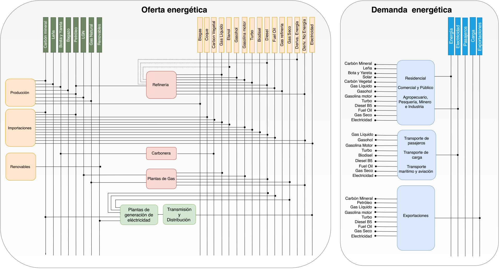
*Figure 3.1: Diagrama de referencía.*

El sector de energía Peruano se divide ampliamente en los macrobloques de demanda
y de oferta, las tecnologías son mostrados en bloques y estan asociados a los 
commodities que son mostradas como líneas verticales. De los commodities se toma 
una división, la cual va a la tecnología correspondiente para su transformación.    

La diversidad de la matriz energética en el Peru se muestra en una amplia cantidad 
de technologías y commodities, todo este conjunto de información para el sector 
energía han sido tomadas de los informes hechos por el PROSEMER en los cuales su 
principal objetivo es el desarrollo de un modelo para la optimización de la oferta 
del sistema energético basados en modelos de optimización TIMES que fue desarrollado 
como parte del IEA-ETSAP's metodología usada para escenarios de energía para conducir 
en un profundo análisis de la energía.

Las tecnologías de entrada son la importación y produción de los commodoties, hay 
tecnologías intermedias como refinación, procesasmiento de gas, producción de 
carbón, plantas de generación, transmisión y distribución de energía eléctrica.
Las commodities inciales son por lo general insumos procesados por tecnologías
o productos importados, estos pasan por tecnologías para su transformación a 
comodities de mayor calidad. 

``bueno ya es hora de divertirse, como para poner lineas de código, esto se debe eliminar``

Para mayor información del modelo TIMES_ 

.. _TIMES: https://iea-etsap.org/index.php/etsap-tools/model-generators/times/

Una oración que enlaza a Wikipedia_ y al `Linux kernel archive`_.

.. _Wikipedia: http://www.wikipedia.org/
.. _Linux kernel archive: http://www.kernel.org/

Otra oración con un `enlace anónimo al sitio de Python`__.

__ http://www.python.org/

`Python <http://www.python.org/>`_. 

3.1.1.1 Sets
---------
Los sets son el conjunto de configuraciones que son establecidos para el modelo, estos 
son particulares por país y región, para su configuración se debe tener un análisis 
del sistema a modelar, los sets se muestrana contiuación.

- *Región*
- *Year*
- *Timeslices*
- *Emissions*
- *Commodity*
- *Technology*
- *Mode of operation*

3.1.1.2 Procesos
---------
Los procesos o tecnologías son representados en forma de bloque y pueden tener o no una entrada de commodities, sin embargo, siempre tienen una salida de commodities, las principales tecnologías para el peru se muestran a continuación.

+--------------------+----------------------------------------------------------------------+
|Producción          | La producción de commodities incluye extración, procesamiento,       |
|                    | transformación de materia primaría hasta llegar a ser commodity.     |
+--------------------+----------------------------------------------------------------------+
|Importaciones       | Importaciones incluyen todos los procesos y acciones comerciales para|
|                    | lograr el suministro de commodities al país.                         |
+--------------------+----------------------------------------------------------------------+
|Refinería           | Refinería incluye todo el procesamiento de crudo para la obtención   |
|                    | de los subproductos como la gasolina o el diesel.                    |
+--------------------+----------------------------------------------------------------------+
|Carboneras          | Carboneras incluye el proceso de extracción de una mina carbón       |
|                    | mineral y trasnformación de en carbon vegetal.                       |
+--------------------+----------------------------------------------------------------------+
|Planta de gas       | Las plantas de gas incluye la licuación, transporte de gas           |
|                    |                                                                      |
+--------------------+----------------------------------------------------------------------+
|Plantas eléctricas  | En las plantas eléctricas se incluye todos las plantas de diversos   |
|                    | tipos de tecnologías como las hidroelectricas, termoelectricas, etc. |
+--------------------+----------------------------------------------------------------------+
|Transmisión         | La transmisión eléctrica incluye todos las formas de transmision en  |
|eléctrica           | alta y media tensión.                                                |
+--------------------+----------------------------------------------------------------------+
|Distribución        | La distribución eléctrica incluye distribución en baja tensión       |
|eléctrica           | hasta el usario final.                                               |
+--------------------+----------------------------------------------------------------------+
|Distribución        | La distribución energética incluye todos los medios y procesos para  |
|energética          | la repartición de los productos.                                     |
+--------------------+----------------------------------------------------------------------+
|Transporte          | Transporte en el Perú  incluyen todos las formas de transporte tanto |
|                    | aéreo, marítimo y terrestre, como privado, público y de carga.       |
+--------------------+----------------------------------------------------------------------+
|Residencial, comer- | Esta tecnología incluye todos los procesos de transformación de      |
|cial y carga        | energía para los sectores residencial, comercial y carga.            |   
+--------------------+----------------------------------------------------------------------+
|Agropecuario, Pesqu-| Estas tecnologías incluyen todos los procesos de ransformacion de    |
|ero, industría      |  energía  para los sectores agropecuarios, minero e industría.       |
+--------------------+----------------------------------------------------------------------+

Para una mejor idenficación de las tecnologías se puede ver a continuación 
las etiquetas de los procesos asociados a cada commdity.

+---------------+---------------------------------------------------------------------------+
|A_BACKSTOP     | Backup Power Systems                                                      |
+---------------+---------------------------------------------------------------------------+
|B_PROD_01      | Producción de combustibles actual                                         |
+---------------+---------------------------------------------------------------------------+
|B_PROD_02      | Producción de combustibles actual                                         |
+---------------+---------------------------------------------------------------------------+
|C_IMPO_01      | Importaciones de energia actual                                           |
+---------------+---------------------------------------------------------------------------+
|C_IMPO_02      | Importaciones de energia futura                                           |
+---------------+---------------------------------------------------------------------------+
|D_REFI_01      | Refinería actual                                                          |
+---------------+---------------------------------------------------------------------------+
|D_REFI_02      | Refinería futura                                                          |
+---------------+---------------------------------------------------------------------------+
|E_CARB_01      | Carbonera actual                                                          |
+---------------+---------------------------------------------------------------------------+
|E_CARB_02      | Carbonera futura                                                          |
+---------------+---------------------------------------------------------------------------+
|F_PGN_01       | Plantas de gas natural actual                                             |
+---------------+---------------------------------------------------------------------------+
|F_PGN_02       | Plantas de gas natural futura                                             |
+---------------+---------------------------------------------------------------------------+
|G_PEBIO_01     | Planta eléctrica biomasa o biogas actual                                  |
+---------------+---------------------------------------------------------------------------+
|G_PEBIO_02     | Planta eléctrica biomasa o biogafutura                                    |
+---------------+---------------------------------------------------------------------------+
|G_PEGA_01      | Planta eléctrica de gas natural actual                                    |
+---------------+---------------------------------------------------------------------------+
|G_PEGA_02      | Planta eléctrica de gas natural futura                                    |
+---------------+---------------------------------------------------------------------------+
|G_PEHI_01      | Planta hidroeléctrica actual                                              |
+---------------+---------------------------------------------------------------------------+
|G_PEHI_02      | Planta hidroeléctrica futura                                              |
+---------------+---------------------------------------------------------------------------+
|G_PEREN_01     | Planta eléctrica renovable actual                                         |
+---------------+---------------------------------------------------------------------------+
|G_PEREN_02     | Planta eléctrica renovable futura                                         |
+---------------+---------------------------------------------------------------------------+
|G_PETE_01      | Planta térmicas actual                                                    |
+---------------+---------------------------------------------------------------------------+
|G_PETE_02      | Planta térmicas futura                                                    |
+---------------+---------------------------------------------------------------------------+
|G_PGDS_02      | Plantas de generación distribuida solar                                   |
+---------------+---------------------------------------------------------------------------+
|G_PGDV_02      | Plantas de generación distribuida eólica                                  |
+---------------+---------------------------------------------------------------------------+
|H_STDE_01      | Transmisión y distribución de electricidad actual                         |
+---------------+---------------------------------------------------------------------------+
|H_STDE_02      | Transmisión y distribución de electricidad futura                         |
+---------------+---------------------------------------------------------------------------+
|I_DISTENECOMP_1| Distribución de energía comercio y público                                |
+---------------+---------------------------------------------------------------------------+
|I_DISTENEPAMI_1| Distribución de energía pesca, agricola, minas e industria                |
+---------------+---------------------------------------------------------------------------+
|I_DISTENERESI_1| Distribución de energía residencial                                       |
+---------------+---------------------------------------------------------------------------+
|J_TPBUSE_02    | Transporte público bus eléctrico o hidrógeno futuro                       |
+---------------+---------------------------------------------------------------------------+
|J_TPUBUSG_02   | Transporte público bus por gas natural futura                             |
+---------------+---------------------------------------------------------------------------+
|J_TPUBUSHC_01  | Transporte público bus por hidrocarburo actual                            |
+---------------+---------------------------------------------------------------------------+
|J_TPUBUSHC_02  | Transporte público bus por hidrocarburo actual                            |
+---------------+---------------------------------------------------------------------------+
|J_TPUTXEL_02   | Transporte público taxi - app eléctrico futuro                            |
+---------------+---------------------------------------------------------------------------+
|J_TPUTXGN_02   | Transporte público taxi - app por gas natural futuro                      |
+---------------+---------------------------------------------------------------------------+
|J_TPUTXHC_01   | Transporte público taxi - app por hidrocarburo actual                     |
+---------------+---------------------------------------------------------------------------+
|J_TPUTXHC_02   | Transporte público taxi - app por hidrocarburo actual                     |
+---------------+---------------------------------------------------------------------------+
|K_TPRMOEL_02   | Transporte privado motocleta eléctrico futuro                             |
+---------------+---------------------------------------------------------------------------+
|K_TPRMOHC_01   | Transporte privado motocicleta por hidrocarburo actual                    |
+---------------+---------------------------------------------------------------------------+
|K_TPRMOHC_02   | Transporte privado motocicleta por hidrocarburo actual                    |
+---------------+---------------------------------------------------------------------------+
|K_TPRVEEL_02   | Transporte privado vehículo eléctrico futuro                              |
+---------------+---------------------------------------------------------------------------+
|K_TPRVEGN_02   | Transporte privado vehículo por gas natural futuro                        |
+---------------+---------------------------------------------------------------------------+
|K_TPRVEHC_01   | Transporte privado vehículo por hidrocarburo actual                       |
+---------------+---------------------------------------------------------------------------+
|K_TPRVEHC_02   | Transporte privado vehículo por hidrocarburo actual                       |
+---------------+---------------------------------------------------------------------------+
|L_TPANOMO_01   | Transporte de pasajeros no motorizado actual                              |
+---------------+---------------------------------------------------------------------------+
|L_TPANOMO_02   | Transporte de pasajeros no motorizado futuro                              |
+---------------+---------------------------------------------------------------------------+
|M_TRENPAEL_01  | Transporte tren eléctrico actual                                          |
+---------------+---------------------------------------------------------------------------+
|M_TRENPAEL_02  | Transporte tren eléctrico futuro                                          |
+---------------+---------------------------------------------------------------------------+
|M_TRENPAHC_01  | Transporte tren de diesel  actual                                         |
+---------------+---------------------------------------------------------------------------+
|N_TCCLEL_02    | Transporte de carga liviana por eléctricidad o H2 futura                  |
+---------------+---------------------------------------------------------------------------+
|N_TCCLGN_02    | Transporte de carga liviana por gas futura                                |
+---------------+---------------------------------------------------------------------------+
|N_TCCLHC_01    | Transporte de carga liviana por hidrocarburos actual                      |
+---------------+---------------------------------------------------------------------------+
|N_TCCLHC_02    | Transporte de carga liviana por hidrocarburos futura                      |
+---------------+---------------------------------------------------------------------------+
|O_TCCMEL_02    | Transporte de carga mediana por eléctricidad o H2 futura                  |
+---------------+---------------------------------------------------------------------------+
|O_TCCMGN_02    | Transporte de carga mediana por gas futura                                |
+---------------+---------------------------------------------------------------------------+
|O_TCCMHC_01    | Transporte de carga mediana  por hidrocarburos actual                     |
+---------------+---------------------------------------------------------------------------+
|O_TCCMHC_02    | Transporte de carga mediana por hidrocarburos futura                      |
+---------------+---------------------------------------------------------------------------+
|P_TCCPEL_02    | Transporte de carga pesada por eléctricidad  futura                       |
+---------------+---------------------------------------------------------------------------+
|P_TCCPGN_02    | Transporte de carga pesada por gas natural futura                         |
+---------------+---------------------------------------------------------------------------+
|P_TCCPHC_01    | Transporte de carga pesada por hidrocarburos actual                       |
+---------------+---------------------------------------------------------------------------+
|P_TCCPHC_02    | Transporte de carga pesada por hidrocarburos futura                       |
+---------------+---------------------------------------------------------------------------+
|Q_TRENCAEL_02  | Transporte tren de carga eléctrico futuro                                 |
+---------------+---------------------------------------------------------------------------+
|Q_TRENCAHC_01  | Transportetren carga de diesel futuro                                     |
+---------------+---------------------------------------------------------------------------+
|Q_TRENCAHC_02  | Transporte tren carga de diesel  actual                                   |
+---------------+---------------------------------------------------------------------------+
|R_TAVMAR_01    | Transporte por aviación o mar actual                                      |
+---------------+---------------------------------------------------------------------------+
|R_TAVMAR_02    | Transporte por aviación o mar futuro                                      |
+---------------+---------------------------------------------------------------------------+

3.1.1.3 Comodities
---------
Los commodities son los bienes, insumos, productos, etc. Estos ingresan a cada 
tecnología para ser transformados y procesados en otros comodities dentro de toda 
la cadena energética, en el Perú contamos con una gran variedad de commodities desde
insumos primarios como bosta y yesta para producción de carbón hasta la electricidad 
generada por cada tecnología eléctrica y los combustibles consumidos por el sector
transporte, las etiquetas para cada commodity considerados se muestran a continuación.

+---------------+---------------------------------------------------------------------------+
|A_EP_BAGA      | Bagazo                                                                    |
+---------------+---------------------------------------------------------------------------+
|A_EP_BOYA      | Bosta y yareta                                                            |
+---------------+---------------------------------------------------------------------------+
|A_EP_CAMI      | Carbpon mineral                                                           |
+---------------+---------------------------------------------------------------------------+
|A_EP_GANA      |  Gas natural                                                              |
+---------------+---------------------------------------------------------------------------+
|A_EP_LENA      | Leña                                                                      |
+---------------+---------------------------------------------------------------------------+
|A_EP_LIGN      | Licuado de gas natural                                                    |
+---------------+---------------------------------------------------------------------------+
|A_EP_PETR      | Petróleo                                                                  |
+---------------+---------------------------------------------------------------------------+
|B_BIDS         | Biodiesel                                                                 |
+---------------+---------------------------------------------------------------------------+
|B_BIGA         | Biogas                                                                    |
+---------------+---------------------------------------------------------------------------+
|B_CAVE         | Carbón vegetal                                                            |
+---------------+---------------------------------------------------------------------------+
|B_COKE         | Coke                                                                      |
+---------------+---------------------------------------------------------------------------+
|B_DISL         | Diesel                                                                    |
+---------------+---------------------------------------------------------------------------+
|B_DREN         | Derivados de energia                                                      |
+---------------+---------------------------------------------------------------------------+
|B_DRNE         | Derivados no energéticos                                                  |
+---------------+---------------------------------------------------------------------------+
|B_ETHA         | Ethanol                                                                   |
+---------------+---------------------------------------------------------------------------+
|B_FOIL         | Fuel oil                                                                  |
+---------------+---------------------------------------------------------------------------+
|B_GALI         | Gas líquido                                                               |
+---------------+---------------------------------------------------------------------------+
|B_GASO         | Gasohol                                                                   |
+---------------+---------------------------------------------------------------------------+
|B_GSNA         | Gasolina                                                                  |
+---------------+---------------------------------------------------------------------------+
|B_GSRF         | Gas Refinería                                                             |
+---------------+---------------------------------------------------------------------------+
|B_GSSC         | Gas seco                                                                  |
+---------------+---------------------------------------------------------------------------+
|B_TURB         | Turbo                                                                     |
+---------------+---------------------------------------------------------------------------+
|C_EL_PTT       | Electricidad producida a transmisión                                      |
+---------------+---------------------------------------------------------------------------+
|C_EL_TTD       | Electricidad para distribución                                            |
+---------------+---------------------------------------------------------------------------+
|D_DECOM        | Demanda energía comercial y público                                       |
+---------------+---------------------------------------------------------------------------+
|D_DEIND        | Demanda energía PAMI                                                      |
+---------------+---------------------------------------------------------------------------+
|D_DERES        | Demanda energía residencial                                               |
+---------------+---------------------------------------------------------------------------+
|E_DTPASPB      | Demanda de pasajeros públicos                                             |
+---------------+---------------------------------------------------------------------------+
|E_DTPASPR      | Demanda de pasajeros privados                                             |
+---------------+---------------------------------------------------------------------------+
|E_DTPASSM      | Demanda de pasajeros no motorizada                                        |
+---------------+---------------------------------------------------------------------------+
|F_DTCALI       | Demanda de carga liviana                                                  |
+---------------+---------------------------------------------------------------------------+
|F_DTCAME       | Demanda de carga media                                                    |
+---------------+---------------------------------------------------------------------------+
|F_DTCAPE       | Demanda de carga pesado                                                   |
+---------------+---------------------------------------------------------------------------+
|G_EXPEL        | Exportación de electricidad                                               |
+---------------+---------------------------------------------------------------------------+
|G_EXPGN        | Exportación de gas natural                                                |
+---------------+---------------------------------------------------------------------------+

3.1.1.4 Costos 
---------

Los procesos tienen involucrados costos como CAPEX(Capital Expenditure), OPEX 
(Operacional Expenditure), LCOE, etc. Los costos examinados por capacidad para las 
plantas de gas y refinerías has sido estudiadas para tener datos con los cuales
poder suministrar al modelo. La proyeciones desde al 2055 de estos datos se han 
obtenido del Informe 9 del PROSEMER. 

   *Figure 3.3: Proyección del precio de carbon.*

Para la proyección de los precios del carbón se utliza las proyección del carbon 
australia del banco mundial (octubre del 2018), todos los costos de internación 
son considerados e incluye  flete y otros costos de transporte, el carbón tiene 
un costo de internación  de 18.6 US$/ton.

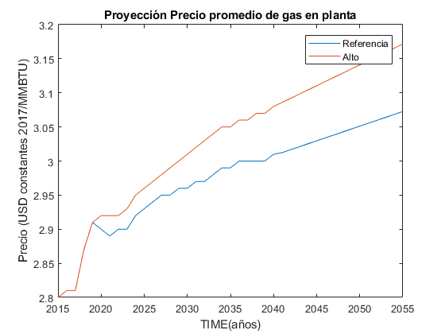

   *Figure 3.4: Proyección del precio del gas en la planta.*

Los precios del gas han utilizado como base las proyeciones de "high oil and gas 
resource and technology" (HRT) del EIA que han sido proyectadas hasta el 2050, y 
como las proyeciones del caso de referencia EIA . 

   *Figure 3.5: Proyección del precio promedio del crudo.*

Para la proyección del precio del crudo se ha utilizado las proyecciones de WTI que 
se estabblecen en dos escenarios uno es el de referencia y el otro es el alto, se 
incluyen todos los costos, el crudo tienen un costos de integración de 5 US$/bbl.

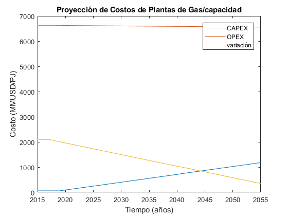

   *Figure 3.6: Proyecciones de los costos por capacidad de la planta de gas.*

Los cálculos se hicieron con los datos de costos de capital y operación de plantas 
de gas y la actividad de las refinería que se encuentran en el informe 9 "Desarrollo 
del Plan Energético a Nivel de Grupos de Regiones y Acompañamiento".  

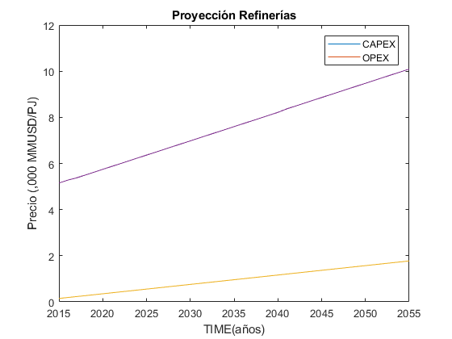

   *Figure 3.7: Proyecciones de los costos por capacidad de la refineria.*

Los cálculos se hicieron con los datos de costos de capital, operación y variación de 
plantas de refinación y la actividad de las refinería que se encuentran en el informe 9 
"Desarrollo del Plan Energético a Nivel de Grupos de Regiones y Acompañamiento".  

 3.1.1.5 Emisiones
---------

Las emisiones en un futuro cercanos se volveran un serio problema, no sólo medioambiental
sino existencial, ahora nos embarcamos en una lucha por reducir las productos de 
contaminación y la principal acción del sector energía y transportes es sustituir
los insumos que podrucen contaminación, las políticas climáticas hoy en día han 
planificado al 2050 lograr la carbononeutralidad.   

 

3.1.1.6 Proyecciones de los sectores económicos
---------

Para determinar las proyecciones futuras de la demanda energética por sector de 
se necesitan información acerca del PBI, consumo de energía por sector de periodos 
pasados, parámetros propios de cada sector para poder hacer las proyecciones con 
métodos autoregresivos. Los valores utilizados del PBI se han adquirido del Anexo 2 
del Informe 9 del prosemer.
    
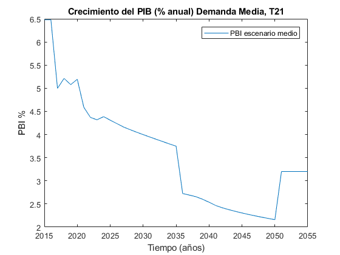
*Figure 3.1: Proyección del crecimiento del PBI anual.*

Para los valores proyectados se utilizaron los valores proporcionados para el 
periodo 2016-2026 por la consultora APOYO, los valores para el periodo 2027-2040 
se tomaron de los escenarios proporcionados por el MINEM y para el periodo 
2040-2055 se tomaron la proyección de la tendencia de los valores de los últimos 
10 años anteriores al 2040. 

Las ecuaciones utilizadas para la proyección
-----

Con base a la información obtenida del PROSEMER sobre las proyecciones de demanda de energía por sectores, para los sectores Comercial, Publico, Agro, Pesca, Minero e Industria Manofactura, se calculó la proyección demanda de energía total para estos sectores en PJ, *(Ecuación 1)*.

\ln \left(E_{t, 1}\right)=\alpha_{1}+\beta_{1} \ln \left(E_{t-1,1}\right)+\gamma_{1} \ln \left(P I B p c_{t-1}\right)+\theta_{1} T e n d_{t}

$\ln \left(E_{t, 1}\right)=\alpha_{1}+\beta_{1} \ln \left(E_{t-1,1}\right)+\gamma_{1} \ln \left(P I B p c_{t-1}\right)+\theta_{1} T e n d_{t}$

$$\ln \left(E_{t, 1}\right)=\alpha_{1}+\beta_{1} \ln \left(E_{t-1,1}\right)+\gamma_{1} \ln \left(P I B p c_{t-1}\right)+\theta_{1} T e n d_{t}$$

\begin{equation}\ln \left(E_{t, 1}\right)=\alpha_{1}+\beta_{1} \ln \left(E_{t-1,1}\right)+\gamma_{1} \ln \left(P I B p c_{t-1}\right)+\theta_{1} T e n d_{t}\end{equation}

| Demanda Energía Total sectores=Dem.S.Comercial+ Dem.S.Público+Dem.S.Agro+Dem.S.Pesca+Dem.S.Minero+Dem.S.Industria Manofactura   *(Ecuación 1)* 

Las proyecciones al 2050 de la demanda para los sectores económicos se muestran 
la siguiente gráfica, en donde la participacion de sector agro es predominante.  

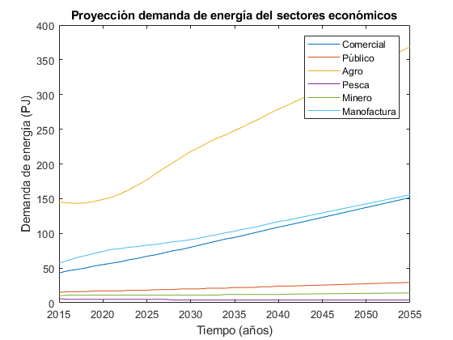
*Figure 3.1: Proyección del crecimiento del PBI anual.*

*____________________________________________________________________*

 Clustering and Representative Networks
 
 Time-Series Analysis and Forecasting

3.1.2 Electricity Sector Simulation
-----------------------------------------------------
 Data Structure and Elements of Electric System
  power..

   

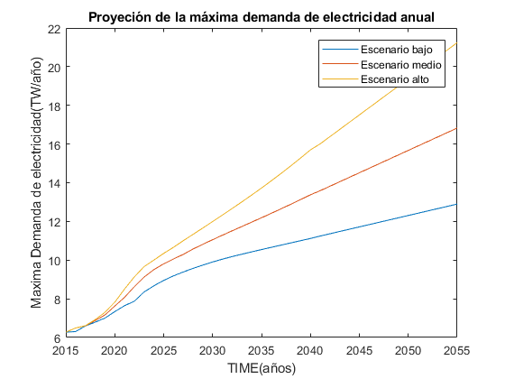
*Figure 3.8: Proyección de la maxima demanda de electricidad anual.*

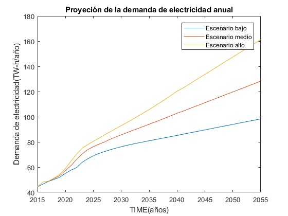
*Figure 3.9: Proyección de la demanda de electricidad anual.*

Para ambas tipos de proyecciones se va a considerar únicamente las zonas del país 
conectadas al SEIN. Iquitos no se incluye en el modelaje.

*____________________________________________________________________*

 Electricity Power Flow and Efficiency
 
 Emissions from Electricity Sector

3.1.3 Transport Sector Simulation
-----------------------------------------------------

 Data Structure and Elements of Transport System
 Traffic Flow Analysis and Efficiency of the System
 Emissions and Air Pollution from Transport Sector

sds

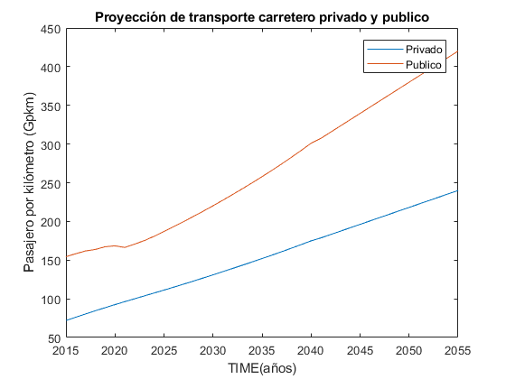
*Figure 3.10: Proyección del sector transporte publico y privado.png.*

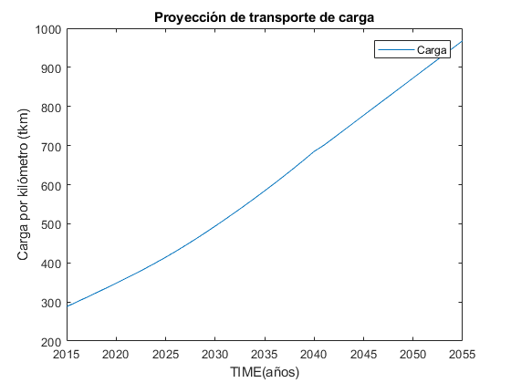
*Figure 3.11: Proyección del sector transporte carga.png.*
   
   
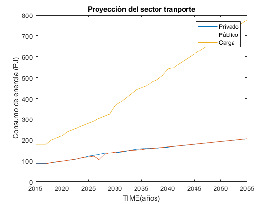
*Figure 3.12: Proyección del sector transporte.*

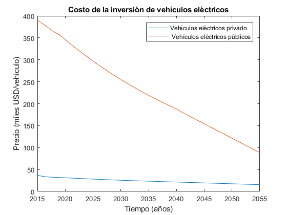
*Figure 3.13: Proyección del precio de vehiculos electricos.*
