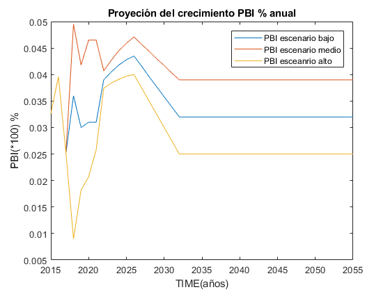
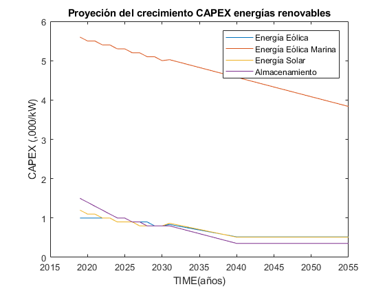
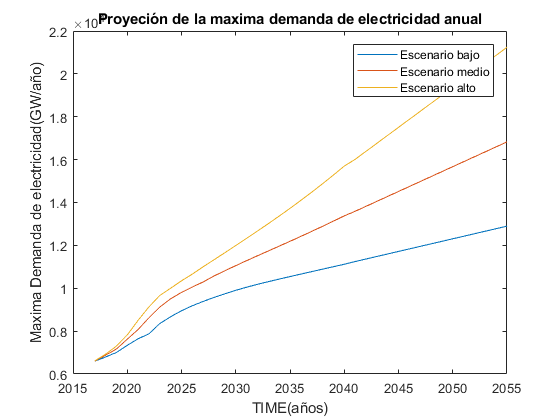
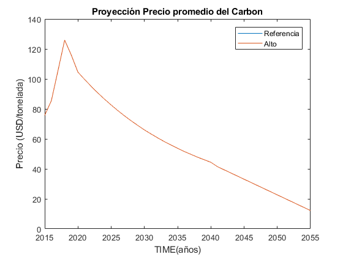
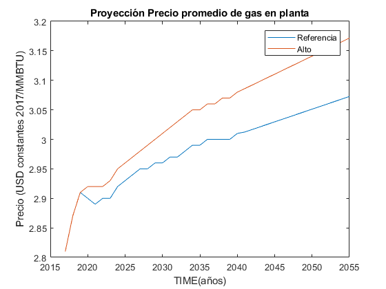
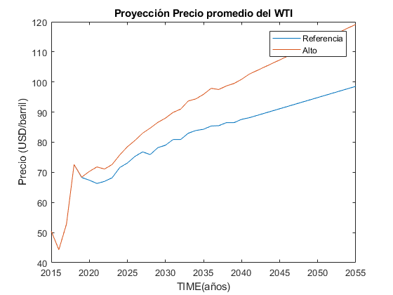
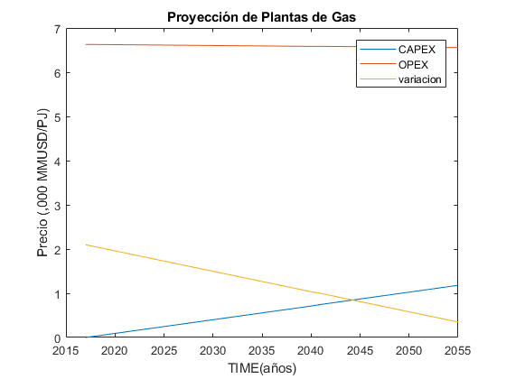

.. _docgen:

Energy System Modeling: Data Analysis
=======================================

Characterization of Energy Sectors
-----------------------------------------------------

 Fitter Data and Outlier Correction
  blaa... 
  
   

   *Figure 2.2: Proyección del crecimiento del PBI anual.*
   
   

   *Figure 2.2: Proyeccion del crecimiento CAPEX energias renovables.*
   
   

   *Figure 2.2: Proyeccion de la maxima demanda de electricidad anual.*
   
  
.. figure:: img/Proyección de la demanda de electricidad anual.png
   :align:   center
   :width:   700 px

   *Figure 2.2: Proyección de la demanda de electricidad anual.png*
   
   

   *Figure 2.2: Proyeccion del precio de carbon.*
   

   *Figure 2.2: Proyeccion del precio del gas en la planta.*
   
   

   *Figure 2.2: Proyeccion del precio promedio del crudo.*
   
.. figure:: img/Proyeccion del precio de vehiculos electricos.png
   :align:   center
   :width:   700 px

   *Figure 2.2: Proyeccion del precio de vehiculos electricos.*
   

   *Figure 2.2: Proyeccione de precio por capacidad de la planta de gas.*
   
.. figure:: img/Proyeccione de precio por capacidad de la refinería.png
   :align:   center
   :width:   700 px

   *Figure 2.2: Proyeccione de precio por capacidad de la refinería.*
   

 
 Clustering and Representative Networks
 
 Time-Series Analysis and Forecasting

Electricity Sector Simulation
-----------------------------------------------------
 Data Structure and Elements of Electric System
  power..
 
 Electricity Power Flow and Efficiency
 
 Emissions from Electricity Sector

Transport Sector Simulation
-----------------------------------------------------

 Data Structure and Elements of Transport System
 Traffic Flow Analysis and Efficiency of the System
 Emissions and Air Pollution from Transport Sector

