   .. _docgen:

3.1 Energy System Modeling: Data Analysis
=======================================

3.1.1 Characterization of Energy Sectors
-----------------------------------------------------
 Fitter Data and Outlier Correction

  

.. figure:: img/RES_Energia.png
   :align:   center
   :width:   700 px
*Figure 3.1: Diagrama de referencía*

El sector de energía Peruano se divide ampliamente en los macrobloques de demanda
y de oferta, las tecnologías son mostradas en bloques y estan asociados a los 
commodities que son mostradas como líneas verticales. De los commodities se toma 
una división, la cual va a la tecnología correspondiente para su transformación.    

La diversidad de la matriz energética en el Peru se muestra en una amplia cantidad 
de technologías y commodities, todo este conjunto de información para el sector 
energía han sido tomadas de los informes hechos por el PROSEMER en los cuales su 
principal objetivo es el desarrollo de un modelo para la optimización de la oferta 
del sistema energético basados en modelos de optimización TIMES_ que fue desarrollado 
como parte del IEA-ETSAP's metodología usada para escenarios de energía para conducir 
en un profundo análisis de la energía.

Las tecnologías de entrada son la importación y produción de los commodoties, hay 
tecnologías intermedias como refinación, procesasmiento de gas, producción de 
carbón, plantas de generación, transmisión y distribución de energía eléctrica.
Las commodities inciales son por lo general insumos procesados por tecnologías
o productos importados, estos pasan por tecnologías para su transformación a 
comodities de mayor calidad. 

.. ``bueno ya es hora de divertirse, como para poner lineas de código, esto se debe eliminar``

.. _TIMES: https://iea-etsap.org/index.php/etsap-tools/model-generators/times/

.. Una oración que enlaza a Wikipedia_ y al `Linux kernel archive`_.

.. .. _Wikipedia: http://www.wikipedia.org/
.. .. _Linux kernel archive: http://www.kernel.org/

.. Otra oración con un `enlace anónimo al sitio de Python`__.

.. __ http://www.python.org/

.. `Python <http://www.python.org/>`_. 

3.1.1.1 Demanda en energía y transporte
--------------

Las demandas energética en el Perú son actualmente proyectadas en base a premisas 
macroeconómicas poblacionales y de eficiencia energética, los resultados atienden a 
la necesidad de otros modelos de optimización dentro de la cadena de planifición 
energética, como OPTGEN y TIMES, para luego ser parte de un bucle de optimización 
con la integración del modelo TIMES-CGE. Los resulatdos obtenidos pueden variarse 
al escenario suspuesto, con la finalidad de situarse y analizarlos, además los 
resulatdos estan desagregados en región, tipo de combustible, escenario, etc. 

Por otra parte, los valores proyectados de las series de tiempo para lograr la 
descarbonización del Perú al 2050 utilizados han sido construidos con modelos autoregresivos
que tienen diferentes variables explicativas por sector, las proyecciones al 2050 de 
la demanda para los sectores económicos se muestran la siguiente gráfica, en donde 
la participacion de sector residencial y manufactura son predominantes.  

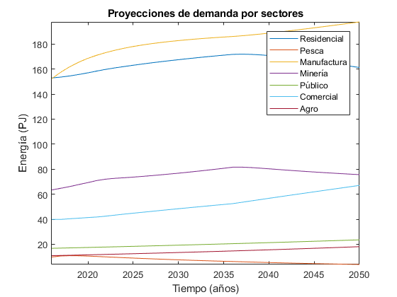
*Figure 3.1: Predicciones de la demanda de energía por sector productivo. Fuente: Propia*

 Todas los valores de demanda, se puede ver a en Anexos demanda_.

.. Hay que cambiar este hyperlink

.. _demanda: https://github.com/guidogz/Doc_ELP_Peru/blob/master/docs/999Annexes.rst/ 

EL sector transporte es el sector productivo que más energía consume y lo hace principalmente a través de combustibles fósiles, con la finalidad de realizar una proyección del sector ha sido conveniente de dividirlo en subdivisiones para facilitar el desarrollo de los modelos que serán utilizados para realizar las predicciones de demanda, es importante aclarar que hay demandas de energía expresadas en *pkm* o *tkm*, que expresan un servicio en lugar de terminos de energía neta (PJ). A continuación se presentarán las subdivisiones realizadas. 

============ =================================
Subdivisión  Tipo
============ =================================
Carretero    Pasajero publico y privado, Carga
Ferroviario  Pasajero y Carga
Naval        Energía neta
Aéreo        Energía neta
============ =================================
*Fuente: Propia* 

Las predicciones sobre la demanda historica de sector transporte específicamente en la subdivision Carretero han tomado como variable explicativa al PBI, sin embargo, no todas las subdivisiones del sector utilizan PBI como variable explicativa tanbien se utiliza la población y una tendecia.

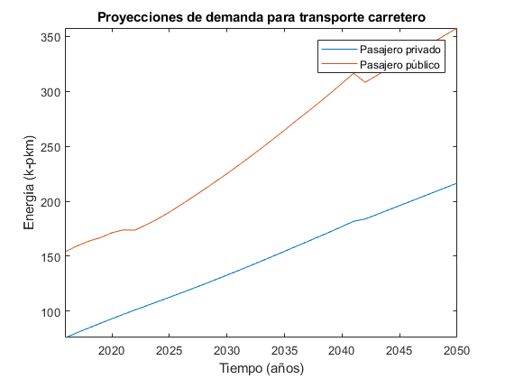
*Figure 3.10: Proyección del sector transporte, carretero público y privado. Fuente: Propia*
   
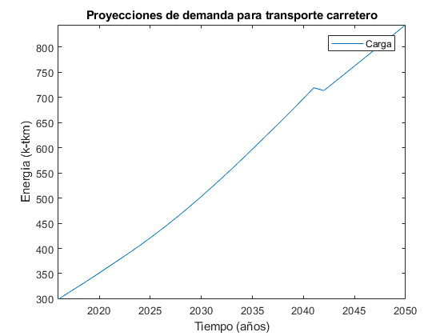
*Figure 3.12: Proyección del sector transporte, carretero de carga. Fuente: Propia

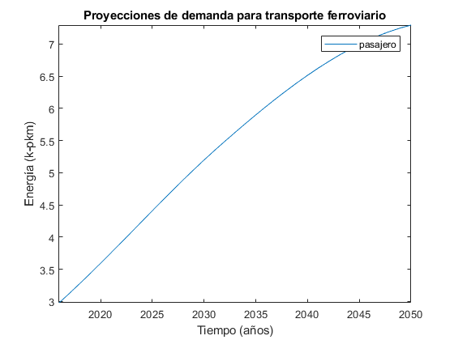
*Figure 3.10: Proyección del sector transporte, ferroviario de pasajeros. Fuente: Propia*
  
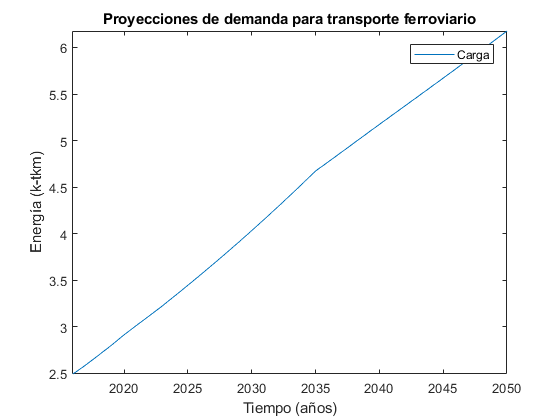
*Figure 3.12: Proyección del sector transporte, ferroviario de carga. Fuente: Propia

*Figure 3.12: Proyección del sector transporte, Naval y Aéreo. Fuente: Propia

Los valores de las proyecciones de demanda de enegía para los sectores productivos y transporte se pueden observar en los anexos de este documento, `Proyecciones de demanda <https://github.com/guidogz/Doc_ELP_Peru/blob/master/docs/999Annexes.rst/>`_.

Las proyecciones del sector trasnporte conlleva un problema grave para el medio ambiente, el uso de los combustibles fósiles para el transporte son un problema importante hoy, por eso, es importante mencionar los precios de los vehículos eléctricos, se han utilizado las proyecciones del precio de los vehículos eléctricos del PROSEMER al 2050.

.. figure:: img/Proyeccion_del_precio_de_vehiculos_electricos.png
   :align:   center
   :width:   700 px
*Figure 3.13: Proyección del precio de vehiculos electricos, Fuente: Propia*

Todos los valores de demanda de energía de transporte y proyecciones de de los precios de los vehículos de gas natural se puede ver en Anexos en A13 y A10 respectivamente `precios y costos <https://github.com/guidogz/Doc_ELP_Peru/blob/master/docs/999Annexes.rst/>`_.

3.1.1.2 Oferta de energía  
--------------

3.1.1.2.1 Plantas de generación 
---------
La capacidad instalada en el Perú ha crecido con el pasar de los años, ha pasado de ser 10,150.0 MW el año 2015 a 13,179.53 MW el año 2019 (COES), y la matriz energética se ha diversificado, sin embargo, la participación de las energías renovables no convecionales en la producción de energía eléctrica aún es pequeña en comparación con la energía eléctrica generada en las plantas de energías renovables convencionales y no renovables. Las empresas de generación en el 2019 han sido un total de 58, las cuales en conjunto
tienen una capacidad instalada de 13179.53 MW y capacidad efectiva de 12636.89 MW, en el 
2019 la producción de energía anual ejecutada se valoró en 52949.19 GW.h  y la máxima 
demanda ejecutada fue de 7017.57 MW en el mes de diciembre. El recurso que tuvo la mayor 
participación en la producción de energía fue el agua con 57.04% seguido de los combustibles 
fósiles con un 38.41%, la potencia efectiva por tipo de generación que predominó fueron las 
termoeléctricas con un 54.67 % y el recurso que que más capacidad efectiva disponia para la 
producción de energías fue el agua con un 37.58 %. A continuación se enlista en tablas  del tipo de la participación 
por tipo de recurso, tipo de generación y finalmente la energía ejecutada. 

============================== ========================== =============
POTENCIA EFECTIVA POR TIPO DE RECURSO ENERGÉTICO 2019       
----------------------------------------------------------------------- 
TIPO DE RECURSO ENERGÉTICO     POTENCIA EFECTIVA (MW)        (%)    
============================== ========================== =============
  AGUA                                  4,748.37               37.58 
  RENOVABLES                            1,041.01                8.24 
  GAS NATURAL DE CAMISEA                3,775.21               29.87 
  GAS NATURAL DE AGUAYTIA                 176.05                1.39 
  GAS NATURAL DE MALACAS                  343.61                2.72 
  DIESEL 2                              2,334.21               18.47 
  RESIDUAL                                 77.73                0.62 
  CARBÓN                                  140.71                1.11 
------------------------------ -------------------------- -------------
  TOTAL                                12,636.89              100.00     
============================== ========================== ============= 

*Fuente: Estadística Anual 2019, Capítulo 2 - Estado actual de la infraestructura del SEIN, Cuadro 2.5*

====== =============== ============== ======= ======== ============
POTENCIA EFECTIVA POR TIPO DE GENERACIÓN A DICIEMBRE 2019 (MW)             
-------------------------------------------------------------------               
ÁREA   HIDROELÉCTRICA  TERMOELÉCTRICA  SOLAR   EÓLICA    TOTAL
====== =============== ============== ======= ======== ============
NORTE      610.07           801.24             114.01    1,525.32 
CENTRO   3,839.10         4,075.82             261.45    8,176.38 
SUR        618.48         2,031.69     285.02            2,935.20 
------ --------------- -------------- ------- -------- ------------
TOTAL    5,067.66         6,908.75     285.02  375.46   12,636.89 
====== =============== ============== ======= ======== ============
*Fuente: Estadística Anual 2019, Capítulo 1 - Estadística relevante del SEIN, Cuadro 1.5*

====== ================ ================ ====== ========== =========================== ==========
PRODUCCIÓN DE ENERGÍA Y MÁXIMA DEMANDA - 2019  (GWh)  
------------------------------------------------------------------------------------------------- 
ÁREA    HIDROELÉCTRICA   TERMOELÉCTRICA  SOLAR    EÓLICA   "IMPORTACIÓN DESDE ECUADOR"   TOTAL
====== ================ ================ ====== ========== =========================== ==========
NORTE     3,370.54           757.83                443.68          60.05                 4,632.10 
CENTRO   22,735.89        19,504.41              1,202.48                               43,442.79 
SUR       4,061.99            50.59      761.73                                          4,874.31 
TOTAL    30,168.43        20,312.83      761.73  1,646.16          60.05                52,949.19 
====== ================ ================ ====== ========== =========================== ==========
*Fuente: Estadística Anual 2019, Capítulo 1 - Estadística relevante del SEIN, Cuadro 1.7*

|
|        **Las proyecciones de la demanda de energía anual al 2050**
|

Para la demanda de energía anual se ha desarrollado un modelo autoregresivo tomando como variables explicativa el PBI y la tendencia, Para las predicciones se va a considerar únicamente las zonas del país 
conectadas al SEIN. Iquitos no se incluye en el modelaje.  

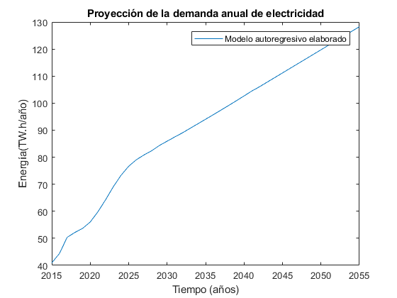
*Figure 3.9: Proyección de la demanda de electricidad anual, Fuente: Propia*

 Todos los valores de demanda anual se puede ver a en Anexos `demanda electrica <https://github.com/guidogz/Doc_ELP_Peru/blob/master/docs/999Annexes.rst/>`_.

   
3.1.1.2.2 Plantas de gas 
---------

Las plantas de gas en el peru suman 8 en las cuales tenemos que 3 son exclusivamente de 
procesamiento (separación), 3 son únicamente de fraccionamiento, 1 de procesamiento y fracionamiento y 
finalmente 1 de licuación, en conjunto suman una capacidad instalada de 1333 PJ con una 
disponibilidad promedio de 92% y un factor de capacidad promedio de 48%. Los costos de 
tratamiento de gas en las plantas se valorizan en 4228.2 MMUSD en el 2013 y tuvo una 
actividad de 639 PJ. En las siguientes tablas se muestra la información.

=================== =================== =============== =============================== =======
Plantas de gas      Capacidad instalada Capacidad de     Tipo de tratamiento            Región
                         PJ (2018)      Procesamiento 
=================== =================== =============== =============================== =======
Malvinas                  804            1160 [MMPCD]   Procesamiento (separación)      Sur
Curimaná                   29              65 [MMPCD]   Procesamiento (separación)      Oriente
GMP-procesamiento          18              80 [MMPCD]   Procesamiento (separación)      Norte
GMP-fraccionamiento         5               3  [MBPD]   Fraccionamiento                 Norte
Pisco                     215              85  [MBPD]   Fraccionamiento                 Sur
Yarinacocha                 8               4.4[MBPD]   Fraccionamiento                 Oriente
Pariñas                    16              61 [MMPCD]   Procesamiento y Fraccionamiento Norte
Pampa Melchorita          238                           Licuefacción                    Centro
------------------- ------------------- --------------- ------------------------------- -------
Total instalado          1333                                                                 
=================== =================== =============== =============================== =======
*Fuente: Anexo 2 - informe 9 PROSEMER, página 101. OSINERGMIN 2020*

================== ================ ==========
Sector                Costo         MUSD 2013
================== ================ ==========
TRATAMIENTO - GAS   OPEX VARIABLE    981.4
TRATAMIENTO - GAS   OPEX FIJO       3246.7
TRATAMIENTO - GAS   CAPEX 
------------------ ---------------- ----------
TRATAMIENTO - GAS   TOTAL           4228.2
================== ================ ==========
*Fuente: Imforme 9 PROSEMER, página 303*

========== ========= ========= ========= ========= ========= =========
Producto   2013 [PJ] 2014 [PJ] 2015 [PJ] 2016 [PJ] 2017 [PJ] 2018 [PJ]
========== ========= ========= ========= ========= ========= =========
Gas seco**    457                 513      571       547      537     
LGN           182                 146      148       134      126     
---------- --------- --------- --------- --------- --------- ---------
Total         639                 659      719       681       663    
========== ========= ========= ========= ========= ========= =========
*Fuente: Informe 9 PROSEMER, pag. 303. Balances Nacional de Energía*

|
|          **Las proyecciones del precio del gas natural y costos por capacidad**
|
Para estas proyecciones se han tomado los valores del los informes del PROSEMER y se han extendido 
de forma lineal hasta el 2050, cabe mencionar que los valores puestos son de inversiones corrinets. Para los precios de gas se han tomado los valores proyectados al 2050
del HENRY HUB.

.. figure:: img/Proyeccion_del_precio_del_gas_en_la_planta.png
   :align:   center
   :width:   700 px

*Figure 3.4: Proyección del precio del gas en la planta, Fuente: PROSEMER*

Los precios del gas han utilizado como base las proyeciones de "high oil and gas 
resource and technology" (HRT) del EIA que han sido proyectadas hasta el 2050, y 
como las proyeciones del caso de referencia EIA . 

.. figure:: img/Proyeccione_de_precio_por_capacidad_de_la_planta_de_gas.png
   :align:   center
   :width:   700 px

*Figure 3.6: Proyecciones de los costos por capacidad de la planta de gas, Fuente: Propia*

Los cálculos se hicieron con los datos de costos de capital y operación de plantas 
de gas y la actividad de las refinería que se encuentran en el informe 9 "Desarrollo 
del Plan Energético a Nivel de Grupos de Regiones y Acompañamiento".  

Todos los valores de los precios de gas natural, CAPEX y OPEX  se puede ver en Anexos en A7 y A12 respectivamente `precios y costos <https://github.com/guidogz/Doc_ELP_Peru/blob/master/docs/999Annexes.rst/>`_.

3.1.1.2.3 Refinerías 
---------

Las refinerías en el Perú suman un total de 9, las cuales en conjunto tienen una 
capacidad de producción de 221-228 miles de barriles diarios, El Milagro ya no se considera
como un refinería economicamente viablea partir del 2016, con una disponibilidad 
en promedio del 90%, esta capacidad de procesamiento cambiará después de la modernización 
de la refinería de talara, su capacidad será de 245.3 miles de barriles diarios.
La produción en PJ de energía en el año 2017 alcanzó un total de 350 con una producción  
de 91459.9 barriles, y tambien para el mismo año los costos operativos se valorizaron en 
492.6 MMUSD, en las siguinetes tablas se puedes apreciar estas cifras. 

=========== ============================ ======================================= ==========
Refinería    Capacidad instalada (2018)  Tipo de combustible refinado            Región
----------- ---------------------------- --------------------------------------- ----------
Nombre         Miles de barriles de
               petróleo día (MBPD)
=========== ============================ ======================================= ==========
Talara        65-95*                     Diesel, Turbo, GLP, Fueloil, Gasolina   Norte
Conchán       15.5                       Diesel, Fueloil, Gasolina               Centro
Pampilla      117                        Diesel, Turbo, GLP, Fueloil, Gasolina   Centro
Iquitos       12.0                       Diesel, Turbo, Fueloil, Gasolina        Oriente
Pucallpa       3.3                       Diesel, Turbo, Gasolina                 Oriente
El Milagro      2                        Diesel, Turbo, Fueloil, Gasolina        Norte
Huayuri        4.0                       Crudo multiuso, Diesel, HFO, Nafta      Oriente
Shiviyacu      5.2                       Crudo, Diesel, Nata, Residual, Multiuso Oriente
Yacimiento     4.0                       Crudo, Diesel, HFO, Nafta/Residual      Oriente
=========== ============================ ======================================= ==========
*Fuente: Anexo 2 - informe 9 PROSEMER, informe 7 PROSEMER, OSINERGMIN*

============ ======= ============
Sector        Costo  2017 (MUSD)
============ ======= ============
REFINERIAS    OPEX    412.4
REFINERIAS    CAPEX    80.1
------------ ------- ------------ 
REFINERIAS    TOTAL   4204.1
============ ======= ============
*Fuente: Informe 9 PROSEMER, pag. 302*

========= ========= ========= =========
Producción total en las refinerías 
--------------------------------------- 
2015 [PJ] 2016 [PJ] 2017 [PJ] 2018 [PJ]
========= ========= ========= =========
300.78    304.153   356.426   337.547
--------- --------- --------- ---------
[MBLS]    [MBLS]    [MBLS]    [MBLS]
--------- --------- --------- ---------
73773.6   79515     91007.70  87144.80
========= ========= ========= =========
*Fuente: Producción total de energia en miles de barriles equivalentes de petróloe y en Peta-Joule*

|
|                  **Las proyecciones del precio del crudo y costos por capacidad**
|
Para estas proyecciones se han tomado los valores del los informes del PROSEMER y se han extendido 
de forma lineal hasta el 2050. Para los hodrocarburos se han tomado los valores proyectados al 2050
del WTI.

.. figure:: img/Proyeccion_del_precio_promedio_del_crudo.png
   :align:   center
   :width:   700 px

*Figure 3.5: Proyección del precio promedio del crudo, Fuente: Propia*

Para la proyección del precio del crudo se ha utilizado las proyecciones de WTI que 
se estabblecen en dos escenarios uno es el de referencia y el otro es el alto, se 
incluyen todos los costos, el crudo tienen un costos de integración de 5 US$/bbl.

.. figure:: img/Proyeccione_de_precio_por_capacidad_de_refineria.png
   :align:   center
   :width:   700 px
*Figure 3.7: Proyecciones de los costos por capacidad de la refineria, Fuente: Propia*

Los cálculos se hicieron con los datos de costos de capital, operación y variación de 
plantas de refinación y la actividad de las refinería que se encuentran en el informe 9 
"Desarrollo del Plan Energético a Nivel de Grupos de Regiones y Acompañamiento".  

Todos los valores de los precios del WTI, CAPEX y OPEX  se puede ver en Anexos en A8 y A11 respectivamente `precios y costos <https://github.com/guidogz/Doc_ELP_Peru/blob/master/docs/999Annexes.rst/>`_.

3.1.1.2.4 Carboneras 
---------
Para el 2013 la capacidad instalada de procesamiento de carbon es de 5.08 PJ, 2.97 para 
la región centro y 2.11 para la región norte, además se asume un costo de producción de 
2.71 MMUSD/PJ que incluye todos lo contos de extración, mina, transporte y acopio. Tambien
se consideró un costo de inversión 2,76 MMUSD/PJ para incrementar la capacidad existente y 
disminuir los costos existentes, cabe mencionar que los valores de transporte para la región 
norte y centro son de 0.69 MMUSD/PJ.

=========== ===========================
Carboneras  Capacidad instalada (2013)
                      PJ-año
=========== ===========================
Norte                  2.11
Centro                 2.97
----------- ---------------------------
Total                  5.08
=========== ===========================
*Fuente: Informe 9 PROSEMER, pag. 302* 

============ ======= ================
Sector        Costo  2017 (MMUSD/PJa)
============ ======= ================
CARBONERAS    TOTAL     2.71
------------ ------- ----------------
CARBONERAS    TOTAL     2.71
============ ======= ================
*Fuente: Informe 9 PROSEMER, pag. 302* 

|
|                  **Las proyecciones del precio del crudo y cotos por capacidad**
|

.. figure:: img/Proyeccion_del_precio_de_carbon.png
   :align:   center
   :width:   700 px

*Figure 3.3: Proyección del precio de carbon, Fuente: Propia*

Para la proyección de los precios del carbón se utliza las proyección del carbon 
australia del banco mundial (octubre del 2018), todos los costos de internación 
son considerados e incluye  flete y otros costos de transporte, el carbón tiene 
un costo de internación  de 18.6 US$/ton.

Todos los valores de los precios de carbón se puede ver en Anexos en A9 `precios <https://github.com/guidogz/Doc_ELP_Peru/blob/master/docs/999Annexes.rst/>`_.

3.1.1.3 Distribución de energía
--------------

La distribución de la energía en Perú se da a traves de diferentes medios, como la distribución eléctrica a traves de líneas eléctricas de transmisión y distribución, el gas natural a traves de gaseoductos o redes virtuales, las refinerías a traves de redes virtuales y oleoductos, etc.

3.1.1.3.1 Transmisión y distribución del Sistema interconectado nacional 
---------

El sistema interconectado nacional está constituido por redes de trasmisión y distribución eléctrica, las redes de transmisión se encuentran constituidas por líneas de transmisión de 500, 220, 138, 66, 60, 50 y 33 kV. El SEIN está integrado por 4 categorías de instalaciones, el sistema garantizado de transmisión (SGT), el sistema complementario de transmisión (SCT), el sistema principal de transmisión (SPT) y el sistema secundario de transmisión (SST). En el 2019 se instalaron un total de 966.4 km de líneas de transmisión, en la siguinete tabla se puede observar el total de líneas de transmisión que hay en el Perú en el sistema principal de transmisión y sistema secundario de transmisión al 2019.

================================= ========= ========= ========= =========
         Longitud de las líneas de transmisión del SEIN (km)
-------------------------------------------------------------------------       
Líneas                             500 kV    220 kV    138 kv    >75 kV
================================= ========= ========= ========= =========
Sistema primario de transmisión     2735.9   6774.54    552.27     0.0
Sistema secundario de transmisión   142.76   6856.84   4361.88   8571.41
--------------------------------- --------- --------- --------- ---------
Total                              2878.66  13631.38   4914.15   8571.41
================================= ========= ========= ========= =========
*Fuente: Estadistica anual 2019, COES*

.. figure:: img/Lineas_ExistentesCOES_Dic2019-SEIN_copia-1.jpg
   :align:   center
   :width:   700 px

*Figure 3.3: Sistema interconectado nacional. Fuente: COES*

3.1.1.3.2 Distribución de crudo y derivados del petróleo 
---------

La distribución del crudo se hace a través de oleoductos, el crudo es llevado hacia las plantas de refinación como sucede en el noroeste y la selva de nuestro país, sin embargo para su distribución se hace uso de redes virtuales. El oleoducto norperuano tiene una longitud aproximada de 1100 km y una capacidadf de 200 MMBD

3.1.1.3.3 Distribución de gas natural
---------

Actualmente se explota gas natural en los lotes 56, 88, por pluspetrol y el lote 57 por repsol, el lote 58 comenzará a explotarse el año 2023 por la empresa CNPC. En camisea se extrae gas natural que es procesado para su separación en líquidos de gas natural y gas seco que son enviados a través del poliducto hasta la planta de fraccionamiento de Pisco, el gas seco que no es reinyectado es transportado a través del TGP hasta el City Gate en Lurín, la empresa caliodad es reponsable de su distribvución en lima y callao.  

3.1.1.4 Importaciones 
--------------

Las importaciones de energía en el Perú son actualmente significativas, más de la mitad de crudo que se necesita se importa, aunque el Perú es autosuficiente con el gas natural hasta la fecha no se han hecho estudios de más reservas de gas, en el sector eléctrico realizamos importaciones del ecuador dependienos del costo marginal de la electricidad.

Las importaciones según el "Anuario estadístico sectorial de hidrocarburos 2018" el 2018 fueron de un total aproximado de 316 (PJ), para crudo, GLP, gasolina y carbón, que representan un valor de 3819.72 MMUSD.

================================= ========= ========= ========= =========
        Importaciones de hidrocarburos (MBLS)
-------------------------------------------------------------------------       
Producto                            2015       2016     2017      2018
================================= ========= ========= ========= =========
Crudo                              31326.81  38489.18  45735.96  41117.13
GLP/butano/propano                  1119.18   1816.05   2491.53   4240.30
Gasolina                            5063.36   6979.09   7776.87   8428.90
================================= ========= ========= ========= =========

*Fuente: Anuario estadístico sectorial de hidrocarburos 2018 DGH, pag. 73*

================================= ========= ========= ========= =========
        Importaciones de hidrocarburos (MMUSD)
-------------------------------------------------------------------------       
Producto                            2015       2016     2017      2018
================================= ========= ========= ========= =========
Crudo                             1642254.8 1600634.4 2458799.2 2853824.6
GLP/butano/propano                 40171.64  60123.61 109991.91 208664.13
Gasolina                          380893.66 423613.28 559352.13 716835.44
================================= ========= ========= ========= =========

*Fuente: Anuario estadístico sectorial de hidrocarburos 2018 DGH, pag. 73*

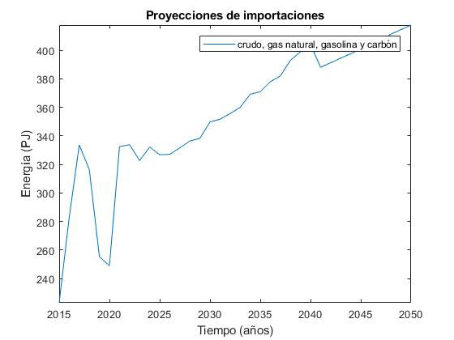

*Figure 3.3: Importaciones de energía*

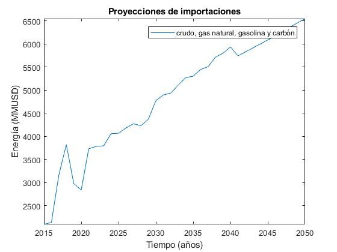

*Figure 3.3: Importaciones de energía*

.. _Proyecciones de importaciones: https://github.com/guidogz/Doc_ELP_Peru/blob/master/docs/999Annexes.rst/ 

3.1.1.5 Exportaciones
--------------

Las importaciones según el "Anuario estadístico sectorial de hidrocarburos 2018" el 2018 fueron de un total aproximado de 316 (PJ), para crudo, GLP, gasolina y carbón, que representan un valor de 3819.72 MMUSD.

================================= ========= ========= ========= =========
                  Importaciones de hidrocarburos (MBLS)
------------------------------------------------------------------------- 
Producto                            2015       2016     2017      2018
================================= ========= ========= ========= =========
Crudo                               2906.63    845.25    572.58   2367.23
Gas Natura                         50898.88  60314.94  51808.68  51399.36
GLP/propano/butano                  1075.67   1460.97    607.97     66.17
Gasolinas                          16707.74  18678.92  19961.24  17803.36
================================= ========= ========= ========= =========

*Fuente: Anuario estadístico sectorial de hidrocarburos 2018 DGH, pag. 73*

================================= ========= ========= ========= =========
               Importaciones de hidrocarburos (MMUSD)
------------------------------------------------------------------------- 
Producto                            2015       2016     2017      2018
================================= ========= ========= ========= =========
Crudo                             120071.32  24015.81  25644.31 138873.88
Gas Natura                        449075.22 522171.53 747859.38 998645.90
GLP/propano/butano                 34427.77  32047.07  31875.49   4192.79
Gasolinas                         860197.63 789710.14 1091366.4 1182051.6
================================= ========= ========= ========= =========

*Fuente: Anuario estadístico sectorial de hidrocarburos 2018 DGH, pag. 73*

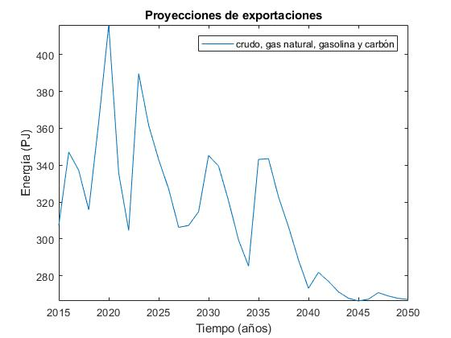

*Figure 3.3: Exportaciones de energía*

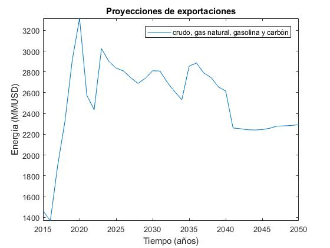

*Figure 3.3: EXportaciones de energía*

.. _Proyecciones de exportaciones: https://github.com/guidogz/Doc_ELP_Peru/blob/master/docs/999Annexes.rst/ 

3.1.2 Emisiones de gases de efecto invernadero (GEI), precio social del carbono.
-----------------------------------------------------

Las emisiones en un futuro cercanos se volveran un serio problema, no sólo medioambiental
sino existencial, ahora nos embarcamos en una lucha por reducir los productos de 
contaminación y la principal acción del sector energía y transportes es sustituir
los insumos que podrucen contaminación, las políticas climáticas hoy en día han 
planificado al 2050 lograr la carbononeutralidad. En la siguiente tabla se muestra el consumo de energía en PJ, las emisiones en Mega-ton CO2e y razón que hay de cada una por sector en el 2018. Además, se puede observar que los sectores que más Mton CO2e generan por unidad de PJ es el sector transporte seguido del sector industrial.

==================== ========= ========= ========= ========= =========== ========== ========== 
                       Energía consumida y emisones por sector (MMUSD)
---------------------------------------------------------------------------------------------- 
2018                  Pesca    Agro      Público    Minero   Residencial Industrial Transporte
                                                             y Comercial   
==================== ========= ========= ========= ========= =========== ========== ========== 
Energía [PJ]          3.075     6.388    12.176    75.847     210.704    163.819    359.798  
Emisiones [MtonCO2e]  0.123     0.139     0.326     1.281       4.4        7.006     24.94
Razón [MtonCO2e/PJ]   0.04      0.0218    0.0268    0.0169      0.0209     0.0428     0.0693
==================== ========= ========= ========= ========= =========== ========== ========== 
*Fuente: Balance nacional de energía 2018*

Los gases de efecto invernadero considerados son el CO2, NH4 y N2O, además tenemos que estos son tomados en su valor equivalente en CO2e, estos valores son tomados del IPCC 2006, a continuación se mostrarán.

+----------+------------+------------+------------+
|          |      CO2   |       CH4  |     N2O    |         
+----------+------------+------------+------------+
|Factor    |       1    |       21   |     310    |
+----------+------------+------------+------------+
*Fuente: Anexo 2 del informe 9 del PROSEMER*

Para los valores correspondientes a las tecnología de producción de energía eléctrica, que relacionan las emisones de GEI, en forma de CO2e, con la Produccióin de energía, se han encontrado en bibliografía los valores o rangos de valores de estos.

========================== ================ ================ =================
Tecnología                  Rango            Media            Unidades 
========================== ================ ================ =================
Refinerías                  949 to 1280             854.5      gCO2e/kWh 
Carboneras                  519 to 1190             1114.5     gCO2e/kWh 
Plantas de gas natural                                         gCO2e/kWh 
Plantas de biodiesel                                68.4       gCO2e/kWh           
Plantas térmicas de gas     485 to 991              738        gCO2e/kWh 
Plantas hidraúlicas           3 to 27                 15       gCO2e/kWh   
Plantas Photovoltáicas       79 to --                 79       gCO2e/kWh                       
Planta eólicas                14 to 21              17.5       gCO2e/kWh  
Plantas térmicas de diesel   519 to 1190            880        gCO2e/kWh    
========================== ================ ================ =================
                                  
*Fuente: GREENHOUSE GAS EMISSIONS FROM ENERGY SYSTEMS: COMPARISON AND OVERVIEW (R. Dones, T. Heck, S. Hirschberg)*

El precio social del carbono es una medida que captura el valor de los daños que causa la emisión de CO2, ayuda a devolver la responsabilidad de los daños a quienes lo causan y ellos puedan evitar eso, hoy en dia los precios de la tonelada de carbono en el mundo es aún bajo, sin embargo, hay países como suecia en donde los presios de la tonelada de carbono esta 126 US$/ton_CO2 (2016) y en proomedio de 10 US$/ton_CO2 para america latina, los precios de la tonelada de carbono en un escenario de descarbonización aumentarían. 

El precio social del carbono en Perú tiene un valor de 7.17 us$/ton-CO2 para el año 2016.

=============================== =======================
Parámetro                             us$/ton-CO2
=============================== =======================
Precio social del carbono                 7.17
=============================== =======================
*Fuente: CIUP, 2016*

3.1.3 Proyección de demanda - Ecuaciones de predicción de los sectores productivos
-----------------------------------------------------

3.1.3.1 Metodología general usada para la predicción de los Sectores Productivos
--------------

Mediante el uso de modelos econométricos se ha proyectado las series de la demandas de los sectores productivos, tomando como variables exógenas: la población, el PBI por sectores, PBI per cápita, etc, en algunos de estas se incluye la tendencia lineal, tambien se ha proyectado con las tazas de crecimiento constantes para el sector agropecuario y público; analizando las series de tiempo para los sectores como procesos autoregresivos (a excepto de agropecuario y público, transporte ferroviario, naval y aéreo) donde con las variables explicativas se ha podido proyectar las demandas de los múltiples sectores hasta el 2050.
Los sectores analizados son los mismos que toma el PROSEMER, que a su vez son los mismos que toma del BEU 2013 (balance de energía útil); los sectores son:

**Se consideran 7 sectores productivo**

- k=1, (Residencial)
- k=2, (Comercial 
- k=3, (Público)
- k=4, (Industrial manufacturera en general)
- k=5, (Pesca)
- k=6, (Agropecuaria)
- k=7, (Minería y metalurgia)

Para el caso de transporte se ha dividido para su análisis en macrogrupos como carretero, ferroviario, naval, aéreo, metro y transporte masivo, a su vez transporte carretero y ferroviario están subdivididos en pasajero y carga.   

Los resultados de los sectores están en diferentes unidades como se puede observar en la Tabla 1, los resultados de transporte carretero están en pkm  y tkm debido que se quiere representar la demanda como un servicio <<necesidad de un servicio>>, sin embargo, los resultados para los demás sectores las unidades están en PJ (energía neta).

============================= ============================= ======================================== =========
Sector                        Variables explicativas               Uso                               Resultado
============================= ============================= ======================================== =========
Residencial                   PBI per cápita                Cons=f(ConsRes(t-1),PIBpc(t-1),tend(t))  PJ
Comercial                     PBI sector terciario          Cons=f(ConsCom(t-1),PIBter(t-1),tend(t)) PJ
Público                       Tasa de crecimiento constante                                          PJ
Agropecuario                  Tasa de crecimiento constante                                          PJ
Pesca                         Producción pesca y tendencia  Cons=f(ConsPesca(t-1),Prod(t-1),tend(t)) PJ
Minería                       PBI minería                   Cons=f(ConsMin(t-1),PIBMin(t-1),tend(t)) PJ
Manufactura insdustrial       PBI manufactura industrial    Cons=f(ConsMan(t-1),PIBMan(t-1),tend(t)) PJ
Energía escenario 2           PBI                           Cons=f(ConsEnerg(t-1),PIB(t-1),tend(t))  PJ
Trans. carretero pas. privado PBI                           Cons=f(ConsTransCarrPriv(t-1),PIB(t-1))  pkm
Trans. carretero pas. público PBI                           Cons=f(ConsTransCarrPubl(t-1),PIB(t-1))  pkm
Trans. carretero carga        PBI                           Cons=f(ConsTransCarrCarg(t-1),PIB(t-1))  tkm
Trans. ferroviario carga      PBI                           Cons=f(ConsTransFerrCarg(t-1),PIB(t-1))  tkm
Trans. ferroviario pasajeros  Población (POB)               Cons=f(ConsTransFerrPas(t-1),POB(t-1))   pkm
Trans. naval                  PBI                           Cons=f(ConsTransNav(t-1),PIB(t-1))       PJ
Trans. éreo                   PBI                           Cons=f(ConsTransAereo(t-1),PIB(t-1))     PJ
============================= ============================= ======================================== =========

*Fuente: Propia*

3.1.3.2 Variables explicativas de las demanda por sectores productivos
--------------

**PBI**

La variable utilizada como varible expliativa en la mayoría de los modelos es el PBI (producto bruto interno), los valores de esta variable se han tomado del T21, estos resultados son de un estudio que se realizó con el objetivo de predecir el crecimiento del PBI al 2050, los valores tabulados de crecimiento del PBI se pueden encontrar en anexos de este documento, Anexos en A3 `PBI <https://github.com/guidogz/Doc_ELP_Peru/blob/master/docs/999Annexes.rst/>`_. En las siguientes gráficas se puede observar los valores de PBI, el porcentaje de crecimiento PBI, el PBI per cápita, y la producción por sector energético. 

.. figure:: img/Proyeccion_del_crecimiento_del_PBI_anual.png
   :align:   center
   :width:   700 px
*Figure 3.13: Proyección del crecimiento del PBI anual, Fuente: Propia*

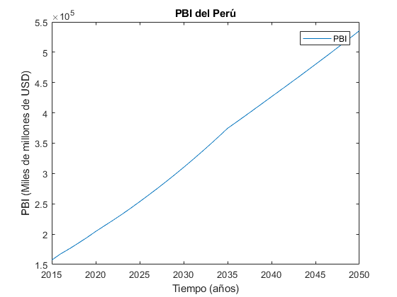
*Figure 3.13: Proyección del PBI en miles de millones, Fuente: Propia*

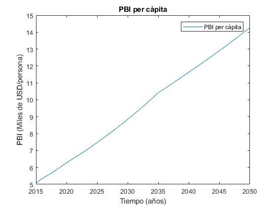
*Figure 3.13: Proyección del PBI per cápita, Fuente: Propia*

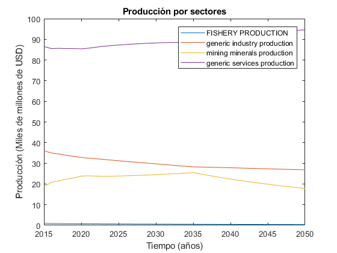
*Figure 3.13: Proyección de la producción por sectores, Fuente: Propia*

**Población**
Los valores de población corresponden a los resultados del T21, los valores grafiados se pueden observar en los anexos en A4 respectivamente `demandas <https://github.com/guidogz/Doc_ELP_Peru/blob/master/docs/999Annexes.rst/>`_. En las siguientes gráficas se puede observar el crecimiento de la población.

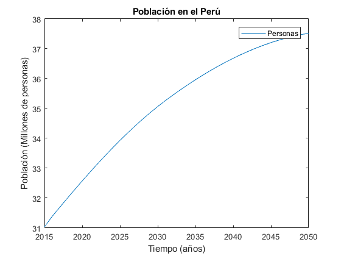
*Figure 3.13: Proyección de la población en el Perú, Fuente: Propia*

3. OSeMOSYS-Peru
=======================================

3.1.3.3 Ecuaciones utilizados para los diferentes sectores
--------------

**Sector residencial**
     Para el sector residencial se ha utilizado los valores históricos de demanda energética y PBI per cápita para poder realizar las predicciones de la demanda, en un inicio se estima la primera diferencia de PBI per cápita y de la demanda, luego se normalizan con los valores mínimos y máximos de las diferencias (véase Tabla 2) de ambos, a continuación se halla el pronóstico (véase ecuación 1) para finalmente poder obtener el pronóstico final (véase ecuación 2), los coeficientes se calculan mediante regresión con ajuste, se realizó con la herramienta solver de excel.

+----------------+----------------------------+-----------------------+
|                | Demanda residencial (DR)   | PBI per cápita        |
+----------------+----------------------------+-----------------------+
| Delta Mínimo   | -29.675                    | -2.5                  |
+----------------+----------------------------+-----------------------+
| Delta Máximo   | 76.2                       | 707.5                 |
+----------------+----------------------------+-----------------------+
*Fuente: Propia*                     

.. math::

 \begin{equation}\text { Pronostico }_{t}=a * \operatorname{nor}\left(R_{t-1}\right)+b * \operatorname{nor}\left(P B I_{t-1}\right)+c\end{equation}

Donde:

- a, b y c       Coeficiente obtenidos por optimización.
- R(t-1)         Consumo de Energía residencial año 𝑡-1.
- nor(R(t-1))    Normalizado del consumo de Energía residencial año 𝑡-1.
- PBI(t-1)       Producto Bruto Interno per cápita en el año t-1.
- nor(PBI(t-1))  Normalizado del Producto Bruto Interno per cápita en el año t-1.

+----------------+----------------------------+-----------------------+
| a              | b                          | c                     |
+----------------+----------------------------+-----------------------+
| 0.13662361     | 0.09599035                 | 0.31028359            |
+----------------+----------------------------+-----------------------+
*Fuente: Propia*

.. math::

 \begin{equation}\text { Pronostico, final }_{t}=\text { Pronostico }_{t} *(D R \max -D R \min )+D R \min +R_{t-1}\end{equation}

Las medidas de error para el modelo fueron 

+----------------------------------------+----------------------------+
| Tipo de error                          | Valoración                 |
+----------------------------------------+----------------------------+
| RMSE (root mediun square error )       | 12.22                      |
+----------------------------------------+----------------------------+
| MAPE (mean absolute percentage error ) | 5.6 %                      |
+----------------+-----------------------+----------------------------+
*Fuente: Propia*

Los valores tabulados al 2050 se pueden encontrar en anexos de este documento, en Anexos en A14 respectivamente `demandas <https://github.com/guidogz/Doc_ELP_Peru/blob/master/docs/999Annexes.rst/>`_.

**Sector comercial**
     Para el sector comercial se ha utilizado los valores históricos de demanda energética y PBI sector terciario para poder realizar las predicciones, en un inicio se estima la primera diferencia de PBI sector terciario y de la demanda, luego se normalizan con los valores mínimos y máximos de las diferencias (véase Tabla 2) de ambos, a continuación se halla el pronóstico (véase ecuación 1) para finalmente poder obtener el pronóstico final (véase ecuación 2), los coeficientes se calculan mediante regresión con ajuste, se realizó con la herramienta solver de excel.

+----------------+----------------------------+-----------------------+
|                | Demanda comercial (DR)     | PBI sector terciario  |
+----------------+----------------------------+-----------------------+
| Delta Mínimo   | -39.8                      | 942.8                 |
+----------------+----------------------------+-----------------------+
| Delta Máximo   | 55.1                       | 7830.38               |
+----------------+----------------------------+-----------------------+
*Fuente: Propia*                      

.. math::

 \begin{equation}\text { Pronostico }_{t}=a * \operatorname{nor}\left(C_{t-1}\right)+b * \text { nor }\left(P B I \operatorname{ter}_{t-1}\right)+c\end{equation}

Donde:

- a, b y c             Coeficiente obtenidos por optimización.
- C(t-1)               Consumo de Energía comercial año 𝑡-1.
- nor(C(t-1))          Normalizado del consumo de Energía comercial año 𝑡-1.
- PBI ter(t-1)         Producto Bruto Interno del sector terciario en el año t-1.
- nor(PBI ter(t-1))    Normalizado del Producto Bruto Interno del sector terciario en el año t-1.

+----------------+----------------------------+-----------------------+
| a              | b                          | c                     |
+----------------+----------------------------+-----------------------+
| -0.4123497     | 0.04998758                 | 0.60658334            |
+----------------+----------------------------+-----------------------+
*Fuente: Propia*

.. math::

 Pronostico, final $_{t}=$ Pronostico $_{t} *(D R m a x-D R m i n)+D R \min +C_{t-1}$

Las medidas de error para el modelo fueron 

+----------------------------------------+----------------------------+
| Tipo de error                          | Valoración                 |
+----------------------------------------+----------------------------+
| RMSE (root mediun square error )       | 1.569757814                |
+----------------------------------------+----------------------------+
| MAPE (mean absolute percentage error ) | 3.3%                       |
+----------------+-----------------------+----------------------------+
*Fuente: Propia*

Los valores tabulados al 2050 se pueden encontrar en anexos de este documento, en Anexos en A14 respectivamente `demandas <https://github.com/guidogz/Doc_ELP_Peru/blob/master/docs/999Annexes.rst/>`_.

**Sector manufactura industrial**

     Para el sector manufactura industrial se han utilizado los valores históricos de demanda energética y PBI sector manufactura para poder realizar las predicciones, en un inicio se estima la primera diferencia de PBI sector manufactura y de la demanda, luego se normalizan con los valores mínimos y máximos de las diferencias (véase Tabla 2) de ambos, a continuación se halla el pronóstico (véase ecuación 1) para finalmente poder obtener el pronóstico final (véase ecuación 2), los coeficientes se calculan mediante regresión con ajuste, se realizó con la herramienta solver de excel.

+----------------+----------------------------+-----------------------+
|                | Demanda manufactura (DR)   | PBI manufactura       |
+----------------+----------------------------+-----------------------+
| Delta Mínimo   | -44.225                    | -2564.238             |
+----------------+----------------------------+-----------------------+
| Delta Máximo   | 19.305                     | 2600.192              |
+----------------+----------------------------+-----------------------+
*Fuente: Propia*            

.. math::

 \text { Pronostico }_{t}=a * \operatorname{nor}\left(M_{t-1}\right)+b * \operatorname{nor}\left(P B I \operatorname{man} u_{t-1}\right)+c

Donde:
 
- a, b y c           Coeficiente obtenidos por optimización.
- M(t-1)             Consumo de Energía manufcatura en el año 𝑡-1.
- nor(M(t-1))        Normalizado del consumo de Energía manufactura en el año 𝑡-1.
- PBI manu(t-1)      Producto Bruto Interno del sector maunfactura en el año t-1.
- nor(PBI manu(t-1)) Normalizado del Producto Bruto Interno del sector maunfactura en el año t-1.

+----------------+----------------------------+-----------------------+
| a              | b                          | c                     |
+----------------+----------------------------+-----------------------+
| -0.48841885    | 0.29028287                 | 0.91878258            |
+----------------+----------------------------+-----------------------+
*Fuente: Propia*

.. math::

 \begin{equation}\text { Pronostico, final }_{t}=\text { Pronostico }_{t} *(D R \max -D R \min )+D R \min +M_{t-1}\end{equation}

Las medidas de error para el modelo fueron 

+----------------------------------------+----------------------------+
| Tipo de error                          | Valoración                 |
+----------------------------------------+----------------------------+
| RMSE (root mediun square error )       | 5.757722853                |
+----------------------------------------+----------------------------+
| MAPE (mean absolute percentage error ) | 6.5%                       |
+----------------+-----------------------+----------------------------+
*Fuente: Propia*

Los valores tabulados al 2050 se pueden encontrar en anexos de este documento, en Anexos en A14 respectivamente `demandas <https://github.com/guidogz/Doc_ELP_Peru/blob/master/docs/999Annexes.rst/>`_.

**Sector minería**

     Para el sector minería se ha utilizado los valores históricos de demanda energética y PBI sector manufactura para poder realizar las predicciones, en un inicio se estima la primera diferencia de PBI sector manufactura y de la demanda, luego se normalizan con los valores mínimos y máximos de las diferencias (véase Tabla 2) de ambos, a continuación se halla el pronóstico (véase ecuación 1) para finalmente poder obtener el pronóstico final (véase ecuación 2), los coeficientes se calculan mediante regresión con ajuste, se realizó con la herramienta solver de excel.

+----------------+----------------------------+-----------------------+
|                | Demanda manufactura (DR)   | PBI manufactura       |
+----------------+----------------------------+-----------------------+
| Delta Mínimo   | -10.3625                   | -1618.73              |
+----------------+----------------------------+-----------------------+
| Delta Máximo   | 14.562                     | 2390.94               |
+----------------+----------------------------+-----------------------+
*Fuente: Propia*                      

.. math::

 \begin{equation}\text { Pronostico }_{t}=\text { Pronostico }_{t}=a * \operatorname{nor}\left(M i_{t-1}\right)+b * \operatorname{nor}\left(P B I \operatorname{mine}_{t-1}\right)+c\end{equation}

Donde:
 
- a, b y c           Coeficiente obtenidos por optimización.
- Mi(t-1)            Consumo de Energía minería en el año 𝑡-1.
- nor(Mi(t-1))       Normalizado del Consumo de Energía minería en el año 𝑡-1.
- PBI mine(t-1)      Producto Bruto Interno del sector minería en el año t-1.
- nor(PBI mine(t-1)) Normalizado del Producto Bruto Interno del sector minería en el año t-1.

+----------------+----------------------------+-----------------------+
| a              | b                          | c                     |
+----------------+----------------------------+-----------------------+
| -0.07251219    | 0.00932579                 | 0.49082724            |
+----------------+----------------------------+-----------------------+
*Fuente: Propia*

.. math::

 \begin{equation}\text { Pronostico, } f \text { inal}_{t}=\text { Pronostico}_{t} *(D R m a x-D R m i n)+D R m i n+M i_{t-1}\end{equation}

Las medidas de error para el modelo fueron 

+----------------------------------------+----------------------------+
| Tipo de error                          | Valoración                 |
+----------------------------------------+----------------------------+
| RMSE (root mediun square error )       | 5.757722853                |
+----------------------------------------+----------------------------+
| MAPE (mean absolute percentage error ) | 6.5%                       |
+----------------+-----------------------+----------------------------+
*Fuente: Propia*

Los valores tabulados al 2050 se pueden encontrar en anexos de este documento, en Anexos en A14 respectivamente `demandas <https://github.com/guidogz/Doc_ELP_Peru/blob/master/docs/999Annexes.rst/>`_.

**Sector agropecuario**
     Para el sector agropecuario se ha tomado una tasa de crecimiento constante la cual se ha fijado en 1.5% anual para la proyección hasta el 2050.

Los valores tabulados al 2050 se pueden encontrar en anexos de este documento, en Anexos en A14 respectivamente `demandas <https://github.com/guidogz/Doc_ELP_Peru/blob/master/docs/999Annexes.rst/>`_.

**Sector público**
     Para el sector público se ha tomado una tasa de crecimiento constante la cual se ha fijado en 1% anual para la proyección hasta el 2050.

Los valores tabulados al 2050 se pueden encontrar en anexos de este documento, en Anexos en A14 respectivamente `demandas <https://github.com/guidogz/Doc_ELP_Peru/blob/master/docs/999Annexes.rst/>`_.

**Sector pesca**
     Para el sector pesca se ha utilizado los valores históricos de demanda energética y PBI producción para poder realizar las predicciones, en un inicio se hacen ajustes estadísticos del PBI sector pesca y de la demanda, luego con una regresión lineal se halla la tendencia del PBI (tendenciaPBI), para después incorporarla a la ecuación de autoregreción (vésase ecuación 9) .

+----------------+----------------------+---------------------+-----------------+
| a              | b                    | c                   |  d              |
+----------------+----------------------+---------------------+-----------------+
| -0.17783316    | 4.95E-01             | 0.28410597          | -6.63E-04       |
+----------------+----------------------+---------------------+-----------------+
*Fuente: Propia*

.. math::

 \begin{equation}P_{t}=a+b * \ln \left(P_{t-1}\right)+c * \ln \left(P B I_{t-1}\right)+e * \text { tendenciaPBI }\end{equation}

Las medidas de error para el modelo fueron 

+----------------------------------------+----------------------------+
| Tipo de error                          | Valoración                 |
+----------------------------------------+----------------------------+
| RMSE (root mediun square error )       | 0.310465837                |
+----------------------------------------+----------------------------+
| MAPE (mean absolute percentage error ) | 23.2 %                     |
+----------------+-----------------------+----------------------------+
*Fuente: Propia*

Los valores tabulados al 2050 se pueden encontrar en anexos de este documento, en Anexos en A14 respectivamente `demandas <https://github.com/guidogz/Doc_ELP_Peru/blob/master/docs/999Annexes.rst/>`_.

3.1.2.3 Ecuaciones utilizados para el sector transporte
---------

La proyección del consumo de energía del sector de transporte considera los modales de transporte de pasajero por carretera (privado y público) y de carga, el ferroviario (pasajero y carga), el marítimo, aéreo y metro.

==== ==================== ======================= ==================== ======================
m     Modal                  Pasajero                Uso                   Resultado
==== ==================== ======================= ==================== ======================
01    Por carretera          Pasajero público      Vehiculos públicos      pkm
02    Por carretera          Pasajero privado      Vehículos privado       pkm
03    Por carretera          Carga                 hehículos de carga      tkm
04    Ferroviario            Pasajero              Líneas 1,2,3            pkm
05    Ferroviario            Carga                 Líneas 1 e 2            tkm
05    Naval                  Pasajero & Carga                              En. neta
06    Aéreo                  Pasajero & Carga                              En. neta
07    Metro                  Pasajero                                      En. neta
08    Transporte masivo      Pasajero                                      pkm
==== ==================== ======================= ==================== ======================
*Fuente: Propia*
   
**Subdivisión transporte carretero privado**

Para la subdivisión del sector transporte se ha utilizado un modelo autoregresivo, para el cual primero se ha utilizado los valores del logaritmo del PBI y de la demanda del sector transporte para luego ajustar la ecuación del modelo, todo esto en la herramienta solver de Excel, se obtiene los coeficientes del modelo para finalmente poder hallar el pronóstico final.
Como ya se ha mencionado anteriormente antes los resultados de estas proyecciones están en pkm.

.. math::

 \begin{equation}T_{t}=a+b * \ln \left(T_{t-1}\right)+c * \ln \left(P B I_{t-1}\right)\end{equation}

+----------------+----------------------------+-----------------------+
| a              | b                          | c                     |
+----------------+----------------------------+-----------------------+
| 0.84331819     | 0.1209881                  | 0.36183109            |
+----------------+----------------------------+-----------------------+
*Fuente: Propia*

- a, b y c          Coeficiente obtenidos por optimización.
- T(t-1)            Consumo de Energía sector transporte privado en el año 𝑡-1.
- PBI(t-1)          Producto Bruto Interno en el año t-1.

Las medidas de error para el modelo fueron 

+----------------------------------------+----------------------------+
| Tipo de error                          | Valoración                 |
+----------------------------------------+----------------------------+
| RMSE (root mediun square error )       | 138.8361788                |
+----------------------------------------+----------------------------+
| MAPE (mean absolute percentage error ) | 0.08 %                     |
+----------------+-----------------------+----------------------------+
*Fuente: Propia*

Los valores tabulados al 2050 se pueden encontrar en anexos de este documento, en Anexos en A14 respectivamente `demandas <https://github.com/guidogz/Doc_ELP_Peru/blob/master/docs/999Annexes.rst/>`_.

**Subdivisión transporte carretero público**

Para la subdivisión del sector transporte público se ha utilizado un modelo autoregresivo, para el cual primero se ha utilizado los valores del logaritmo del PBI y de la demanda del sector transporte para luego ajustar la ecuación del modelo, todo esto en la herramienta solver de Excel, se obtiene los coeficientes del modelo para finalmente poder hallar el pronóstico final.
Como ya se ha mencionado anteriormente antes los resultados de estas proyecciones están en pkm.

.. math::

 \begin{equation}T_{t}=a+b * \ln \left(T_{t-1}\right)+c * \ln \left(P B I_{t-1}\right)\end{equation}

+----------------+----------------------------+-----------------------+
| a              | b                          | c                     |
+----------------+----------------------------+-----------------------+
| 0.78746426     | 0.19176726                 | 0.24507861            |
+----------------+----------------------------+-----------------------+
*Fuente: Propia*

- a, b y c          Coeficiente obtenidos por optimización.
- T(t-1)            Consumo de Energía sector transporte público en el año 𝑡-1.
- PBI(t-1)          Producto Bruto Interno en el año t-1.

Las medidas de error para el modelo fueron 

+----------------------------------------+----------------------------+
| Tipo de error                          | Valoración                 |
+----------------------------------------+----------------------------+
| RMSE (root mediun square error )       | 1248.217912                |
+----------------------------------------+----------------------------+
| MAPE (mean absolute percentage error ) | 0.37%                      |
+----------------+-----------------------+----------------------------+
*Fuente: Propia*

Los valores tabulados al 2050 se pueden encontrar en anexos de este documento, en Anexos en A14 respectivamente `demandas <https://github.com/guidogz/Doc_ELP_Peru/blob/master/docs/999Annexes.rst/>`_.

**Subdivisión transporte carretero carga**

Para la subdivisión del sector transporte público se ha utilizado un modelo autoregresivo, para el cual primero se ha utilizado los valores del logaritmo del PBI y de la demanda del sector transporte para luego ajustar la ecuación del modelo, todo esto en la herramienta solver de Excel, se obtiene los coeficientes del modelo para finalmente poder hallar el pronóstico final.
Como ya se ha mencionado anteriormente antes los resultados de estas proyecciones están en pkm.

.. math::

 \begin{equation}T_{t}=a+b * \ln \left(T_{t-1}\right)+c * \ln \left(P B I_{t-1}\right)\end{equation}

+----------------+----------------------------+-----------------------+
| a              | b                          | c                     |
+----------------+----------------------------+-----------------------+
| 0.82591532     | 0.16141611                 | 0.29490398            |
+----------------+----------------------------+-----------------------+
*Fuente: Propia*

- a, b y c          Coeficiente obtenidos por optimización.
- T(t-1)            Consumo de Energía sector transporte de carga en el año 𝑡-1.
- PBI(t-1)          Producto Bruto Interno en el año t-1.

Las medidas de error para el modelo fueron 

+----------------------------------------+----------------------------+
| Tipo de error                          | Valoración                 |
+----------------------------------------+----------------------------+
| RMSE (root mediun square error )       | 442.3843504                |
+----------------------------------------+----------------------------+
| MAPE (mean absolute percentage error ) | 0.08%                      |
+----------------+-----------------------+----------------------------+
*Fuente: Propia*

Los valores tabulados al 2050 se pueden encontrar en anexos de este documento, en Anexos en A14 respectivamente `demandas <https://github.com/guidogz/Doc_ELP_Peru/blob/master/docs/999Annexes.rst/>`_.

**Subdivisión transporte ferroviario pasajeros**
    Para esta subdivisón se ha utilizados las ecuaciones del modelo TIMES para obtener la proyección, las cuales en un inicio calcula Q_(t,m), (cantidad de vehículos en venta) con los valores de población, con este resultado se prosigue a calcular los valores de consumo de energía de las principales flotas de trenes en el país, a este valor  le multiplica por un peso que denota el ratio de pasajero por kilómetro, que se denota por  K. 

.. math::

 \begin{equation}\ln \left(Q_{t, m}\right)=\alpha_{m}+\beta_{m} \ln \left(P O B_{t}\right), \quad m=12\end{equation}

.. math::

 \begin{equation}W_{t, m, l}=W_{t-1, m, l} \times \frac{Q_{t, m}}{Q_{t-1, m}}\end{equation}

.. math::

 \begin{equation}p k m_{m, t, r}=\sum_{l}\left(W_{t, m, l} \times k m_{-} W_{m, l} \times \omega_{m, l}\right)\end{equation}

Los valores tabulados al 2050 se pueden encontrar en anexos de este documento, en Anexos en A16 respectivamente `demandas <https://github.com/guidogz/Doc_ELP_Peru/blob/master/docs/999Annexes.rst/>`_.

**Subdivisión transporte ferroviario carga**
    Para esta subdivisón se ha utilizados las ecuaciones del modelo TIMES para obtener la proyección, las cuales en un inicio calcula Q_(t,m), (cantidad de vehículos en venta) con los valores de PBI, con este resultado se prosigue a calcular los valores de consumo de energía de las principales flotas de trenes en el país, a este valor  le multiplica por un peso que denota el ratio de pasajero por kilómetro, que se denota por  

.. math::

 \begin{equation}\ln \left(Q_{t, m}\right)=\alpha_{m}+\beta_{m} \ln \left(P I B_{t}\right), \quad \quad m=13\end{equation}

.. math::

 \begin{equation}W_{t, m, l}=W_{t-1, m, l} \times \frac{Q_{t, m}}{Q_{t-1, m}}\end{equation}

.. math::

 \begin{equation}t k m_{m, t, r}=\sum_{l}\left(W_{t, m, l} \times k m_{-} W_{m, l} \times \omega_{m, l}\right)\end{equation}

Los valores tabulados al 2050 se pueden encontrar en anexos de este documento, en Anexos en A16 respectivamente `demandas <https://github.com/guidogz/Doc_ELP_Peru/blob/master/docs/999Annexes.rst/>`_.

**Subdivisión transporte naval**
    Para esta subdivisón se ha utilizados las ecuaciones del modelo TIMES para obtener la proyección, las cuales en un inicio calcula Q_(t,m), con los valores de PIB, ahora con los valores de la demanda anterior se calcula el nuevo valor con la ecuación 14. 

.. math::

 \begin{equation}\ln \left(Q_{t, m}\right)=\alpha_{m}+\beta_{m} \ln \left(P I B_{t}\right), \quad m=14\end{equation}

.. math::

 \begin{equation}E_{t, m}=E_{t-1, m} \times \frac{Q_{t, m}}{Q_{t-1, m}}\end{equation}

Subdivisión transporte aéreo
Para esta subdivisón se ha utilizados las ecuaciones del modelo TIMES para obtener la proyección, las cuales en un inicio calcula Q_(t,m), con los valores de PIB, , ahora con los valores de la demanda anterior se calcula el nuevo valor con la ecuación 16

.. math::

 \begin{equation}\ln \left(Q_{t, m}\right)=\alpha_{m}+\beta_{m} \ln \left(P I B_{t}\right), \quad \quad m=15\end{equation}

.. math::

 \begin{equation}E_{t, m}=E_{t-1, m} \times \frac{Q_{t, m}}{Q_{t-1, m}}\end{equation}

Los valores tabulados al 2050 se pueden encontrar en anexos de este documento, en Anexos en A14 respectivamente `demandas <https://github.com/guidogz/Doc_ELP_Peru/blob/master/docs/999Annexes.rst/>`_.

**Sector energético (escenario 2)**
     Para el sector energético se ha utilizado los valores históricos de demanda energética y PBI para poder realizar las proyecciones, en un inicio se estima la primera diferencia de PBI per cápita y de la demanda, luego se normalizan con los valores mínimos y máximos de las diferencias (véase Tabla 14) de ambos, a continuación se halla el pronóstico (véase ecuación 17) para finalmente poder obtener el pronóstico final (véase ecuación 18), los coeficientes se calculan mediante regresión con ajuste, se realizó con la herramienta solver de excel.

+----------------+----------------------------+-----------------------+
|                | Demanda manufactura (DR)   | PBI manufactura       |
+----------------+----------------------------+-----------------------+
| Delta Mínimo   | -38.115                    | -10731                |
+----------------+----------------------------+-----------------------+
| Delta Máximo   | 51.255                     | 14088                 |
+----------------+----------------------------+-----------------------+
*Fuente: Propia*                      

.. math::

 \begin{equation}\text { Pronostico }_{t}=\text { Pronostico }_{t}=a * \operatorname{nor}\left(E_{t-1}\right)+b * \operatorname{nor}\left(P B I_{t-1}\right)+c\end{equation}

Donde:
 
- a, b y c           Coeficiente obtenidos por optimización.
- Mi(t-1)            Consumo de Energía minería en el año 𝑡-1.
- nor(Mi(t-1))       Normalizado del Consumo de Energía minería en el año 𝑡-1.
- PBI mine(t-1)      Producto Bruto Interno del sector minería en el año t-1.
- nor(PBI mine(t-1)) Normalizado del Producto Bruto Interno del sector minería en el año t-1.

+----------------+----------------------------+-----------------------+
| a              | b                          | c                     |
+----------------+----------------------------+-----------------------+
| -0.34489406    | 0.51238552                 | 0.36684512            |
+----------------+----------------------------+-----------------------+
*Fuente: Propia*

.. math::

 Pronostico, final $_{t}=$ Pronostico $_{t} *(D R m a x-D R m i n)+D R m i n+E_{t-1}$

Las medidas de error para el modelo fueron 

+----------------------------------------+----------------------------+
| Tipo de error                          | Valoración                 |
+----------------------------------------+----------------------------+
| RMSE (root mediun square error )       | 10.52662931                |
+----------------------------------------+----------------------------+
| MAPE (mean absolute percentage error ) | 3.1%                       |
+----------------+-----------------------+----------------------------+
*Fuente: Propia*

Los valores tabulados al 2050 se pueden encontrar en anexos de este documento.
