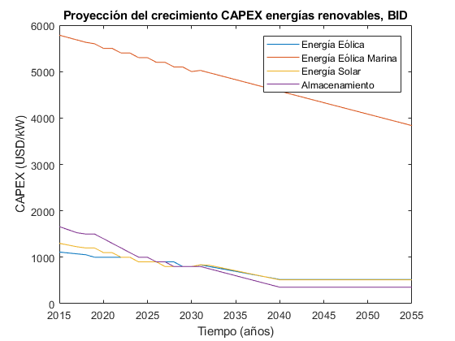

.. _docgen:

Energy System Modeling: Data Analysis
=======================================

Characterization of Energy Sectors
-----------------------------------------------------
 Fitter Data and Outlier Correction
  blaa... 
  
  

   *Figure 3.1: Proyección del crecimiento del PBI anual.*
   
   

   *Figure 3.2: Proyeccion del crecimiento CAPEX energias renovables.*
   
   
.. figure:: img/Proyeccion_de_la_maxima_demanda_de_electricidad_anual.png
   :align:   center
   :width:   700 px

   *Figure 3.3: Proyeccion de la maxima demanda de electricidad anual.*
   
  
.. figure:: img/Proyeccion_de_la_demanda _de_electricidad_anual.svg
   :align:   center
   :width:   700 px

   *Figure 3.4: Proyección de la demanda de electricidad anual.*
   
   
.. figure:: img/Proyeccion_del_precio_de_carbon.png
   :align:   center
   :width:   700 px

   *Figure 3.5: Proyeccion del precio de carbon.*
   
.. figure:: img/Proyeccion_del_precio_del_gas_en_la_planta.png
   :align:   center
   :width:   700 px

   *Figure 3.6: Proyeccion del precio del gas en la planta.*
   
   
.. figure:: img/Proyeccion_del_precio_promedio_del_crudo.png
   :align:   center
   :width:   700 px

   *Figure 3.7: Proyeccion del precio promedio del crudo.*
   

   *Figure 3.8: Proyeccion del precio de vehiculos electricos.*
   
.. figure:: img/Proyeccione _de_precio_por_capacidad_de_refineria.svg
   :align:   center
   :width:   700 px

   *Figure 3.10: Proyeccione de precio por capacidad de la refineria.*

.. figure:: img/Proyeccione_de_precio_por_capacidad_de_la_planta_de_gas.png
   :align:   center
   :width:   700 px

   *Figure 3.9: Proyeccione de precio por capacidad de la planta de gas.*
   

   

 
 Clustering and Representative Networks
 
 Time-Series Analysis and Forecasting

Electricity Sector Simulation
-----------------------------------------------------
 Data Structure and Elements of Electric System
  power..
 
 Electricity Power Flow and Efficiency
 
 Emissions from Electricity Sector

Transport Sector Simulation
-----------------------------------------------------

 Data Structure and Elements of Transport System
 Traffic Flow Analysis and Efficiency of the System
 Emissions and Air Pollution from Transport Sector

