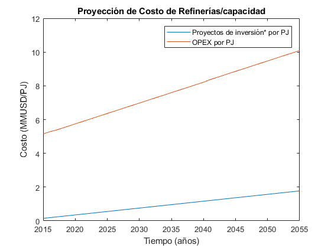

   .. _docgen:

Energy System Modeling: Data Analysis
=======================================

Characterization of Energy Sectors
-----------------------------------------------------
 Fitter Data and Outlier Correction
  blaa... 
  
.. figure:: img/RES_Energia.png
   :align:   center
   :width:   700 px
  *Figure 3.1: Diagrama del modelo desarrollado.*
   :align:   center

3.2.1 Sets
---------

3.2.1 Procesos
---------

3.2.1 Comodities
---------

3.2.1 Costos 
---------

3.2.1 Emisiones
---------  
 
 3.2.1 Datos de entrada
---------   
    
.. figure:: img/Proyeccion_del_crecimiento_del_PBI_anual.png
   :align:   center
   :width:   500 px

   *Figure 3.1: Proyección del crecimiento del PBI anual.*

Para los valores proyectados se utilizaron los valores proporcionados para el periodo 2016-2026 por la consultora APOYO, los valores para el periodo 2027-2040 se tomaron de los escenarios proporcionados por el MINEM y para el periodo 2040-2055 se tomaron la proyección de la tendencia de los valores de los últimos 10 años anteriores al 2040. 

   
.. figure:: img/proyeccion_del_crecimiento_CAPEX_energias_renovables.png
   :align:   center
   :width:   700 px

   *Figure 3.2: Proyección del crecimiento CAPEX energias renovables.*

Para la proyección del CAPEX (Capital expenditure) de las energías renovables se tomaron valores del "Evolución futura de costos de las energías renovables y almacenamiento en América Latina" para el periodo 2018-2030, para el periodo 2030-2055 se ha utilizado un ajuste lotgarítmico para poder proyectar los valores.

.. figure:: img/Proyeccion_del_precio_de_carbon.png
   :align:   center
   :width:   700 px

   *Figure 3.3: Proyección del precio de carbon.*

Para la proyección de los precios del carbón se utliza las proyección del carbon australia del banco mundial
(octubre del 2018), todos los costos de internación son considerados e incluye flete y otros costos de transporte, el carbón tiene un costo de internación  de 18.6 US$/ton.

.. figure:: img/Proyeccion_del_precio_del_gas_en_la_planta.png
   :align:   center
   :width:   700 px

   *Figure 3.4: Proyección del precio del gas en la planta.*

Los precios del gas han utilizado como base las proyeciones de "high oil and gas resource and technology" (HRT) del EIA que han sido proyectadas hasta el 2050, y como las proyeciones del caso de referencia EIA . 

.. figure:: img/Proyeccion_del_precio_promedio_del_crudo.png
   :align:   center
   :width:   700 px

   *Figure 3.5: Proyección del precio promedio del crudo.*

Para la proyección del precio del crudo se ha utilizado las proyecciones de WTI que se estabblecen en dos escenarios uno es el de referencia y el otro es el alto, se incluyen todos los costos, el crudo tienen un costos de integración de 5 US$/bbl.

.. figure:: img/Proyeccione_de_precio_por_capacidad_de_la_planta_de_gas.png
   :align:   center
   :width:   700 px

   *Figure 3.6: Proyecciones del precio por capacidad de la planta de gas.*

Los cálculos se hicieron con los datos de costos de capital y operación de plantas de gas y la actividad de las refinería que se encuentran en el informe 9 "Desarrollo del Plan Energético a Nivel de Grupos de Regiones y Acompañamiento".  

   *Figure 3.7: Proyecciones del precio por capacidad de la refineria.*

Los cálculos se hicieron con los datos de costos de capital, operación y variación de plantas de refinación y la actividad de las refinería que se encuentran en el informe 9 "Desarrollo del Plan Energético a Nivel de Grupos de Regiones y Acompañamiento".  

*____________________________________________________________________*

 Clustering and Representative Networks
 
 Time-Series Analysis and Forecasting

Electricity Sector Simulation
-----------------------------------------------------
 Data Structure and Elements of Electric System
  power..
   

.. figure:: img/Proyeccion_de_la_maxima_demanda_de_electricidad_anual.png
   :align:   center
   :width:   700 px

   *Figure 3.8: Proyección de la maxima demanda de electricidad anual.*

.. figure:: img/Proyeccion_de_la_demanda_de_electricidad_anual.png
   :align:   center
   :width:   700 px

   *Figure 3.9: Proyección de la demanda de electricidad anual.*

Para ambas tipos de proyecciones se va a considerar únicamente las zonas del país conectadas al SEIN. Iquitos no se incluye en el modelaje.

*____________________________________________________________________*

 Electricity Power Flow and Efficiency
 
 Emissions from Electricity Sector

Transport Sector Simulation
-----------------------------------------------------

 Data Structure and Elements of Transport System
 Traffic Flow Analysis and Efficiency of the System
 Emissions and Air Pollution from Transport Sector

.. figure:: img/proyecion_sector_transporte_publico_privado.png
   :align:   center
   :width:   700 px

   *Figure 3.10: Proyección del sector transporte publico y privado.png.*

.. figure:: img/proyecion_sector_transporte_carga.png
   :align:   center
   :width:   700 px

   *Figure 3.11: Proyección del sector transporte carga.png.*
   
   
.. figure:: img/proyecion_sector_transporte.png
   :align:   center
   :width:   700 px

   *Figure 3.12: Proyección del sector transporte.*

.. figure:: img/Proyeccion_del_precio_de_vehiculos_electricos.png
   :align:   center
   :width:   700 px

   *Figure 3.13: Proyección del precio de vehiculos electricos.*
