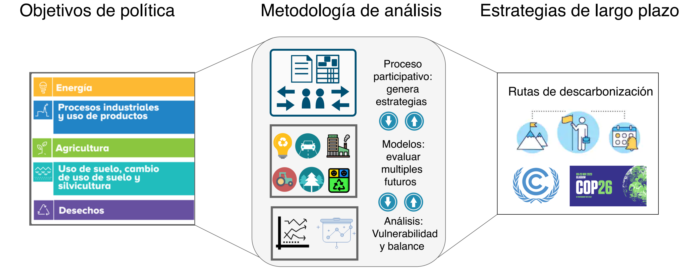

3. OSeMOSYS-Peru
=======================================

3.1 Estructura
+++++++++

3.2 Datos e información
+++++++++

3.2.1 Sets
---------

3.2.1 Procesos
---------

3.2.1 Comodities
---------

3.2.1 Costos 
---------

3.2.1 Emisiones
---------

3.2 Consideraciones del modelo 
+++++++++
.. figure:: img/Proyección DemandaTotal-Modelo de ajuste con PBI.png
   :align:   center
   :width:   700 px

3.2.1 Construcción de scenarios 
---------

3.2.2 Narrativas
---------

3.2.3 Síntesis cuantitativa de escenarios
---------

3.3 Resultados de los escenarios base
+++++++++

