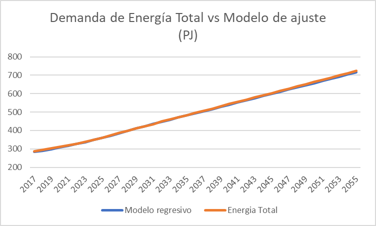

3.2 Characterization of Energy Sectors
+++++++++

.. figure:: img/RES_Energia.png
   :align:   center
   :width:   700 px

Como ya se ha mencionado en "Data Processing", el modelo OSeMOSYS de energía y transporte está compuesto por diferentes comodities y fuels que son propios de cada país o sistema. Ahora trataremos la configuración del modelo OSeMOSYS, esta se da a través de los siguientes items:

 - *Sets*
 - *Parameters*
 - *Variables*
 - *Obejetive functions*
 - *Constraints*

Nosotros trataremos con un modelo simple, el cual es la vesión más manejable, por el momento debido a las necesidades, en el modelo OSeMOSYS Perú. Cada item está compuesto por un conjunto de items y sus valores son particulares del sistema a modelar, a continuación mostaremos todos estos para la cnfiguración de un modelo simple, lo cual sisgnifica que nuestra función objetivo de costo es corta. 

================== ============================ ==================================== ========= ======================================== 
                                       Items de configuración para un modelo simple
---------------------------------------------------------------------------------------------------------------------------------------  
      Sets          Parameters                   Variables                           Ojective          Constraints
                    ("Insumos")                  ("salidas")                         functions
================== ============================ ==================================== ========= ========================================   
EMISSION           AccumulatedAnnualDemand      AccumulatedNewCapacity               OFS_Cost  Acc1_FuelProductionByTechnology
FUEL               AnnualEmissionLimit          AnnualEmissions                                Acc2_FuelUseByTechnology
MODE OF OPERATION  AnnualExogenousEmission      AnnualFixedOperatingCost                       Acc3_AverageAnnualRateOfActivity
REGION             AvailabilityFactor           AnnualTechnologyEmission                       CAa1_TotalNewCapacity
STORAGE            CapacityFactor               AnnualTechnologyEmissionByMode                 CAa2_TotalAnnualCapacity                        
REGION             CapacityOfOneTechnologyUnit  AnnualVariableOperatingCost                    CAa5_TotalNewCapacity        
TECHNOLOG          CapacityToActivityUnit       CapitalInvestment                              CC1_UndiscountedCapitalInvestment        
TIMESLICE          CapitalCost                  Demand                                         E2_AnnualEmissionProduction            
YEAR               CapitalCostStorage           DiscountedSalvageValue                         EBa10_EnergyBalanceEachTS4            
                   DepreciationMethod           DiscountedTechnologyEmissionsPenalty           EBa1_RateOfFuelProduction1                          
                   DiscountRate                 NewCapacity                                    EBa2_RateOfFuelProduction2              
                   EmissionActivityRatio        NewStorageCapacity                             EBa4_RateOfFuelUse1            
                   EmissionsPenalty             NumberOfNewTechnologyUnits                     EBa5_RateOfFuelUse2           
                   FixedCost                    ProductionByTechnology                         NCC1_TotalAnnualMaxNewCapacityConstraint              
                   InputActivityRatio           ProductionByTechnologyAnnual                   NCC2_TotalAnnualMinNewCapacityConstraint          
                   ModelPeriodEmissionLimit     RateOfActivity                                 OC1_OperatingCostsVariable             
                   ModelPeriodExogenousEmission RateOfProductionByTechnology                   OC2_OperatingCostsFixedAnnual            
                   OperationalLife              RateOfProductionByTechnologyByMode             SI6_SalvageValueStorageAtEndOfPeriod1                 
                   OperationalLifeStorage       RateOfUseByTechnology                          SV3_SalvageValueAtEndOfPeriod3      
                   OutputActivityRatio          RateOfUseByTechnologyByMode                    SV4_SalvageValueDiscountedToStartYear            
                   REMinProductionTarget        SalvageValue                                   TAC1_TotalModelHorizonTechnologyActivity      
                   RETagFuel                    SalvageValueStorage                            Short_Code_Equations                               
                   RETagTechnology              TotalAnnualTechnologyActivityByMode                            
                   ReserveMargin                TotalCapacityAnnual                                                   
                   ReserveMarginTagFuel         TotalTechnologyAnnualActivity                                    
                   ReserveMarginTagTechnology   TotalTechnologyModelPeriodActivity                                    
                   ResidualCapacity             Trade                                                    
                   SpecifiedAnnualDemand        UseByTechnology                                                  
                   SpecifiedDemandProfile                                                                              
                   TradeRoute                                                                                        
                   VariableCost                                                                                             
                   YearSplit                                        
================== ============================ ==================================== ========= ======================================== 
*Fuente: Propia*
 
No todos estos items han sido insertados en el modelo, debido que se ha trabajado un modelo que se acomoda más a las necesidades del Perú, ahora se pueden encontrar todos los valores de corespondiente a todos los item de configuración en `Items <https://github.com/guidogz/Doc_ELP_Peru/blob/master/docs/999Annexes.rst/>`_.

3.2.1 Sets
---------

Los sets son el conjunto de configuraciones que son establecidos para el modelo, estos 
son particulares por país y región, para su configuración se debe tener un análisis 
del sistema a modelar, los sets se muestrana contiuación.

 - *Región*
 - *Year*
 - *Timeslices*
 - *Emissions*
 - *Commodity*
 - *Technology*
 - *Mode of operation*

3.2.1.1 Región
---------
Para El Perú se ha hipotetizado una sola región para poder simplificar el análisis de nuestro sistema, se puede mencionar que el modelo TIMES se considera 4 regiones, centro, norte, oriente y sur.

========== ===============
región(es)   Perú
========== ===============
*Fuente: Propia*

3.2.1.2 Year
---------

Los años de análisis se consideran desde el 2015 hasta el 2050, este es el marco de tiempo de nuestro estudio para el modelo de energía y transporte.

========== =============== ============
parámetro   Inicio          Final              
---------- --------------- ------------
Año         2015            2050
========== =============== ============
*Fuente: Propia*

3.2.1.3 Timeslices
---------
En el modelo de OSeMOSYSY Perú se han tomado una fraccion anual de 2 para un escenario alto y de 4 para un escenario medio y bajo.

========== ===============
Timeslice    Perú
---------- ---------------
An_alto      0.5
An_bajo      0.25
An_medio     0.25
========== ===============
*Fuente: Propia*

3.2.1.4 Emissions
---------

Para las emisiones se han considerado todos los tipos de gases de efecto invernadero (GEI) que son resultado de la actividad de los procesos, como CO2, CH4 y N2O, todos estos son transformado en CO2 euivalentes, en la tabla a continuación se puede observar estos factores de equivalencia.

========== ============ ============ ============
                CO2          CH4          N2O              
---------- ------------ ------------ ------------
Factor           1           21           310
========== ============ ============ ============
*Fuente: Anexo 2 del informe 9 del PROSEMER*

3.2.1.5 Commodities
---------

Los commodities son los bienes, insumos, productos, etc. Estos ingresan a cada 
tecnología para ser transformados y procesados en otros comodities dentro de toda 
la cadena energética, en el Perú contamos con una gran variedad de commodities desde
insumos primarios como bosta y yesta para producción de carbón hasta la electricidad 
generada por cada tecnología eléctrica y los combustibles consumidos por el sector
transporte, las etiquetas para cada commodity considerados se muestran a continuación.
Los commodities se pueden encontrar en Anexos Fuels_. 

.. _Fuels: https://github.com/guidogz/Doc_ELP_Peru/blob/master/docs/999Annexes.rst/

+--------------------+-----------------------------------------------------------------------+
| Combustibles       | Los combustibles fósiles son residuos de materia orgánica obtenidos   |
| Fósiles            | de forma extrativas, estas son crudo, gas natural y carbón.           |
+--------------------+-----------------------------------------------------------------------+
| Biocombustibles    | Son los combustibles que son sintetizados a partir de materia organica|
|                    | tales como la cañade azucar, oleaginosas y microalgas                 |
+--------------------+-----------------------------------------------------------------------+
| Electricidad       | La electricidad como commodity, es un producto de la generación de    |
|                    | diferentes tipos de tecnología como la combustión, fotovoltaico.      |
+--------------------+-----------------------------------------------------------------------+
| Demandas de        | Para las demandas de trasnporte puede ser de pasajeros públicos y     |
| Transporte         | privados y carga, falta aún poner esta parte.                         |
+--------------------+-----------------------------------------------------------------------+
| Productos de       | Actualmente se exporta una parte de hidrocarburos y gas natural.      |
| Exportación        |                                                                       |
+--------------------+-----------------------------------------------------------------------+
*Fuente: Propia*

3.2.1.6 Technologies
---------

Los procesos o tecnologías son representados en forma de bloque y pueden tener o no una 
entrada de commodities, sin embargo, siempre tienen una salida de commodities, Los procesos 
tienen involucrados costos como CAPEX(Capital Expenditure), OPEX (Operacional Expenditure), los 
costos examinados por capacidad para las plantas de gas y refinerías han sido estudiadas 
para tener datos con los cuales poder suministrar al modelo. Las principales tecnologías 
para el peru se muestran a continuación.

+--------------------+----------------------------------------------------------------------+
|Producción          | La producción de commodities incluye extración, procesamiento,       |
|                    | transformación de materia primaría hasta llegar a ser commodity.     |
+--------------------+----------------------------------------------------------------------+
|Importaciones       | Importaciones incluyen todos los procesos y acciones comerciales para|
|                    | lograr el suministro de commodities al país.                         |
+--------------------+----------------------------------------------------------------------+
|Refinería           | Refinería incluye todo el procesamiento de crudo para la obtención   |
|                    | de los subproductos como la gasolina o el diesel.                    |
+--------------------+----------------------------------------------------------------------+
|Carboneras          | Carboneras incluye el proceso de extracción de una mina carbón       |
|                    | mineral y trasnformación de en carbon vegetal.                       |
+--------------------+----------------------------------------------------------------------+
|Planta de gas       | Las plantas de gas incluye la licuación, transporte de gas           |
|                    |                                                                      |
+--------------------+----------------------------------------------------------------------+
|Plantas eléctricas  | En las plantas eléctricas se incluye todos las plantas de diversos   |
|                    | tipos de tecnologías como las hidroelectricas, termoelectricas, etc. |
+--------------------+----------------------------------------------------------------------+
|Transmisión         | La transmisión eléctrica incluye todos las formas de transmision en  |
|eléctrica           | alta y media tensión.                                                |
+--------------------+----------------------------------------------------------------------+
|Distribución        | La distribución eléctrica incluye distribución en baja tensión       |
|eléctrica           | hasta el usario final.                                               |
+--------------------+----------------------------------------------------------------------+
|Distribución        | La distribución energética incluye todos los medios y procesos para  |
|energética          | la repartición de los productos.                                     |
+--------------------+----------------------------------------------------------------------+
|Transporte          | Transporte en el Perú  incluyen todos las formas de transporte tanto |
|                    | carretero (pasajero y carga), ferroviario, naval, aéreo.             |
+--------------------+----------------------------------------------------------------------+
|Residencial, comer- | Esta tecnología incluye todos los procesos de transformación de      |
|cial y carga        | energía para los sectores residencial, comercial y carga.            |   
+--------------------+----------------------------------------------------------------------+
|Agropecuario, Pesqu-| Estas tecnologías incluyen todos los procesos de ransformacion de    |
|ero, industría      |  energía  para los sectores agropecuarios, minero e industría.       |
+--------------------+----------------------------------------------------------------------+
*Fuente: Propia*

 Todas las tecnologías se puede ver a en Anexos Tecnologías_.

.. Hay que cambiar este hyperlink

.. _Tecnologías: https://github.com/guidogz/Doc_ELP_Peru/blob/master/docs/999Annexes.rst/ 

3.2.1.7 Mode of operation
---------

Para los procesos se ha hipotetizado un modo de operación, lo que quiere decir que por cada inpt solo obtenemos un tipo de output.

3.2.2 Parameters
---------

Los parámetros son los insumos del modelo, han sido completados con información obtenida de las diferentes fuentes de información, como publicaciones oficiles de los diferentes ministerios, publicaciones de entidades internacionales, papers científicos publicados, etc.  

3.2.2.1 YearSplit
---------

3.2.2.1 Accumulated Annual Demand
---------

El Accumulated Anual Demand es la demanda anual de energía en el Perú, esta comprende la demanda de energía primaría y secundaría en sus diferentes formas como crudo, leña, bagazo, bosta y yareta para la energía primaria; y en derivados de petróloe, gas natural, GLP, biocombustibles, y mexcla de estos como Diesel-B5, gasohol, etc. También comprende las demandas finales de energía de los diferentes sectores, como transporte, comercial, público, residencial, minero, agro y pesca; tambien exportaciones de energía, todos los valores han sido tomados de los balances nacionales de energía y se han hecho las prediciones en baso a variaables exógenas como PBI, la población y la tendencia. A continuación se presenta una tabla con los valores de demanda correspondientes a las demandas de los todos los fuels correspondientes s la energía primaria, secundaria, neta y exportaciones.

=================================== ======== ======= ======= =========
Tecnologías                          2015     2016    2017    2018
=================================== ======== ======= ======= =========
Refinerías                           0.776   0.777   0.834   0.80
Plantas de gas                       0.659   0.659   0.659   0.659
Plantas de generación con biofuels   0.755   0.672   0.858   0.764
Plantas térmica de gas natural       0.62    0.62    0.54    0.52
Plantas generación hidráulica        0.65    0.57    0.61    0.6
Planats de generación solar PV       0.28    0.29    0.27    0.28
Plantas de generación eólica         0.48    0.51    0.5     0.46
Plantas térmica de diesel o fueloil  0.1     0.1     0.1     0.1
G_PGDV_02                            0.17    0.17    0.17    0.17
=================================== ======== ======= ======= =========
*Fuente: Informes PROSEMER, Estadística anual de hidrocarburos 2018, Balances nacionales de energía, IRENA, COES*

3.2.2.1 Capacity To Activity Unit 
---------

"Capacity To Activity Unit" es la actividad generada por la capacidad de las diferentes tecnologías, esta es diferentes para cada una las tecnologías existentes y además es constante.

3.2.2.2 Availability Factor
---------

El factor de disponibilidad, es la fracción de la capacidad instalada que esta disponible durante un año, este valor es de 0 a 1 y ve reflejada las salidas de operación programadas y fortuitas del sistema. El factor de disponibilidad para las refinerías, plantas de gas y carbón se ha tomado de los informes del PROSEMER, los valores de las plantas de generación eléctrica se han obtenido de bibliografia internacional, solo para el caso de las energías renovables no convecionales se tiene que los valores de factores de disponibilidad se han extraido de bibliografía web.

=================================== =======================
Tecnologías                         Availability factor
=================================== =======================
Producción                              1
Importaciones                           1
REfinerías                             0.9
Carboneras                             0.9
Plantas de gas natural                 0.92
Plantas de generación con biofuels     0.9
Plantas térmica de gas natural         0.9
Plantas generación hidráulica          0.9
Planats de generación solar PV         0.94
Plantas de generación eólica           0.95
Plantas térmica de diesel o fueloil    0.9
G_PGDV_02                              0.9
G_PGGTH_02                             0.8
H_STDE_01                                1
H_STDE_02                                1
=================================== =======================
*Feunte: Propia*

*El diesel tambiém se puede encontrar como gasóleo.   

3.2.2.3 Capacity Factor
---------

El factor de capacidad es la capacidad disponible de la capacidad anual, si hubiera trabajado a plena carga, de cada tecnología y para cada timeslice. El factor de capacidad de las refinerías, plantas de gas y carboneras han sido calculados a partir del anuario estadístico de hidrocarburos de la dirección general de hidrocarburos (DGH) y los balances nacionales de energía, para las demás tecnologías se ha utilizado valores de referencia del IRENA y calculos de los factores de planta de las plantas de generación que publica el COES. A continuación se mostrará los factores de planta para las distintas tecnologías en los años 2015, 2016, 2017 y 2018.    

=================================== ======== ======= ======= =========
Tecnologías                          2015     2016    2017    2018
=================================== ======== ======= ======= =========
Refinerías                           0.776   0.777   0.834   0.80
Plantas de gas                       0.659   0.659   0.659   0.659
Plantas de generación con biofuels   0.755   0.672   0.858   0.764
Plantas térmica de gas natural       0.62    0.62    0.54    0.52
Plantas generación hidráulica        0.65    0.57    0.61    0.6
Planats de generación solar PV       0.28    0.29    0.27    0.28
Plantas de generación eólica         0.48    0.51    0.5     0.46
Plantas térmica de diesel o fueloil  0.1     0.1     0.1     0.1
G_PGDV_02                            0.17    0.17    0.17    0.17
=================================== ======== ======= ======= =========
*Fuente: Informes PROSEMER, Estadística anual de hidrocarburos 2018, Balances nacionales de energía, IRENA, COES*

3.2.2.4 Operational Life
---------

El Operation Life es la vida de operacional de las tecnologías, generalmente estan diseñados para largos periodos de tiempo, estas pueden variar, debido a que las plantas reciben actualizaciones, modificaciones, o simplemente se acaba la materia prima para hacerlas funcionar. Los valores de Operational Life se han obtenido de fuentes bibliográficas como LAZARD’S y National Renewable Energy Laboraqtory (NREL).

=================================== ==========================
Tecnologías                         Operational Life (Años)
=================================== ==========================
Producción                              -
Importaciones                           -
REfinerías                             40
Carboneras                              -
Plantas de gas natural                 20
Plantas de generación con biofuels     30
Plantas térmica de gas natural         30
Plantas generación hidráulica          30
Planats de generación solar PV         30
Plantas de generación eólica           20
Plantas térmica de diesel o fueloil    20
G_PGDV_02                              25
=================================== ==========================
*Feunte: LAZARD’S y National Renewable Energy Laboraqtory (NREL)*

3.2.2.5 Capital Cost
---------

3.2.2.6 Fixed Cost
---------

3.2.2.7 Variable Costs
---------

3.2.2.8 Emission Activity Ratio
---------

3.3 Consideraciones del modelo 
+++++++++

3.3.1 Narrativas
---------

3.3.2 Síntesis cuantitativa de escenarios
---------

3.4 Resultados de los escenarios base
+++++++++

